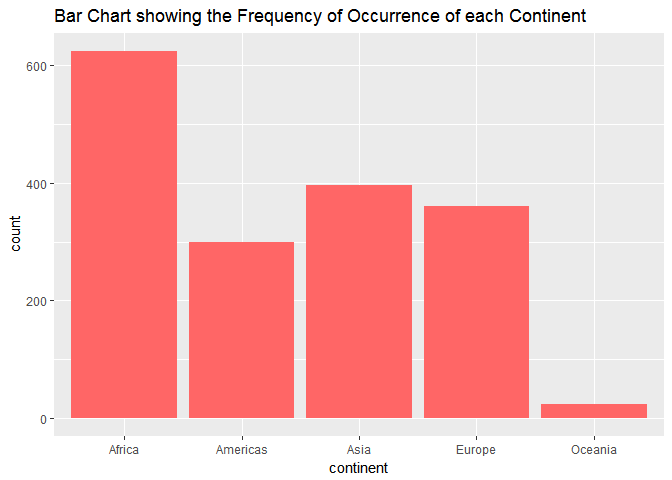
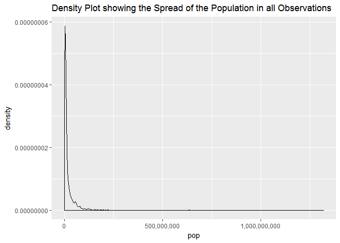
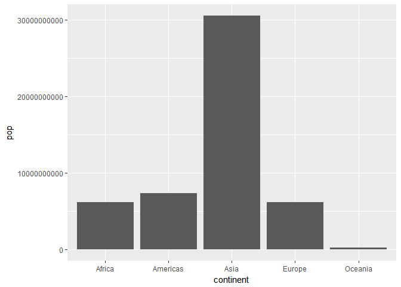
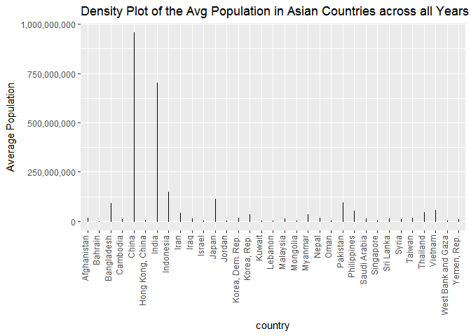
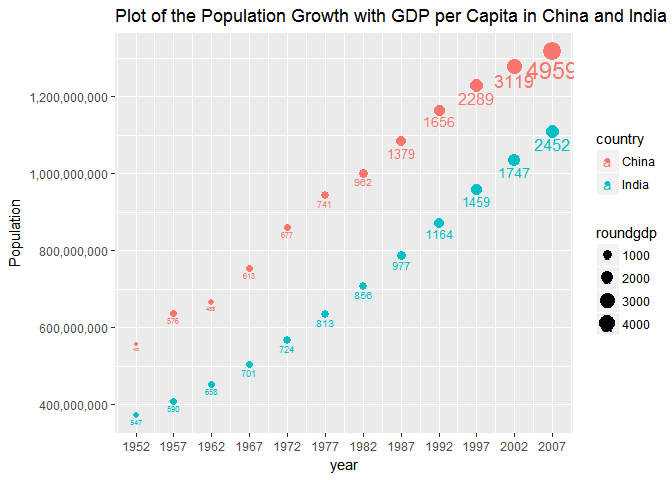

Gapminder\_Explore
================
Shirlett
September 24, 2017

Bring the Data In
-----------------

``` r
library(gapminder)
```

    ## Warning: package 'gapminder' was built under R version 3.3.3

``` r
library(tidyverse)
```

    ## Warning: package 'tidyverse' was built under R version 3.3.3

    ## Loading tidyverse: ggplot2
    ## Loading tidyverse: tibble
    ## Loading tidyverse: tidyr
    ## Loading tidyverse: readr
    ## Loading tidyverse: purrr
    ## Loading tidyverse: dplyr

    ## Warning: package 'ggplot2' was built under R version 3.3.3

    ## Warning: package 'tibble' was built under R version 3.3.3

    ## Warning: package 'tidyr' was built under R version 3.3.3

    ## Warning: package 'readr' was built under R version 3.3.3

    ## Warning: package 'purrr' was built under R version 3.3.3

    ## Warning: package 'dplyr' was built under R version 3.3.3

    ## Conflicts with tidy packages ----------------------------------------------

    ## filter(): dplyr, stats
    ## lag():    dplyr, stats

Smell Test The Data
-------------------

``` r
#Find the structure of the object
str(gapminder)
```

    ## Classes 'tbl_df', 'tbl' and 'data.frame':    1704 obs. of  6 variables:
    ##  $ country  : Factor w/ 142 levels "Afghanistan",..: 1 1 1 1 1 1 1 1 1 1 ...
    ##  $ continent: Factor w/ 5 levels "Africa","Americas",..: 3 3 3 3 3 3 3 3 3 3 ...
    ##  $ year     : int  1952 1957 1962 1967 1972 1977 1982 1987 1992 1997 ...
    ##  $ lifeExp  : num  28.8 30.3 32 34 36.1 ...
    ##  $ pop      : int  8425333 9240934 10267083 11537966 13079460 14880372 12881816 13867957 16317921 22227415 ...
    ##  $ gdpPercap: num  779 821 853 836 740 ...

``` r
#alternative ways to view the extent and size of the gapminder object ie., summary and #dim
summary(gapminder)
```

    ##         country        continent        year         lifeExp     
    ##  Afghanistan:  12   Africa  :624   Min.   :1952   Min.   :23.60  
    ##  Albania    :  12   Americas:300   1st Qu.:1966   1st Qu.:48.20  
    ##  Algeria    :  12   Asia    :396   Median :1980   Median :60.71  
    ##  Angola     :  12   Europe  :360   Mean   :1980   Mean   :59.47  
    ##  Argentina  :  12   Oceania : 24   3rd Qu.:1993   3rd Qu.:70.85  
    ##  Australia  :  12                  Max.   :2007   Max.   :82.60  
    ##  (Other)    :1632                                                
    ##       pop              gdpPercap       
    ##  Min.   :6.001e+04   Min.   :   241.2  
    ##  1st Qu.:2.794e+06   1st Qu.:  1202.1  
    ##  Median :7.024e+06   Median :  3531.8  
    ##  Mean   :2.960e+07   Mean   :  7215.3  
    ##  3rd Qu.:1.959e+07   3rd Qu.:  9325.5  
    ##  Max.   :1.319e+09   Max.   :113523.1  
    ## 

``` r
dim(gapminder)
```

    ## [1] 1704    6

Based on the values returned by R's structure command, the gapminder object is a data frame with class table dataframe. There are six variables and 1704 observations. The structure command provides an abbreviated description of an object in R including the number of observations and variables.The summary function provides the information about extent and size but also provides basic statistical information. It is useful to double check results from other statistical functions. The dim function also shows the number of rows x number of columns. This function provides the least amount of information and is useful for determining whether the entire content of the dataframe can be easily The structure function also provides the data type for each variable. Country and Continent are factors or nominal values; year and population are integers; lifeExp and GDP per Capita are numbers.

Explore Individual Variables
----------------------------

``` r
#Exploring Continent as a categorical variable
#Tabular description of the spread of Continent
with(gapminder, table(continent))
```

    ## continent
    ##   Africa Americas     Asia   Europe  Oceania 
    ##      624      300      396      360       24

``` r
#bar plot showing the relative frequency of the occurrence of each variable
ggplot(gapminder, aes(x = continent)) + geom_bar()
```



``` r
#Exploring Population as a Quantitative variable
#One line description of the central tendency of Population
options(scipen=15)
summary(gapminder$pop)   
```

    ##       Min.    1st Qu.     Median       Mean    3rd Qu.       Max. 
    ##      60010    2794000    7024000   29600000   19590000 1319000000

``` r
#more detailed description of the population
library(psych)
```

    ## 
    ## Attaching package: 'psych'

    ## The following objects are masked from 'package:ggplot2':
    ## 
    ##     %+%, alpha

``` r
describe(gapminder$pop)
```

    ##    vars    n     mean        sd  median  trimmed     mad   min        max
    ## X1    1 1704 29601212 106157897 7023596 11399459 7841474 60011 1318683096
    ##         range skew kurtosis      se
    ## X1 1318623085 8.33    77.62 2571683

``` r
#density plot to illustrate the spread of population
ggplot(gapminder, aes(x = pop)) + geom_density()
```



For continent, there are six possible values, with Africa occurring most frequently at 624. Oceania occurs the least frequently with 24 observations. Population has a much wider range, with 60,010 as the lowest number and 1,319,000,000 as the highest observation. The average population is 29,600,000 although the value in the middle is 7,024,000. Overall, the population data is skewed to the right with most values being less than the mean.

Explore Various Plot Types
--------------------------

### BoxPlot and Density Plot

``` r
#This is a basic boxplot that that shows the spread of population by continent. It
#appears that Asia has the highest population 
ggplot(gapminder, aes(x = continent, y = pop)) + geom_col() 
```



``` r
#These commands create a variable that shows the countries in Asia and the average population across the years
library(dplyr)
population <- gapminder %>% 
    filter(continent == "Asia") %>% 
    group_by(country) %>% 
    select(country, pop) %>%
    summarize(avgpop = mean(pop))
```

    ## Warning: package 'bindrcpp' was built under R version 3.3.3

``` r
#This command creates a density plot to show the average population and reorients
#the labels on the x-axis. It shows that China and India have the highest population #levels
ggplot(population, aes(x = country, y = avgpop)) + geom_density() + theme(axis.text.x = element_text(angle = 90, vjust= 0, hjust = 1)) + ggtitle("Density Plot of the Average Population in Asian Countries")
```



### ScatterPlot

``` r
#This command modifies the data so that the GDP per Capita in the most population dense countries in Asia can be viewed. A new column is added that rounds the GDP per capita.
pop_growth <- gapminder %>% 
    filter(country == "China"| country == "India") %>% 
    mutate(roundgdp = round(gdpPercap,  digits = 0)) %>% 
    select(country, year, pop, roundgdp)


#These commands create a plot that shows population growth in China and India and the 
#associated gdp per Capita. Although the populations of both countries have steadily
#increased since 1952, after 1977, China has had a far greater gdp per capita than India.
g1 <- ggplot(pop_growth, aes(x = year, y = pop, color=country, size = roundgdp)) + ggtitle("Plot of the Population Growth with GDP per Capita in China and India") + geom_point() +
geom_text(aes(label=roundgdp, hjust=0.5, vjust=1.5)) + scale_x_continuous(breaks=seq(1952, 2007, 5)) 

g1 
```



Extra
-----

### Incorrect Filter Method

``` r
#Given method of getting Rwanda and Afghanistan whih produces only 12 results
filter(gapminder, country == c("Rwanda", "Afghanistan"))
```

    ## # A tibble: 12 x 6
    ##        country continent  year lifeExp      pop gdpPercap
    ##         <fctr>    <fctr> <int>   <dbl>    <int>     <dbl>
    ##  1 Afghanistan      Asia  1957  30.332  9240934  820.8530
    ##  2 Afghanistan      Asia  1967  34.020 11537966  836.1971
    ##  3 Afghanistan      Asia  1977  38.438 14880372  786.1134
    ##  4 Afghanistan      Asia  1987  40.822 13867957  852.3959
    ##  5 Afghanistan      Asia  1997  41.763 22227415  635.3414
    ##  6 Afghanistan      Asia  2007  43.828 31889923  974.5803
    ##  7      Rwanda    Africa  1952  40.000  2534927  493.3239
    ##  8      Rwanda    Africa  1962  43.000  3051242  597.4731
    ##  9      Rwanda    Africa  1972  44.600  3992121  590.5807
    ## 10      Rwanda    Africa  1982  46.218  5507565  881.5706
    ## 11      Rwanda    Africa  1992  23.599  7290203  737.0686
    ## 12      Rwanda    Africa  2002  43.413  7852401  785.6538

### Correct Filter Method

``` r
#Correct method to obtain Rwanda and Afghanistan which produces all 24 possible results
filter(gapminder, country %in% c("Rwanda", "Afghanistan"))
```

    ## # A tibble: 24 x 6
    ##        country continent  year lifeExp      pop gdpPercap
    ##         <fctr>    <fctr> <int>   <dbl>    <int>     <dbl>
    ##  1 Afghanistan      Asia  1952  28.801  8425333  779.4453
    ##  2 Afghanistan      Asia  1957  30.332  9240934  820.8530
    ##  3 Afghanistan      Asia  1962  31.997 10267083  853.1007
    ##  4 Afghanistan      Asia  1967  34.020 11537966  836.1971
    ##  5 Afghanistan      Asia  1972  36.088 13079460  739.9811
    ##  6 Afghanistan      Asia  1977  38.438 14880372  786.1134
    ##  7 Afghanistan      Asia  1982  39.854 12881816  978.0114
    ##  8 Afghanistan      Asia  1987  40.822 13867957  852.3959
    ##  9 Afghanistan      Asia  1992  41.674 16317921  649.3414
    ## 10 Afghanistan      Asia  1997  41.763 22227415  635.3414
    ## # ... with 14 more rows
