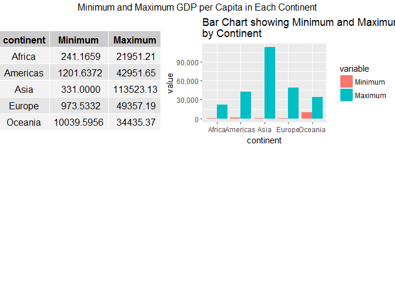
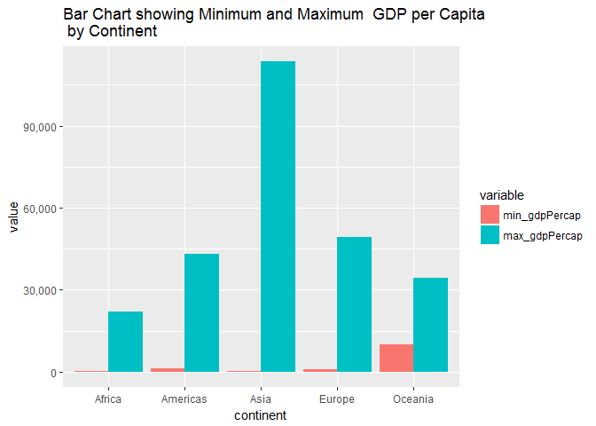
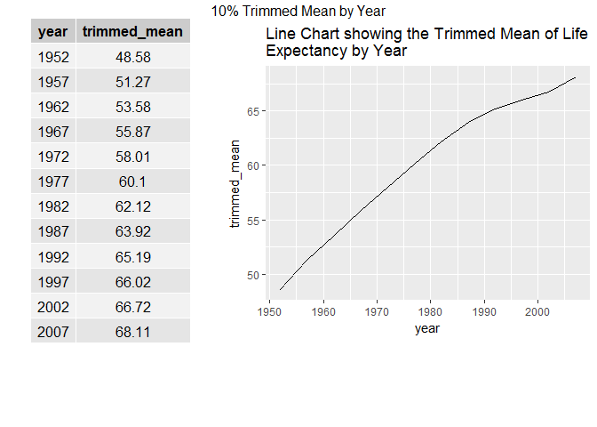
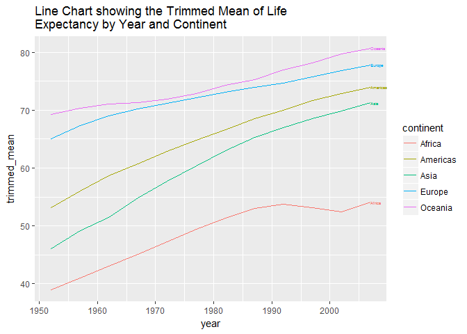
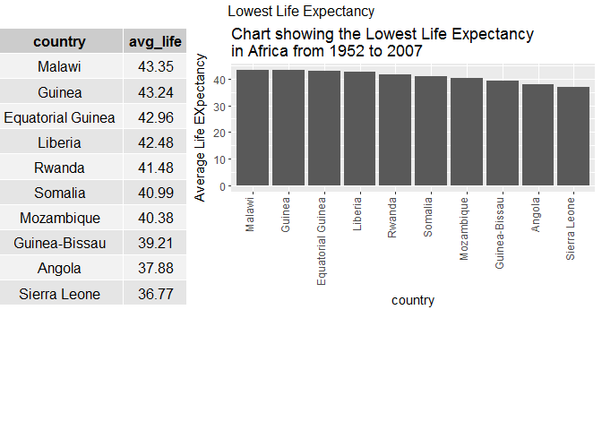

STAT545-HW03
================
Shirlett
September 30, 2017

Get the maximum and minimum of GDP per capita for all continents.
-----------------------------------------------------------------

``` r
gdp <- gapminder %>%
    group_by(continent) %>% 
    summarize(Minimum = min(gdpPercap), Maximum = max(gdpPercap))
    

#melt table and group variables together by continent and modify y axis
gdp_melted<-melt(gdp) %>%
ggplot(aes(continent,value,fill=variable))+ 
geom_bar(stat="identity",position="dodge") +
ggtitle("Bar Chart showing Minimum and Maximum GDP per Capita \nby Continent") +
scale_y_continuous(labels = comma)


#Set the table as a Grob for Grid
gdp_tbl <- tableGrob(gdp, rows=NULL)


#Arrange the figures in a grid
grid.arrange(gdp_tbl, gdp_melted,
             ncol=2,
             as.table=TRUE,
             heights=c(4,4),
             widths=c(11, 16),
             top="Minimum and Maximum GDP per Capita in Each Continent")
```



The results of this query show that Africa has the lowest GDP per capita at 241.17. The highest is found in Asia at a 113,523.13. Asia also appears to have the widest income gap of all the continents.

Look at the spread of GDP per capita within the continents
----------------------------------------------------------

``` r
spread_gdp <- gapminder %>%
    group_by(continent) %>% 
    summarize(Interquartile=IQR(gdpPercap), Median=median(gdpPercap))
```

    ## Warning: package 'bindrcpp' was built under R version 3.3.3

``` r
#use library scales to modify the figures in the y-axis
gdp_spread <- ggplot(gapminder, aes(continent, gdpPercap)) + geom_boxplot() + 
ggtitle("BoxPlot showing the Spread of GDP per Capita \nby Continent") + scale_y_continuous(labels = comma)

#Set the table as a Grob for Grid
grob_tbl <- tableGrob(spread_gdp, rows=NULL)


#Arrange the figures in a grid
grid.arrange(grob_tbl, gdp_spread,
             ncol=2,
             as.table=TRUE,
             heights=c(4,4),
             widths=c(11, 16),
             top="Spread of GDP per Capita in Each Continent")
```



The charts above provide a more balanced interpretation of the income gap in all the countries. Although the first set of charts indicate that Asia has the widest income gap, the boxplot illustrates the fact that the high values are extreme outliers. Europe and Oceania have higher median incomes or gross domestic products.

Compute a trimmed mean of life expectancy for different years
-------------------------------------------------------------

``` r
#Trim the 10% of the highest and lowest life expectancies, then find the mean
Life <- gapminder %>%
    group_by(year) %>% 
    summarize(trimmed_mean=round(mean(lifeExp, trim=0.1), digits=2))


#Create figure
Trim_time <- ggplot(Life, aes(year, trimmed_mean)) +  geom_line()  + 
ggtitle("Line Chart showing the Trimmed Mean of Life \nExpectancy by Year") 

#Set the table as a Grob for Grid
grob_tbl <- tableGrob(Life, rows=NULL)


#Arrange the figures in a grid
grid.arrange(grob_tbl, Trim_time,
             ncol=2,
             as.table=TRUE,
             heights=c(15,4),
             widths=c(10, 17),
             top="10% Trimmed Mean by Year")
```



The charts above show that there has been a steady increase in life expectancy since 1952. In 1952, the average was less than 49 years, but this figure increased to 68 in four decades.

How is life expectancy changing over time on different continents
-----------------------------------------------------------------

``` r
#Isolate only the relevant columns first
Life_Cont <- gapminder %>%
    select(continent, year, lifeExp) %>%
    group_by(continent, year) %>%
    summarize(trimmed_mean=round(mean(lifeExp, trim=0.1), digits=2))


#Create the table with pander
panderOptions('big.mark', '')
pandoc.table(Life_Cont, style = "grid", round=2, caption = "Trend of Average Life Expectancy in Continents from 1952 to 2007 \n (Lowest 10% of highest and Lowest Figures Removed)")
```

    ## 
    ## 
    ## +-----------+------+--------------+
    ## | continent | year | trimmed_mean |
    ## +===========+======+==============+
    ## |  Africa   | 1952 |    38.93     |
    ## +-----------+------+--------------+
    ## |  Africa   | 1957 |    40.97     |
    ## +-----------+------+--------------+
    ## |  Africa   | 1962 |    43.05     |
    ## +-----------+------+--------------+
    ## |  Africa   | 1967 |    45.12     |
    ## +-----------+------+--------------+
    ## |  Africa   | 1972 |    47.26     |
    ## +-----------+------+--------------+
    ## |  Africa   | 1977 |    49.35     |
    ## +-----------+------+--------------+
    ## |  Africa   | 1982 |    51.32     |
    ## +-----------+------+--------------+
    ## |  Africa   | 1987 |    53.01     |
    ## +-----------+------+--------------+
    ## |  Africa   | 1992 |    53.71     |
    ## +-----------+------+--------------+
    ## |  Africa   | 1997 |    53.08     |
    ## +-----------+------+--------------+
    ## |  Africa   | 2002 |    52.47     |
    ## +-----------+------+--------------+
    ## |  Africa   | 2007 |    54.08     |
    ## +-----------+------+--------------+
    ## | Americas  | 1952 |    53.18     |
    ## +-----------+------+--------------+
    ## | Americas  | 1957 |    56.05     |
    ## +-----------+------+--------------+
    ## | Americas  | 1962 |    58.64     |
    ## +-----------+------+--------------+
    ## | Americas  | 1967 |    60.75     |
    ## +-----------+------+--------------+
    ## | Americas  | 1972 |    62.86     |
    ## +-----------+------+--------------+
    ## | Americas  | 1977 |    64.87     |
    ## +-----------+------+--------------+
    ## | Americas  | 1982 |    66.67     |
    ## +-----------+------+--------------+
    ## | Americas  | 1987 |    68.55     |
    ## +-----------+------+--------------+
    ## | Americas  | 1992 |    70.01     |
    ## +-----------+------+--------------+
    ## | Americas  | 1997 |    71.63     |
    ## +-----------+------+--------------+
    ## | Americas  | 2002 |    72.89     |
    ## +-----------+------+--------------+
    ## | Americas  | 2007 |    74.01     |
    ## +-----------+------+--------------+
    ## |   Asia    | 1952 |    45.98     |
    ## +-----------+------+--------------+
    ## |   Asia    | 1957 |    49.16     |
    ## +-----------+------+--------------+
    ## |   Asia    | 1962 |    51.45     |
    ## +-----------+------+--------------+
    ## |   Asia    | 1967 |    54.79     |
    ## +-----------+------+--------------+
    ## |   Asia    | 1972 |    57.71     |
    ## +-----------+------+--------------+
    ## |   Asia    | 1977 |    60.42     |
    ## +-----------+------+--------------+
    ## |   Asia    | 1982 |    62.99     |
    ## +-----------+------+--------------+
    ## |   Asia    | 1987 |    65.31     |
    ## +-----------+------+--------------+
    ## |   Asia    | 1992 |    66.99     |
    ## +-----------+------+--------------+
    ## |   Asia    | 1997 |     68.5     |
    ## +-----------+------+--------------+
    ## |   Asia    | 2002 |    69.84     |
    ## +-----------+------+--------------+
    ## |   Asia    | 2007 |    71.31     |
    ## +-----------+------+--------------+
    ## |  Europe   | 1952 |     65.1     |
    ## +-----------+------+--------------+
    ## |  Europe   | 1957 |    67.31     |
    ## +-----------+------+--------------+
    ## |  Europe   | 1962 |    69.08     |
    ## +-----------+------+--------------+
    ## |  Europe   | 1967 |     70.2     |
    ## +-----------+------+--------------+
    ## |  Europe   | 1972 |    71.15     |
    ## +-----------+------+--------------+
    ## |  Europe   | 1977 |    72.22     |
    ## +-----------+------+--------------+
    ## |  Europe   | 1982 |     73.1     |
    ## +-----------+------+--------------+
    ## |  Europe   | 1987 |    73.97     |
    ## +-----------+------+--------------+
    ## |  Europe   | 1992 |    74.73     |
    ## +-----------+------+--------------+
    ## |  Europe   | 1997 |    75.77     |
    ## +-----------+------+--------------+
    ## |  Europe   | 2002 |    76.89     |
    ## +-----------+------+--------------+
    ## |  Europe   | 2007 |    77.83     |
    ## +-----------+------+--------------+
    ## |  Oceania  | 1952 |    69.25     |
    ## +-----------+------+--------------+
    ## |  Oceania  | 1957 |     70.3     |
    ## +-----------+------+--------------+
    ## |  Oceania  | 1962 |    71.09     |
    ## +-----------+------+--------------+
    ## |  Oceania  | 1967 |    71.31     |
    ## +-----------+------+--------------+
    ## |  Oceania  | 1972 |    71.91     |
    ## +-----------+------+--------------+
    ## |  Oceania  | 1977 |    72.85     |
    ## +-----------+------+--------------+
    ## |  Oceania  | 1982 |    74.29     |
    ## +-----------+------+--------------+
    ## |  Oceania  | 1987 |    75.32     |
    ## +-----------+------+--------------+
    ## |  Oceania  | 1992 |    76.94     |
    ## +-----------+------+--------------+
    ## |  Oceania  | 1997 |    78.19     |
    ## +-----------+------+--------------+
    ## |  Oceania  | 2002 |    79.74     |
    ## +-----------+------+--------------+
    ## |  Oceania  | 2007 |    80.72     |
    ## +-----------+------+--------------+
    ## 
    ## Table: Trend of Average Life Expectancy in Continents from 1952 to 2007 
    ##  (Lowest 10% of highest and Lowest Figures Removed)

``` r
#Use the direct labels library to set the labels within the Line Chart
ggplot(Life_Cont, aes(year, trimmed_mean, color=continent)) + 
geom_line() + 
ggtitle("Line Chart showing the Trimmed Mean of Life \nExpectancy by Year and Continent") +
geom_dl(aes(label = continent), method = list(dl.trans(x = x + 0), "last.points",cex = 0.4)) # adapted from https://stackoverflow.com/questions/29357612/plot-labels-at-ends-of-lines
```



Based on the table and chart above, Oceania has maintained the highest average life expectancy over the 40 year period, whereas Africa has maintained the lowest. Countries in the Americas have seen a steady increase. Africa saw a steady increase up to 1992 when the continent became ravaged by war, famine, and disease.

Report the absolute and/or relative abundance of countries with low life expectancy over time by continent
----------------------------------------------------------------------------------------------------------

``` r
Life_Ab <- gapminder %>% 
    select(continent, country, year, lifeExp) %>%
    filter(lifeExp < mean(gapminder$lifeExp)) %>%
    group_by(continent, year) %>%
    summarize(no_low_lifeExp=n_distinct(country))

#Create table
panderOptions('big.mark', '')
pandoc.table(Life_Ab, style = "grid", round=2, caption = "Number of Countries with Low Life Expectancies in each Continent")
```

    ## 
    ## 
    ## +-----------+------+----------------+
    ## | continent | year | no_low_lifeExp |
    ## +===========+======+================+
    ## |  Africa   | 1952 |       52       |
    ## +-----------+------+----------------+
    ## |  Africa   | 1957 |       52       |
    ## +-----------+------+----------------+
    ## |  Africa   | 1962 |       51       |
    ## +-----------+------+----------------+
    ## |  Africa   | 1967 |       50       |
    ## +-----------+------+----------------+
    ## |  Africa   | 1972 |       50       |
    ## +-----------+------+----------------+
    ## |  Africa   | 1977 |       49       |
    ## +-----------+------+----------------+
    ## |  Africa   | 1982 |       43       |
    ## +-----------+------+----------------+
    ## |  Africa   | 1987 |       39       |
    ## +-----------+------+----------------+
    ## |  Africa   | 1992 |       38       |
    ## +-----------+------+----------------+
    ## |  Africa   | 1997 |       39       |
    ## +-----------+------+----------------+
    ## |  Africa   | 2002 |       41       |
    ## +-----------+------+----------------+
    ## |  Africa   | 2007 |       40       |
    ## +-----------+------+----------------+
    ## | Americas  | 1952 |       19       |
    ## +-----------+------+----------------+
    ## | Americas  | 1957 |       15       |
    ## +-----------+------+----------------+
    ## | Americas  | 1962 |       13       |
    ## +-----------+------+----------------+
    ## | Americas  | 1967 |       10       |
    ## +-----------+------+----------------+
    ## | Americas  | 1972 |       8        |
    ## +-----------+------+----------------+
    ## | Americas  | 1977 |       7        |
    ## +-----------+------+----------------+
    ## | Americas  | 1982 |       5        |
    ## +-----------+------+----------------+
    ## | Americas  | 1987 |       2        |
    ## +-----------+------+----------------+
    ## | Americas  | 1992 |       1        |
    ## +-----------+------+----------------+
    ## | Americas  | 1997 |       1        |
    ## +-----------+------+----------------+
    ## | Americas  | 2002 |       1        |
    ## +-----------+------+----------------+
    ## |   Asia    | 1952 |       29       |
    ## +-----------+------+----------------+
    ## |   Asia    | 1957 |       26       |
    ## +-----------+------+----------------+
    ## |   Asia    | 1962 |       25       |
    ## +-----------+------+----------------+
    ## |   Asia    | 1967 |       23       |
    ## +-----------+------+----------------+
    ## |   Asia    | 1972 |       19       |
    ## +-----------+------+----------------+
    ## |   Asia    | 1977 |       14       |
    ## +-----------+------+----------------+
    ## |   Asia    | 1982 |       11       |
    ## +-----------+------+----------------+
    ## |   Asia    | 1987 |       8        |
    ## +-----------+------+----------------+
    ## |   Asia    | 1992 |       7        |
    ## +-----------+------+----------------+
    ## |   Asia    | 1997 |       6        |
    ## +-----------+------+----------------+
    ## |   Asia    | 2002 |       3        |
    ## +-----------+------+----------------+
    ## |   Asia    | 2007 |       1        |
    ## +-----------+------+----------------+
    ## |  Europe   | 1952 |       5        |
    ## +-----------+------+----------------+
    ## |  Europe   | 1957 |       3        |
    ## +-----------+------+----------------+
    ## |  Europe   | 1962 |       1        |
    ## +-----------+------+----------------+
    ## |  Europe   | 1967 |       1        |
    ## +-----------+------+----------------+
    ## |  Europe   | 1972 |       1        |
    ## +-----------+------+----------------+
    ## 
    ## Table: Number of Countries with Low Life Expectancies in each Continent

``` r
#Create a faceted chart so that each year is represented by its own grid
ggplot(Life_Ab, aes(continent, no_low_lifeExp)) +
    facet_wrap(~ year) +
    geom_point(colour="red")+ ylab("Number of Countries")+ 
    ggtitle("Faceted Graph showing the Number of Countries with Low Life Expectancy \nby Continent")+
  theme(axis.text.x = element_text(angle = 90, vjust= 0, hjust = 1))
```


Given the previous set of charts, it is unsurprising that Africa has the most countries with average life expectancies of less than the worldwide average of 59 years. Oceania has no countries with relatively low life expectancy, whereas the count of countries in Europe dropped from five to one over a forty year span.

Extra: Which countries in Africa have the lowest life expectancy
----------------------------------------------------------------

``` r
#Obtain the average life expectancy for all continents in all years
all_means = mean(gapminder$lifeExp)

# Get all the relevant columns in Africa, get the life expectancy for each country \n #across all years, then apply another filter to remove countries that have a mean \n #score less than the number for all continents

Af_Life <- gapminder %>% 
    select(continent, country, year, lifeExp)  %>%  
    filter(continent == "Africa") %>%
    group_by(country)  %>%
    summarize(avg_life=round(mean(lifeExp), digits=2)) %>%
    filter (avg_life < all_means) %>%
    arrange(desc(avg_life)) %>%
    top_n(-10)


#Create a bar chart that is ordered by life expectancy in descending order
#and reorients the x-axis labels
low_life <- ggplot(Af_Life, aes(x=reorder(country, - avg_life), y=avg_life)) +  geom_bar(stat="identity")  + 
ggtitle("Chart showing the Lowest Life Expectancy \nin Africa from 1952 to 2007") + xlab("country") + ylab("Average Life EXpectancy") + 
theme(axis.text.x = element_text(angle = 90, vjust= 0, hjust = 1))


#Set the table as a Grob for Grid
grob_tbl <- tableGrob(Af_Life, rows=NULL)


#Arrange the figures in a grid
grid.arrange(grob_tbl, low_life,
             ncol=2,
             as.table=TRUE,
             heights=c(20,8),
             widths=c(9, 20),
             top="Lowest Life Expectancy")
```



In order to obtain more detailed results for the specific countries driving the low levels of life expectancy in Africa, the dataset was filtered and arranged to get the bottom ten ranked countries. The life expectancy in Sierra Leone is less than 36.77 years. From 1991 to 2002, the country had a civil war which greatly impacted the life expectancy.
