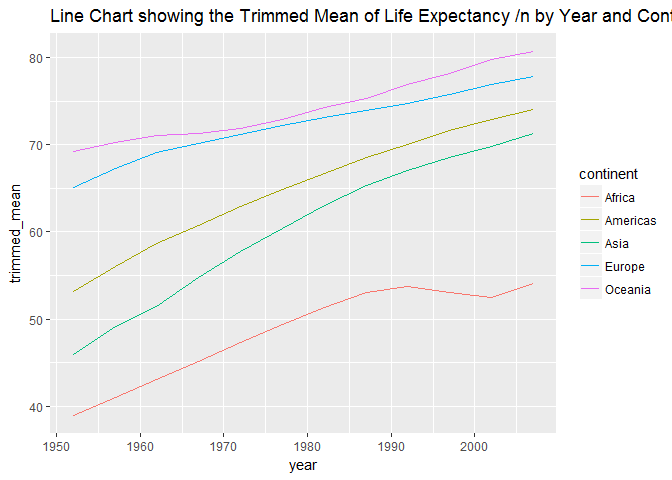
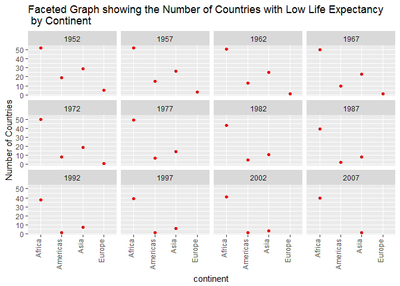

STAT545-HW03
================
Shirlett
September 30, 2017

Get the maximum and minimum of GDP per capita for all continents.
-----------------------------------------------------------------

### Table

``` r
gdp <- gapminder %>%
    group_by(continent) %>% 
    summarize(min_gdpPercap = min(gdpPercap),max_gdpPercap = max(gdpPercap))

#summarize(min_gdpPercap = comma_format()(min(gdpPercap)),max_gdpPercap = #comma_format()(max(gdpPercap)))


knitr::kable(gdp)
```

| continent |  min\_gdpPercap|  max\_gdpPercap|
|:----------|---------------:|---------------:|
| Africa    |        241.1659|        21951.21|
| Americas  |       1201.6372|        42951.65|
| Asia      |        331.0000|       113523.13|
| Europe    |        973.5332|        49357.19|
| Oceania   |      10039.5956|        34435.37|

### Figure

``` r
library(reshape2)
```

    ## Warning: package 'reshape2' was built under R version 3.3.3

    ## 
    ## Attaching package: 'reshape2'

    ## The following object is masked from 'package:tidyr':
    ## 
    ##     smiths

``` r
gdp_melted<-melt(gdp)
```

    ## Using continent as id variables

``` r
ggplot(gdp_melted,aes(continent,value,fill=variable))+ geom_bar(stat="identity",position="dodge") + ggtitle("Bar Chart showing Minimum and Maximum  GDP per Capita \n by Continent") + scale_y_continuous(labels = comma)
```

 \#\# Look at the spread of GDP per capita within the continents

### Table

``` r
spread_gdp <- gapminder %>%
    group_by(continent) %>% 
    summarize(interquartile_gdp=comma_format()(IQR(gdpPercap)), median_gdp=comma_format()(median(gdpPercap)))
```

    ## Warning: package 'bindrcpp' was built under R version 3.3.3

``` r
knitr::kable(spread_gdp)
```

| continent | interquartile\_gdp | median\_gdp |
|:----------|:-------------------|:------------|
| Africa    | 1,616.17           | 1,192.138   |
| Americas  | 4,402.431          | 5,465.51    |
| Asia      | 7,492.262          | 2,646.787   |
| Europe    | 13,248.3           | 12,081.75   |
| Oceania   | 8,072.258          | 17,983.3    |

``` r
ggplot(gapminder, aes(continent, gdpPercap)) + geom_boxplot() + ggtitle("BoxPlot showing the Spread of GDP per Capita /n by Continent") + scale_y_continuous(labels = comma)
```

 \#\# Compute a trimmed mean of life expectancy for different years \#\#\# Table

``` r
Life <- gapminder %>%
    group_by(year) %>% 
    summarize(trimmed_mean=mean(lifeExp, trim=0.1))
knitr::kable(Life)
```

|  year|  trimmed\_mean|
|-----:|--------------:|
|  1952|       48.57668|
|  1957|       51.26888|
|  1962|       53.58075|
|  1967|       55.86538|
|  1972|       58.01444|
|  1977|       60.10206|
|  1982|       62.11694|
|  1987|       63.92106|
|  1992|       65.18519|
|  1997|       66.01736|
|  2002|       66.71641|
|  2007|       68.11489|

### Figure

``` r
ggplot(Life, aes(year, trimmed_mean)) +  geom_line()  + ggtitle("Line Chart showing the Trimmed Mean of Life Expectancy /n by Year") 
```


How is life expectancy changing over time on different continents
-----------------------------------------------------------------

### Table

``` r
Life_Cont <- gapminder %>%
    select(continent, year, lifeExp) %>%
    group_by(continent, year) %>%
    summarize(trimmed_mean=mean(lifeExp, trim=0.1))

knitr::kable(Life_Cont)
```

| continent     |  year|  trimmed\_mean|
|:--------------|-----:|--------------:|
| Africa        |  1952|       38.93298|
| Africa        |  1957|       40.96993|
| Africa        |  1962|       43.04819|
| Africa        |  1967|       45.11750|
| Africa        |  1972|       47.26495|
| Africa        |  1977|       49.34983|
| Africa        |  1982|       51.31998|
| Africa        |  1987|       53.00740|
| Africa        |  1992|       53.71045|
| Africa        |  1997|       53.08371|
| Africa        |  2002|       52.47467|
| Africa        |  2007|       54.07752|
| Americas      |  1952|       53.18157|
| Americas      |  1957|       56.04624|
| Americas      |  1962|       58.64005|
| Americas      |  1967|       60.75086|
| Americas      |  1972|       62.86081|
| Americas      |  1977|       64.86633|
| Americas      |  1982|       66.66624|
| Americas      |  1987|       68.54767|
| Americas      |  1992|       70.00586|
| Americas      |  1997|       71.62719|
| Americas      |  2002|       72.88752|
| Americas      |  2007|       74.01419|
| Asia          |  1952|       45.98107|
| Asia          |  1957|       49.16422|
| Asia          |  1962|       51.45357|
| Asia          |  1967|       54.78682|
| Asia          |  1972|       57.71233|
| Asia          |  1977|       60.41761|
| Asia          |  1982|       62.99337|
| Asia          |  1987|       65.31263|
| Asia          |  1992|       66.99396|
| Asia          |  1997|       68.49633|
| Asia          |  2002|       69.83704|
| Asia          |  2007|       71.31067|
| Europe        |  1952|       65.09708|
| Europe        |  1957|       67.30763|
| Europe        |  1962|       69.07921|
| Europe        |  1967|       70.19675|
| Europe        |  1972|       71.14942|
| Europe        |  1977|       72.22067|
| Europe        |  1982|       73.09983|
| Europe        |  1987|       73.96738|
| Europe        |  1992|       74.73196|
| Europe        |  1997|       75.77375|
| Europe        |  2002|       76.88962|
| Europe        |  2007|       77.82504|
| Oceania       |  1952|       69.25500|
| Oceania       |  1957|       70.29500|
| Oceania       |  1962|       71.08500|
| Oceania       |  1967|       71.31000|
| Oceania       |  1972|       71.91000|
| Oceania       |  1977|       72.85500|
| Oceania       |  1982|       74.29000|
| Oceania       |  1987|       75.32000|
| Oceania       |  1992|       76.94500|
| Oceania       |  1997|       78.19000|
| Oceania       |  2002|       79.74000|
| Oceania       |  2007|       80.71950|
| \#\#\# Figure |      |               |

``` r
ggplot(Life_Cont, aes(year, trimmed_mean, color=continent)) + geom_line() + ggtitle("Line Chart showing the Trimmed Mean of Life Expectancy /n by Year and Continent") 
```



Report the absolute and/or relative abundance of countries with low life expectancy over time by continent
----------------------------------------------------------------------------------------------------------

### Table

``` r
Life_Ab <- gapminder %>% 
    select(continent, country, year, lifeExp) %>%
    filter(lifeExp < mean(gapminder$lifeExp)) %>%
    group_by(continent, year) %>%
    summarize(no_low_lifeExp=n_distinct(country))


knitr::kable(Life_Ab)
```

| continent |  year|  no\_low\_lifeExp|
|:----------|-----:|-----------------:|
| Africa    |  1952|                52|
| Africa    |  1957|                52|
| Africa    |  1962|                51|
| Africa    |  1967|                50|
| Africa    |  1972|                50|
| Africa    |  1977|                49|
| Africa    |  1982|                43|
| Africa    |  1987|                39|
| Africa    |  1992|                38|
| Africa    |  1997|                39|
| Africa    |  2002|                41|
| Africa    |  2007|                40|
| Americas  |  1952|                19|
| Americas  |  1957|                15|
| Americas  |  1962|                13|
| Americas  |  1967|                10|
| Americas  |  1972|                 8|
| Americas  |  1977|                 7|
| Americas  |  1982|                 5|
| Americas  |  1987|                 2|
| Americas  |  1992|                 1|
| Americas  |  1997|                 1|
| Americas  |  2002|                 1|
| Asia      |  1952|                29|
| Asia      |  1957|                26|
| Asia      |  1962|                25|
| Asia      |  1967|                23|
| Asia      |  1972|                19|
| Asia      |  1977|                14|
| Asia      |  1982|                11|
| Asia      |  1987|                 8|
| Asia      |  1992|                 7|
| Asia      |  1997|                 6|
| Asia      |  2002|                 3|
| Asia      |  2007|                 1|
| Europe    |  1952|                 5|
| Europe    |  1957|                 3|
| Europe    |  1962|                 1|
| Europe    |  1967|                 1|
| Europe    |  1972|                 1|

Figure
======

``` r
ggplot(Life_Ab, aes(continent, no_low_lifeExp)) +
    facet_wrap(~ year) +
    geom_point(colour="red")+ ylab("Number of Countries")+ 
   ggtitle("Faceted Graph showing the Number of Countries with Low Life Expectancy \n by Continent")+
    theme(axis.text.x = element_text(angle = 90, vjust= 0, hjust = 1))
```


