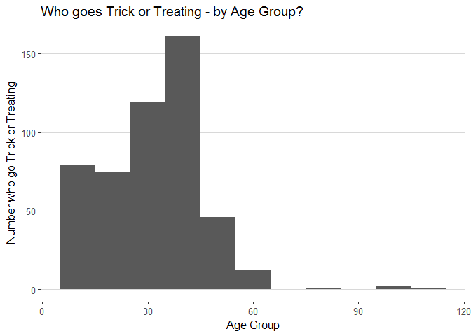
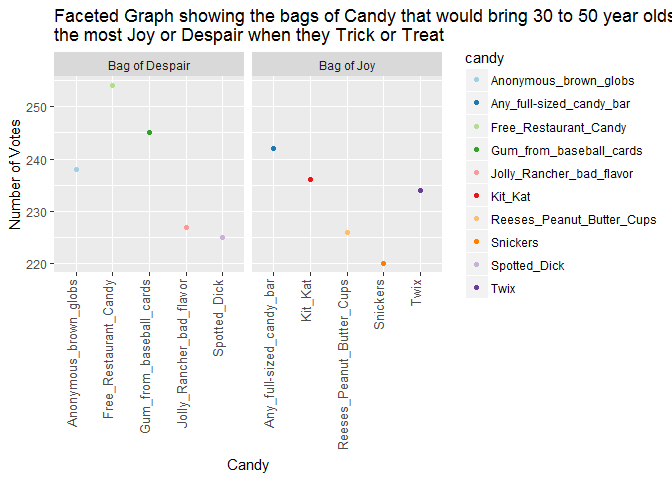
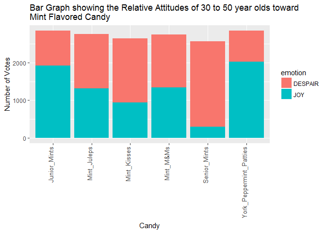

STAT545-HW06-Part2
================
Shirlett
November 5, 2017

-   [3. Candy Survey Results](#candy-survey-results)
    -   [Data Cleansing](#data-cleansing)
    -   [Profile of Trick or Treaters](#profile-of-trick-or-treaters)
    -   [Bags of Joy or Bags of Despair to Trick or Treaters](#bags-of-joy-or-bags-of-despair-to-trick-or-treaters)
    -   [What About the General Attitude of Specific Age Groups toward Mint Flavored Candy?](#what-about-the-general-attitude-of-specific-age-groups-toward-mint-flavored-candy)
-   [4. Addresses of Singers/Bands using Google Map API](#addresses-of-singersbands-using-google-map-api)
    -   [Extraction of reverse geographic codes](#extraction-of-reverse-geographic-codes)
    -   [Assess the accuracy of the city name in the Singer dataset](#assess-the-accuracy-of-the-city-name-in-the-singer-dataset)
    -   [Geographic depiction of the bands that had true matches with Google's Map API](#geographic-depiction-of-the-bands-that-had-true-matches-with-googles-map-api)

3. Candy Survey Results
=======================

Data Cleansing
--------------

``` r
library(readr)
candy <- read_csv("~/myrepositories/STAT545-hw-Hall-Shirlett/HW06/CANDY-HIERARCHY-2015 SURVEY-Responses.csv")


#Remove columns from "Please leave any comments"" onwards
candy <- candy[,-(97:124),drop=FALSE]
#Remove Timestamp
candy <- candy[,-(1),drop=FALSE] 
#Remove square brackets and other non-alpha characters from column names
find.list <- list("\\[", "\\]", "'\'’", '["’]', '\'', "’", "\\?", "\\(", "\\)")
find.string <- paste(unlist(find.list), collapse = "|")
names(candy) <- gsub(find.string, replacement = "", names(candy))

#Replace spaces, slashes and comma with underscore
find.list <- list("\\,", "\\/", "\\ ")
find.string <- paste(unlist(find.list), collapse = "|")
names(candy) <- gsub(find.string, replacement = "_", names(candy))

#Replaces the stubborn apostrophe from Box'of'Raisins etc
names(candy) <- str_replace_all(names(candy), "\\p{quotation mark}", "")

#Change long name "How Old are you" to Age
colnames(candy)[colnames(candy)=="How_old_are_you"] <- "Age"

#Remove list of columns mixed in with candy names
dropcols <- c("Cash__or_other_forms_of_legal_tender",
"Dental_paraphenalia",
"Generic_Brand_Acetaminophen",
"Glow_sticks",
"Broken_glow_stick",
"Healthy_Fruit",
"Creepy_Religious_comics_Chick_Tracts",
"Hugs_actual_physical_hugs",
"Kale_smoothie",
"Kinder_Happy_Hippo",
"Lapel_Pins",
"Mary_Janes",
"Minibags_of_chips",
"Pencils",
"Mint_Leaves",
"Vicodin",
"White_Bread",
"Whole_Wheat_anything")
candy2 <- candy[, !colnames(candy) %in% dropcols]

#create an ID for each respondent padded with 4 digits 
#sprintf() is used to return a vector of strings 
#recast age as integer and remove the nonsensical figures
candy_with_id <- candy2 %>%                        
  mutate(id = sprintf("ID%04d", row_number(), 0)) %>% 
  rename(Trick_or_Treat= Are_you_going_actually_going_trick_or_treating_yourself) %>%
  mutate(Trick_or_Treat = str_to_lower(Trick_or_Treat)) %>%
  mutate(Age = as.integer(Age)) %>%
    dplyr::select(id, Age, Trick_or_Treat, everything()) %>%
  filter(!is.na(Age) & between(Age, 1, 120)) 
  
candy_with_id
```

    ## # A tibble: 5,359 x 78
    ##        id   Age Trick_or_Treat Butterfinger `100_Grand_Bar`
    ##     <chr> <int>          <chr>        <chr>           <chr>
    ##  1 ID0001    35             no          JOY            <NA>
    ##  2 ID0002    41             no          JOY             JOY
    ##  3 ID0003    33             no      DESPAIR         DESPAIR
    ##  4 ID0004    31             no          JOY             JOY
    ##  5 ID0005    30             no         <NA>             JOY
    ##  6 ID0006    38             no          JOY             JOY
    ##  7 ID0007    48             no          JOY             JOY
    ##  8 ID0008    39             no      DESPAIR             JOY
    ##  9 ID0010    54             no          JOY             JOY
    ## 10 ID0011    40             no          JOY             JOY
    ## # ... with 5,349 more rows, and 73 more variables:
    ## #   Anonymous_brown_globs_that_come_in_black_and_orange_wrappers <chr>,
    ## #   `Any_full-sized_candy_bar` <chr>, Black_Jacks <chr>, Bonkers <chr>,
    ## #   Bottle_Caps <chr>, Boxo_Raisins <chr>,
    ## #   Brach_products_not_including_candy_corn <chr>, Bubble_Gum <chr>,
    ## #   Cadbury_Creme_Eggs <chr>, Candy_Corn <chr>,
    ## #   `Vials_of_pure_high_fructose_corn_syrup__for_main-lining_into_your_vein` <chr>,
    ## #   Candy_that_is_clearly_just_the_stuff_given_out_for_free_at_restaurants <chr>,
    ## #   Chiclets <chr>, Caramellos <chr>, Snickers <chr>,
    ## #   Dark_Chocolate_Hershey <chr>, Dots <chr>, Fuzzy_Peaches <chr>,
    ## #   Goo_Goo_Clusters <chr>, Good_N_Plenty <chr>,
    ## #   Gum_from_baseball_cards <chr>, Gummy_Bears_straight_up <chr>,
    ## #   Heath_Bar <chr>, Hersheys_Kissables <chr>,
    ## #   Hersheys_Milk_Chocolate <chr>, Jolly_Rancher_bad_flavor <chr>,
    ## #   Jolly_Ranchers_good_flavor <chr>, Kit_Kat <chr>, Hard_Candy <chr>,
    ## #   LemonHeads <chr>, Licorice <chr>, Licorice_not_black <chr>,
    ## #   Lindt_Truffle <chr>, Lollipops <chr>, Mars <chr>, Maynards <chr>,
    ## #   Milk_Duds <chr>, LaffyTaffy <chr>, JoyJoy_Mit_Iodine <chr>,
    ## #   Reggie_Jackson_Bar <chr>, Pixy_Stix <chr>, Nerds <chr>,
    ## #   Nestle_Crunch <chr>, NownLaters <chr>, Milky_Way <chr>,
    ## #   Reeses_Peanut_Butter_Cups <chr>, Tolberone_something_or_other <chr>,
    ## #   Runts <chr>, Junior_Mints <chr>, Senior_Mints <chr>,
    ## #   Mint_Kisses <chr>, Mint_Juleps <chr>, `Peanut_M&Ms` <chr>,
    ## #   `Regular_M&Ms` <chr>, `Mint_M&Ms` <chr>, Ribbon_candy <chr>,
    ## #   Rolos <chr>, Skittles <chr>, Smarties_American <chr>,
    ## #   Smarties_Commonwealth <chr>,
    ## #   `Chick-o-Sticks_we_dont_know_what_that_is` <chr>, Spotted_Dick <chr>,
    ## #   Starburst <chr>, Swedish_Fish <chr>, Sweetums <chr>,
    ## #   Those_odd_marshmallow_circus_peanut_things <chr>,
    ## #   Three_Musketeers <chr>, Peterson_Brand_Sidewalk_Chalk <chr>,
    ## #   Peanut_Butter_Bars <chr>, Peanut_Butter_Jars <chr>, Trail_Mix <chr>,
    ## #   Twix <chr>, York_Peppermint_Patties <chr>

Profile of Trick or Treaters
----------------------------

``` r
#People who actually go trick or treating by age
Tricky<- candy_with_id %>%
  dplyr::select(Trick_or_Treat, Age) %>%
         filter(Trick_or_Treat=="yes") 

   
ggplot(Tricky, aes(x = Age)) +
  geom_histogram(binwidth=10) + 
  ggtitle("Who goes Trick or Treating - by Age Group?") + 
  labs(y = "Number who go Trick or Treating", x= "Age Group")+
  theme_hc() + 
  scale_color_hc() 
```



``` r
#Factorising Age to find exact count
fac_Tricky <- Tricky %>%
              mutate(Age=factor(Age)) %>%
              dplyr::select(Age)

Tricky_collapse <- fct_collapse(fac_Tricky$Age,
one_to_10 = c("1","2","3","4","5","6","7","8","9","10"),
eleven_to_20 = c(11:20),
twenty_one_to_30 = c(21:30),
thirty_one_to_40 = c(31:40),
forty_one_to_50 = c(41:50),
fifty_one_to_60 = c(51:60),
seniors = c(61:120)
)


kable(fct_count(Tricky_collapse), format='markdown')
```

| f                   |    n|
|:--------------------|----:|
| one\_to\_10         |   23|
| eleven\_to\_20      |   97|
| twenty\_one\_to\_30 |   73|
| thirty\_one\_to\_40 |  164|
| forty\_one\_to\_50  |  112|
| fifty\_one\_to\_60  |   22|
| seniors             |    5|

Bags of Joy or Bags of Despair to Trick or Treaters
---------------------------------------------------

``` r
#Reshape the Candy_with_id table from a wide format to a long one
gather_candy <- candy_with_id %>%
                gather(key=candy , value=emotion, c(Butterfinger:York_Peppermint_Patties) )


#The 31 to 50 year old groups tend to go trick or treating the most in this survey.
#What candies would make them have the happiest halloween or worst halloween?

i_love_candy <- gather_candy %>%
                filter(!is.na(emotion), Trick_or_Treat=="yes", between(Age, 31, 50)) %>%
                dplyr::select(candy, emotion)  %>%
                group_by(candy, emotion) %>% 
                            mutate(Count = n()) %>%
                            group_by(candy, emotion, Count) %>%
                            summarize_at(vars(), funs(count)) %>%
                  arrange(desc(Count)) %>%
                head(10) 

#Shorten the name of candy descriptions for graphing    
i_love_candy$candy <- gsub("_that_come_in_black_and_orange_wrappers","", i_love_candy$candy, ignore.case = TRUE)

i_love_candy$candy <- gsub("Candy_that_is_clearly_just_the_stuff_given_out_for_free_at_restaurants","Free_Restaurant_Candy", i_love_candy$candy, ignore.case = TRUE)
                                

kable(i_love_candy)
```

| candy                        | emotion |  Count|
|:-----------------------------|:--------|------:|
| Free\_Restaurant\_Candy      | DESPAIR |    254|
| Gum\_from\_baseball\_cards   | DESPAIR |    245|
| Any\_full-sized\_candy\_bar  | JOY     |    242|
| Anonymous\_brown\_globs      | DESPAIR |    238|
| Kit\_Kat                     | JOY     |    236|
| Twix                         | JOY     |    234|
| Jolly\_Rancher\_bad\_flavor  | DESPAIR |    227|
| Reeses\_Peanut\_Butter\_Cups | JOY     |    226|
| Spotted\_Dick                | DESPAIR |    225|
| Snickers                     | JOY     |    220|

``` r
#Change the labels on the Facetted Grids
labels <- c(JOY = "Bag of Joy", DESPAIR = "Bag of Despair")

#Create the Facetted graph
  i_love_candy %>%
        ggplot(aes(x = candy, y = Count)) +
    geom_point(aes(color=candy)) +
    facet_wrap(~emotion, scales="free_x", labeller=labeller(emotion = labels)) +
    labs(y = "Number of Votes", x= "Candy")+
    ggtitle("Faceted Graph showing the bags of Candy that would bring 30 to 50 year olds\nthe most Joy or Despair when they Trick or Treat")+
  theme(axis.text.x = element_text(angle = 90, vjust= 0, hjust = 1, size=10))+
  scale_colour_brewer(palette = "Paired")
```



``` r
#It appears that any full size candy bar in their loot bag would bring joy to this age group as
#long as it is not the type one would get free from a restaurant or the gum from baseball
#cards.
```

What About the General Attitude of Specific Age Groups toward Mint Flavored Candy?
----------------------------------------------------------------------------------

``` r
i_love_mint <- gather_candy %>%
                filter(!is.na(emotion), str_detect(candy, regex("mint", ignore_case=TRUE)), between(Age, 31, 50)) %>%
                dplyr::select(candy, emotion)  %>%
                group_by(candy, emotion) %>% 
                  mutate(Count = n()) %>%
                            group_by(candy, emotion, Count) %>%
                            summarize_at(vars(), funs(count)) %>%
                  arrange(desc(Count)) 
                                 
kable(i_love_mint)
```

| candy                     | emotion |  Count|
|:--------------------------|:--------|------:|
| Senior\_Mints             | DESPAIR |   2263|
| York\_Peppermint\_Patties | JOY     |   2022|
| Junior\_Mints             | JOY     |   1917|
| Mint\_Kisses              | DESPAIR |   1692|
| Mint\_Juleps              | DESPAIR |   1439|
| Mint\_M&Ms                | DESPAIR |   1408|
| Mint\_M&Ms                | JOY     |   1337|
| Mint\_Juleps              | JOY     |   1310|
| Mint\_Kisses              | JOY     |    941|
| Junior\_Mints             | DESPAIR |    931|
| York\_Peppermint\_Patties | DESPAIR |    822|
| Senior\_Mints             | JOY     |    293|

``` r
i_love_mint %>%
        ggplot(aes(x = candy, y = Count)) +
    geom_bar(aes(fill=emotion), stat="identity") +
    labs(y = "Number of Votes", x= "Candy")+
    ggtitle("Bar Graph showing the Relative Attitudes of 30 to 50 year olds toward\nMint Flavored Candy")+
  theme(axis.text.x = element_text(angle = 90, vjust= 0, hjust = 1, size=10))
```



``` r
#Peppermint Patties are the most popular in the 31 to 50 year old age group and Senior Mints are
#the least popular. That may change for this group in another ten to thirty years 
#(tongue in cheek).
```

<a href="#top">Back to top</a>

4. Addresses of Singers/Bands using Google Map API
==================================================

Extraction of reverse geographic codes
--------------------------------------

``` r
#Run to verify the data type for longitude and latitude in the singer dataframe to ensure numeric
typeof(singer_locations$longitude)
```

\[1\] "double"

``` r
typeof(singer_locations$latitude)
```

\[1\] "double"

``` r
#Obtain only the relevant columns from Singer dataset
clean_singer <- singer_locations %>%
                filter(!(is.na(latitude))) %>%
                dplyr::select(name, longitude, latitude, city) %>%
                head(20)
kable(clean_singer)
```

| name                     |   longitude|  latitude| city                         |
|:-------------------------|-----------:|---------:|:-----------------------------|
| Gene Chandler            |   -87.63241|  41.88415| Chicago, IL                  |
| Paul Horn                |   -74.00712|  40.71455| New York, NY                 |
| Dorothy Ashby            |   -83.04792|  42.33168| Detroit, MI                  |
| Barleyjuice              |   -77.60454|  40.99471| Pennsylvania                 |
| Madlib                   |  -119.18044|  34.20034| Oxnard, CA                   |
| Seeed feat. Elephant Man |     7.10169|  50.73230| Bonn                         |
| Keali I Reichel          |  -155.43414|  19.59009| Hawaii                       |
| Little Feat              |  -118.24532|  34.05349| Los Angeles, CA              |
| Joan Baez                |   -74.15400|  40.57250| Staten Island, NY            |
| 31Knots                  |  -122.67563|  45.51179| Portland, OR                 |
| Bleep                    |    -0.12714|  51.50632| UK - England - London        |
| Lucio Battisti           |    12.88512|  42.50172| Poggio Bustone, Rieti, Italy |
| Ray Brown Trio           |   -79.99745|  40.43831| Pittsburgh, PA               |
| iio                      |   -74.00712|  40.71455| New York, NY                 |
| Tom Lehrer               |  -122.42005|  37.77916| New York, NY                 |
| John Zorn                |   -74.00712|  40.71455| New York, NY                 |
| The Meeting Places       |  -118.24532|  34.05349| Los Angeles, CA              |
| Ben Harper               |  -119.27023|  37.27188| California                   |
| Billy Cobham             |   -80.11278|   8.41770| Panama                       |
| Daphne Loves Derby       |  -122.23742|  47.38028| KENT, WASHINGTON             |

``` r
#Create a function that will map over each row in the new dataframe
my_find <- function(x, y) {
stopifnot(is.numeric(x))
return(revgeocode(c(x,y),output = c("more"), messaging = FALSE, override_limit=TRUE))

}

#Define the vector pair
longit <- clean_singer$longitude
latit <- clean_singer$latitude

#Retrieve and unnest the data from Google
update_singer <- clean_singer  %>%
                mutate(addresses = map2(longit,latit, my_find)) %>%
                unnest(addresses)

#The use of map with possibly() could not be coerced to the same data type as the output from 
#the Google API as the API generates the address as a dataframe object. Messages were already
#suppressed to minimize the chance of receiving unknown data types.         


pandoc.table(update_singer, style = "grid", justify = 'left',  split.table = 95)
```

<table>
<caption>Table continues below</caption>
<colgroup>
<col width="33%" />
<col width="14%" />
<col width="13%" />
<col width="38%" />
</colgroup>
<thead>
<tr class="header">
<th>name</th>
<th>longitude</th>
<th>latitude</th>
<th>city</th>
</tr>
</thead>
<tbody>
<tr class="odd">
<td><p>Gene Chandler</p></td>
<td><p>-87.63</p></td>
<td><p>41.88</p></td>
<td><p>Chicago, IL</p></td>
</tr>
<tr class="even">
<td><p>Paul Horn</p></td>
<td><p>-74.01</p></td>
<td><p>40.71</p></td>
<td><p>New York, NY</p></td>
</tr>
<tr class="odd">
<td><p>Dorothy Ashby</p></td>
<td><p>-83.05</p></td>
<td><p>42.33</p></td>
<td><p>Detroit, MI</p></td>
</tr>
<tr class="even">
<td><p>Barleyjuice</p></td>
<td><p>-77.6</p></td>
<td><p>40.99</p></td>
<td><p>Pennsylvania</p></td>
</tr>
<tr class="odd">
<td><p>Madlib</p></td>
<td><p>-119.2</p></td>
<td><p>34.2</p></td>
<td><p>Oxnard, CA</p></td>
</tr>
<tr class="even">
<td><p>Seeed feat. Elephant Man</p></td>
<td><p>7.102</p></td>
<td><p>50.73</p></td>
<td><p>Bonn</p></td>
</tr>
<tr class="odd">
<td><p>Keali I Reichel</p></td>
<td><p>-155.4</p></td>
<td><p>19.59</p></td>
<td><p>Hawaii</p></td>
</tr>
<tr class="even">
<td><p>Little Feat</p></td>
<td><p>-118.2</p></td>
<td><p>34.05</p></td>
<td><p>Los Angeles, CA</p></td>
</tr>
<tr class="odd">
<td><p>Joan Baez</p></td>
<td><p>-74.15</p></td>
<td><p>40.57</p></td>
<td><p>Staten Island, NY</p></td>
</tr>
<tr class="even">
<td><p>31Knots</p></td>
<td><p>-122.7</p></td>
<td><p>45.51</p></td>
<td><p>Portland, OR</p></td>
</tr>
<tr class="odd">
<td><p>Bleep</p></td>
<td><p>-0.1271</p></td>
<td><p>51.51</p></td>
<td><p>UK - England - London</p></td>
</tr>
<tr class="even">
<td><p>Lucio Battisti</p></td>
<td><p>12.89</p></td>
<td><p>42.5</p></td>
<td><p>Poggio Bustone, Rieti, Italy</p></td>
</tr>
<tr class="odd">
<td><p>Ray Brown Trio</p></td>
<td><p>-80</p></td>
<td><p>40.44</p></td>
<td><p>Pittsburgh, PA</p></td>
</tr>
<tr class="even">
<td><p>iio</p></td>
<td><p>-74.01</p></td>
<td><p>40.71</p></td>
<td><p>New York, NY</p></td>
</tr>
<tr class="odd">
<td><p>Tom Lehrer</p></td>
<td><p>-122.4</p></td>
<td><p>37.78</p></td>
<td><p>New York, NY</p></td>
</tr>
<tr class="even">
<td><p>John Zorn</p></td>
<td><p>-74.01</p></td>
<td><p>40.71</p></td>
<td><p>New York, NY</p></td>
</tr>
<tr class="odd">
<td><p>The Meeting Places</p></td>
<td><p>-118.2</p></td>
<td><p>34.05</p></td>
<td><p>Los Angeles, CA</p></td>
</tr>
<tr class="even">
<td><p>Ben Harper</p></td>
<td><p>-119.3</p></td>
<td><p>37.27</p></td>
<td><p>California</p></td>
</tr>
<tr class="odd">
<td><p>Billy Cobham</p></td>
<td><p>-80.11</p></td>
<td><p>8.418</p></td>
<td><p>Panama</p></td>
</tr>
<tr class="even">
<td><p>Daphne Loves Derby</p></td>
<td><p>-122.2</p></td>
<td><p>47.38</p></td>
<td><p>KENT, WASHINGTON</p></td>
</tr>
</tbody>
</table>

<table>
<caption>Table continues below</caption>
<colgroup>
<col width="41%" />
<col width="20%" />
<col width="37%" />
</colgroup>
<thead>
<tr class="header">
<th>address</th>
<th>street_number</th>
<th>route</th>
</tr>
</thead>
<tbody>
<tr class="odd">
<td><p>123-135 North LaSalle Street, Chicago, IL 60602, USA</p></td>
<td><p>123-135</p></td>
<td><p>North LaSalle Street</p></td>
</tr>
<tr class="even">
<td><p>80 Chambers St, New York, NY 10007, USA</p></td>
<td><p>80</p></td>
<td><p>Chambers Street</p></td>
</tr>
<tr class="odd">
<td><p>2-44 Michigan Ave, Detroit, MI 48226, USA</p></td>
<td><p>2-44</p></td>
<td><p>Michigan Avenue</p></td>
</tr>
<tr class="even">
<td><p>997 Sand Ridge Rd, Howard, PA 16841, USA</p></td>
<td><p>997</p></td>
<td><p>Sand Ridge Road</p></td>
</tr>
<tr class="odd">
<td><p>349 3rd Street, Oxnard, CA 93030, USA</p></td>
<td><p>349</p></td>
<td><p>3rd Street</p></td>
</tr>
<tr class="even">
<td><p>An der Evangelischen Kirche 6, 53113 Bonn, Germany</p></td>
<td><p>6</p></td>
<td><p>An der Evangelischen Kirche</p></td>
</tr>
<tr class="odd">
<td><p>Unnamed Road, Hawaii, USA</p></td>
<td><p>NA</p></td>
<td><p>Unnamed Road</p></td>
</tr>
<tr class="even">
<td><p>262-298 W 1st St, Los Angeles, CA 90012, USA</p></td>
<td><p>262-298</p></td>
<td><p>West 1st Street</p></td>
</tr>
<tr class="odd">
<td><p>215 Arthur Kill Rd, Staten Island, NY 10306, USA</p></td>
<td><p>215</p></td>
<td><p>Arthur Kill Road</p></td>
</tr>
<tr class="even">
<td><p>NA</p></td>
<td><p>NA</p></td>
<td><p>NA</p></td>
</tr>
<tr class="odd">
<td><p>18-20 Whitehall, Westminster, London SW1A, UK</p></td>
<td><p>18-20</p></td>
<td><p>Whitehall</p></td>
</tr>
<tr class="even">
<td><p>Via Roma, 24, 02018 Poggio Bustone RI, Italy</p></td>
<td><p>24</p></td>
<td><p>Via Roma</p></td>
</tr>
<tr class="odd">
<td><p>408-414 Grant St, Pittsburgh, PA 15219, USA</p></td>
<td><p>408-414</p></td>
<td><p>Grant Street</p></td>
</tr>
<tr class="even">
<td><p>80 Chambers St, New York, NY 10007, USA</p></td>
<td><p>80</p></td>
<td><p>Chambers Street</p></td>
</tr>
<tr class="odd">
<td><p>320-398 Van Ness Ave, San Francisco, CA 94102, USA</p></td>
<td><p>320-398</p></td>
<td><p>Van Ness Avenue</p></td>
</tr>
<tr class="even">
<td><p>80 Chambers St, New York, NY 10007, USA</p></td>
<td><p>80</p></td>
<td><p>Chambers Street</p></td>
</tr>
<tr class="odd">
<td><p>262-298 W 1st St, Los Angeles, CA 90012, USA</p></td>
<td><p>262-298</p></td>
<td><p>West 1st Street</p></td>
</tr>
<tr class="even">
<td><p>Stump Springs Rd, Lakeshore, CA 93634, USA</p></td>
<td><p>NA</p></td>
<td><p>Stump Springs Road</p></td>
</tr>
<tr class="odd">
<td><p>NA</p></td>
<td><p>NA</p></td>
<td><p>NA</p></td>
</tr>
<tr class="even">
<td><p>220-298 4th Ave S, Kent, WA 98032, USA</p></td>
<td><p>220-298</p></td>
<td><p>4th Avenue South</p></td>
</tr>
</tbody>
</table>

<table style="width:90%;">
<caption>Table continues below</caption>
<colgroup>
<col width="25%" />
<col width="23%" />
<col width="41%" />
</colgroup>
<thead>
<tr class="header">
<th>neighborhood</th>
<th>locality</th>
<th>administrative_area_level_2</th>
</tr>
</thead>
<tbody>
<tr class="odd">
<td><p>Chicago Loop</p></td>
<td><p>Chicago</p></td>
<td><p>Cook County</p></td>
</tr>
<tr class="even">
<td><p>Lower Manhattan</p></td>
<td><p>New York</p></td>
<td><p>New York County</p></td>
</tr>
<tr class="odd">
<td><p>Downtown</p></td>
<td><p>Detroit</p></td>
<td><p>Wayne County</p></td>
</tr>
<tr class="even">
<td><p>NA</p></td>
<td><p>Howard</p></td>
<td><p>Centre County</p></td>
</tr>
<tr class="odd">
<td><p>Wilson</p></td>
<td><p>Oxnard</p></td>
<td><p>Ventura County</p></td>
</tr>
<tr class="even">
<td><p>NA</p></td>
<td><p>Bonn</p></td>
<td><p>Köln</p></td>
</tr>
<tr class="odd">
<td><p>NA</p></td>
<td><p>NA</p></td>
<td><p>Hawaii County</p></td>
</tr>
<tr class="even">
<td><p>Central LA</p></td>
<td><p>Los Angeles</p></td>
<td><p>Los Angeles County</p></td>
</tr>
<tr class="odd">
<td><p>NA</p></td>
<td><p>NA</p></td>
<td><p>Richmond County</p></td>
</tr>
<tr class="even">
<td><p>NA</p></td>
<td><p>NA</p></td>
<td><p>NA</p></td>
</tr>
<tr class="odd">
<td><p>Westminster</p></td>
<td><p>London</p></td>
<td><p>Greater London</p></td>
</tr>
<tr class="even">
<td><p>NA</p></td>
<td><p>Poggio Bustone</p></td>
<td><p>Provincia di Rieti</p></td>
</tr>
<tr class="odd">
<td><p>Downtown</p></td>
<td><p>Pittsburgh</p></td>
<td><p>Allegheny County</p></td>
</tr>
<tr class="even">
<td><p>Lower Manhattan</p></td>
<td><p>New York</p></td>
<td><p>New York County</p></td>
</tr>
<tr class="odd">
<td><p>Civic Center</p></td>
<td><p>San Francisco</p></td>
<td><p>San Francisco County</p></td>
</tr>
<tr class="even">
<td><p>Lower Manhattan</p></td>
<td><p>New York</p></td>
<td><p>New York County</p></td>
</tr>
<tr class="odd">
<td><p>Central LA</p></td>
<td><p>Los Angeles</p></td>
<td><p>Los Angeles County</p></td>
</tr>
<tr class="even">
<td><p>NA</p></td>
<td><p>Lakeshore</p></td>
<td><p>Fresno County</p></td>
</tr>
<tr class="odd">
<td><p>NA</p></td>
<td><p>NA</p></td>
<td><p>NA</p></td>
</tr>
<tr class="even">
<td><p>NA</p></td>
<td><p>Kent</p></td>
<td><p>King County</p></td>
</tr>
</tbody>
</table>

<table>
<caption>Table continues below</caption>
<colgroup>
<col width="38%" />
<col width="22%" />
<col width="18%" />
<col width="20%" />
</colgroup>
<thead>
<tr class="header">
<th>administrative_area_level_1</th>
<th>country</th>
<th>postal_code</th>
<th>political</th>
</tr>
</thead>
<tbody>
<tr class="odd">
<td><p>Illinois</p></td>
<td><p>United States</p></td>
<td><p>60602</p></td>
<td><p>NA</p></td>
</tr>
<tr class="even">
<td><p>New York</p></td>
<td><p>United States</p></td>
<td><p>10007</p></td>
<td><p>Manhattan</p></td>
</tr>
<tr class="odd">
<td><p>Michigan</p></td>
<td><p>United States</p></td>
<td><p>48226</p></td>
<td><p>NA</p></td>
</tr>
<tr class="even">
<td><p>Pennsylvania</p></td>
<td><p>United States</p></td>
<td><p>16841</p></td>
<td><p>NA</p></td>
</tr>
<tr class="odd">
<td><p>California</p></td>
<td><p>United States</p></td>
<td><p>93030</p></td>
<td><p>NA</p></td>
</tr>
<tr class="even">
<td><p>Nordrhein-Westfalen</p></td>
<td><p>Germany</p></td>
<td><p>53113</p></td>
<td><p>NA</p></td>
</tr>
<tr class="odd">
<td><p>Hawaii</p></td>
<td><p>United States</p></td>
<td><p>NA</p></td>
<td><p>NA</p></td>
</tr>
<tr class="even">
<td><p>California</p></td>
<td><p>United States</p></td>
<td><p>90012</p></td>
<td><p>NA</p></td>
</tr>
<tr class="odd">
<td><p>New York</p></td>
<td><p>United States</p></td>
<td><p>10306</p></td>
<td><p>Staten Island</p></td>
</tr>
<tr class="even">
<td><p>NA</p></td>
<td><p>NA</p></td>
<td><p>NA</p></td>
<td><p>NA</p></td>
</tr>
<tr class="odd">
<td><p>England</p></td>
<td><p>United Kingdom</p></td>
<td><p>SW1A</p></td>
<td><p>NA</p></td>
</tr>
<tr class="even">
<td><p>Lazio</p></td>
<td><p>Italy</p></td>
<td><p>02018</p></td>
<td><p>NA</p></td>
</tr>
<tr class="odd">
<td><p>Pennsylvania</p></td>
<td><p>United States</p></td>
<td><p>15219</p></td>
<td><p>NA</p></td>
</tr>
<tr class="even">
<td><p>New York</p></td>
<td><p>United States</p></td>
<td><p>10007</p></td>
<td><p>Manhattan</p></td>
</tr>
<tr class="odd">
<td><p>California</p></td>
<td><p>United States</p></td>
<td><p>94102</p></td>
<td><p>NA</p></td>
</tr>
<tr class="even">
<td><p>New York</p></td>
<td><p>United States</p></td>
<td><p>10007</p></td>
<td><p>Manhattan</p></td>
</tr>
<tr class="odd">
<td><p>California</p></td>
<td><p>United States</p></td>
<td><p>90012</p></td>
<td><p>NA</p></td>
</tr>
<tr class="even">
<td><p>California</p></td>
<td><p>United States</p></td>
<td><p>93634</p></td>
<td><p>NA</p></td>
</tr>
<tr class="odd">
<td><p>NA</p></td>
<td><p>NA</p></td>
<td><p>NA</p></td>
<td><p>NA</p></td>
</tr>
<tr class="even">
<td><p>Washington</p></td>
<td><p>United States</p></td>
<td><p>98032</p></td>
<td><p>NA</p></td>
</tr>
</tbody>
</table>

<table style="width:90%;">
<colgroup>
<col width="41%" />
<col width="29%" />
<col width="19%" />
</colgroup>
<thead>
<tr class="header">
<th>administrative_area_level_3</th>
<th>postal_code_suffix</th>
<th>postal_town</th>
</tr>
</thead>
<tbody>
<tr class="odd">
<td><p>NA</p></td>
<td><p>NA</p></td>
<td><p>NA</p></td>
</tr>
<tr class="even">
<td><p>NA</p></td>
<td><p>NA</p></td>
<td><p>NA</p></td>
</tr>
<tr class="odd">
<td><p>NA</p></td>
<td><p>NA</p></td>
<td><p>NA</p></td>
</tr>
<tr class="even">
<td><p>Marion Township</p></td>
<td><p>NA</p></td>
<td><p>NA</p></td>
</tr>
<tr class="odd">
<td><p>NA</p></td>
<td><p>NA</p></td>
<td><p>NA</p></td>
</tr>
<tr class="even">
<td><p>NA</p></td>
<td><p>NA</p></td>
<td><p>NA</p></td>
</tr>
<tr class="odd">
<td><p>NA</p></td>
<td><p>NA</p></td>
<td><p>NA</p></td>
</tr>
<tr class="even">
<td><p>NA</p></td>
<td><p>NA</p></td>
<td><p>NA</p></td>
</tr>
<tr class="odd">
<td><p>NA</p></td>
<td><p>1166</p></td>
<td><p>NA</p></td>
</tr>
<tr class="even">
<td><p>NA</p></td>
<td><p>NA</p></td>
<td><p>NA</p></td>
</tr>
<tr class="odd">
<td><p>NA</p></td>
<td><p>NA</p></td>
<td><p>London</p></td>
</tr>
<tr class="even">
<td><p>Poggio Bustone</p></td>
<td><p>NA</p></td>
<td><p>NA</p></td>
</tr>
<tr class="odd">
<td><p>NA</p></td>
<td><p>NA</p></td>
<td><p>NA</p></td>
</tr>
<tr class="even">
<td><p>NA</p></td>
<td><p>NA</p></td>
<td><p>NA</p></td>
</tr>
<tr class="odd">
<td><p>NA</p></td>
<td><p>NA</p></td>
<td><p>NA</p></td>
</tr>
<tr class="even">
<td><p>NA</p></td>
<td><p>NA</p></td>
<td><p>NA</p></td>
</tr>
<tr class="odd">
<td><p>NA</p></td>
<td><p>NA</p></td>
<td><p>NA</p></td>
</tr>
<tr class="even">
<td><p>NA</p></td>
<td><p>NA</p></td>
<td><p>NA</p></td>
</tr>
<tr class="odd">
<td><p>NA</p></td>
<td><p>NA</p></td>
<td><p>NA</p></td>
</tr>
<tr class="even">
<td><p>NA</p></td>
<td><p>5838</p></td>
<td><p>NA</p></td>
</tr>
</tbody>
</table>

<a href="#top">Back to top</a>

Assess the accuracy of the city name in the Singer dataset
----------------------------------------------------------

``` r
#define the variables for the match exercise
singer_city <- update_singer$city
google_locality <- update_singer$locality

#Using stringdist to calculate the degree of match between the city name in Singer and the
#locality from Google

compare_singer <- update_singer %>%
                                    dplyr::select(name, longitude, latitude, city, locality) %>%
                    mutate(matching=(stringdist(singer_city, google_locality, "osa")))

kable(compare_singer)
```

| name                     |   longitude|  latitude| city                         | locality       |  matching|
|:-------------------------|-----------:|---------:|:-----------------------------|:---------------|---------:|
| Gene Chandler            |   -87.63241|  41.88415| Chicago, IL                  | Chicago        |         4|
| Paul Horn                |   -74.00712|  40.71455| New York, NY                 | New York       |         4|
| Dorothy Ashby            |   -83.04792|  42.33168| Detroit, MI                  | Detroit        |         4|
| Barleyjuice              |   -77.60454|  40.99471| Pennsylvania                 | Howard         |        11|
| Madlib                   |  -119.18044|  34.20034| Oxnard, CA                   | Oxnard         |         4|
| Seeed feat. Elephant Man |     7.10169|  50.73230| Bonn                         | Bonn           |         0|
| Keali I Reichel          |  -155.43414|  19.59009| Hawaii                       | NA             |        NA|
| Little Feat              |  -118.24532|  34.05349| Los Angeles, CA              | Los Angeles    |         4|
| Joan Baez                |   -74.15400|  40.57250| Staten Island, NY            | NA             |        NA|
| 31Knots                  |  -122.67563|  45.51179| Portland, OR                 | NA             |        NA|
| Bleep                    |    -0.12714|  51.50632| UK - England - London        | London         |        15|
| Lucio Battisti           |    12.88512|  42.50172| Poggio Bustone, Rieti, Italy | Poggio Bustone |        14|
| Ray Brown Trio           |   -79.99745|  40.43831| Pittsburgh, PA               | Pittsburgh     |         4|
| iio                      |   -74.00712|  40.71455| New York, NY                 | New York       |         4|
| Tom Lehrer               |  -122.42005|  37.77916| New York, NY                 | San Francisco  |        12|
| John Zorn                |   -74.00712|  40.71455| New York, NY                 | New York       |         4|
| The Meeting Places       |  -118.24532|  34.05349| Los Angeles, CA              | Los Angeles    |         4|
| Ben Harper               |  -119.27023|  37.27188| California                   | Lakeshore      |         8|
| Billy Cobham             |   -80.11278|   8.41770| Panama                       | NA             |        NA|
| Daphne Loves Derby       |  -122.23742|  47.38028| KENT, WASHINGTON             | Kent           |        15|

``` r
#The output below shows the number of true matches found - a stringdist value of 0 is an exact
#match but 5 indicates a relatively close match. Only nine out of twenty were close matches.
match_count <- data.frame(table(compare_singer$matching<6))
na_count <- data.frame(Var1="NAs", Freq=(sum(is.na(compare_singer$matching))))
rbind.data.frame(match_count, na_count)
```

    ##    Var1 Freq
    ## 1 FALSE    6
    ## 2  TRUE   10
    ## 3   NAs    4

Geographic depiction of the bands that had true matches with Google's Map API
-----------------------------------------------------------------------------

``` r
singer_map <- compare_singer %>% 
    filter(matching<6) %>%
  leaflet()  %>%   
  addTiles() %>% 
    addMarkers(popup = ~name)

singer_map
```

<!--html_preserve-->

<script type="application/json" data-for="htmlwidget-a760860df0cefe5ff362">{"x":{"options":{"crs":{"crsClass":"L.CRS.EPSG3857","code":null,"proj4def":null,"projectedBounds":null,"options":{}}},"calls":[{"method":"addTiles","args":["https://{s}.tile.openstreetmap.org/{z}/{x}/{y}.png",null,null,{"minZoom":0,"maxZoom":18,"maxNativeZoom":null,"tileSize":256,"subdomains":"abc","errorTileUrl":"","tms":false,"continuousWorld":false,"noWrap":false,"zoomOffset":0,"zoomReverse":false,"opacity":1,"zIndex":null,"unloadInvisibleTiles":null,"updateWhenIdle":null,"detectRetina":false,"reuseTiles":false,"attribution":"&copy; <a href=\"http://openstreetmap.org\">OpenStreetMap\u003c/a> contributors, <a href=\"http://creativecommons.org/licenses/by-sa/2.0/\">CC-BY-SA\u003c/a>"}]},{"method":"addMarkers","args":[[41.88415,40.71455,42.33168,34.20034,50.7323,34.05349,40.43831,40.71455,40.71455,34.05349],[-87.63241,-74.00712,-83.04792,-119.18044,7.10169,-118.24532,-79.99745,-74.00712,-74.00712,-118.24532],null,null,null,{"clickable":true,"draggable":false,"keyboard":true,"title":"","alt":"","zIndexOffset":0,"opacity":1,"riseOnHover":false,"riseOffset":250},["Gene Chandler","Paul Horn","Dorothy Ashby","Madlib","Seeed feat. Elephant Man","Little Feat","Ray Brown Trio","iio","John Zorn","The Meeting Places"],null,null,null,null,null,null]}],"limits":{"lat":[34.05349,50.7323],"lng":[-119.18044,7.10169]}},"evals":[],"jsHooks":[]}</script>
<!--/html_preserve-->
``` r
htmlwidgets::saveWidget(singer_map, file="singer_map.html")
```


<a href="#top">Back to top</a>
