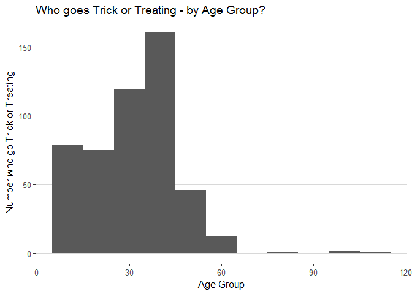
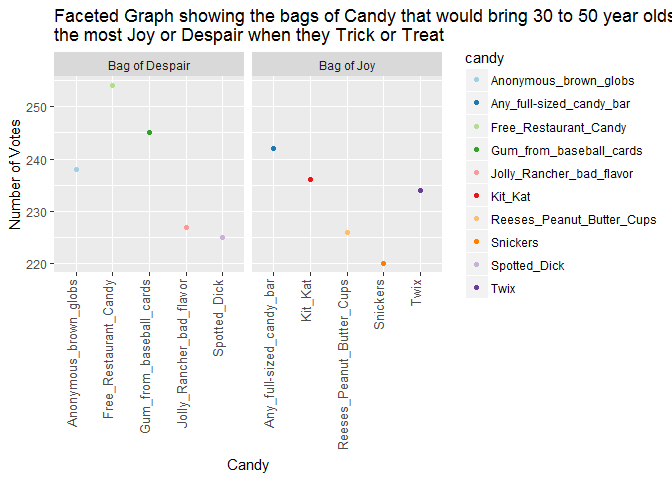
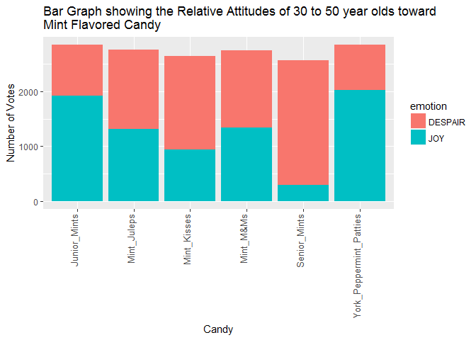

STAT545-HW06
================
Shirlett
November 5, 2017

-   [1. String Instruments from <http://r4ds.had.co.nz/strings.html>](#string-instruments-from-httpr4ds.had.co.nzstrings.html)
    -   [14.2.5 - String Basics](#string-basics)
    -   [14.3.1.1 - Basic Matches](#basic-matches)
    -   [14.3.2.1 - Anchors](#anchors)
    -   [14.3.3.1 - Character Classes and Alternatives](#character-classes-and-alternatives)
    -   [14.3.4.1 - Repetition](#repetition)
    -   [14.3.5.1 - Grouping and Backreferences](#grouping-and-backreferences)
    -   [14.4.2 - Detect Matches](#detect-matches)
    -   [14.4.3.1 - Extract Matches](#extract-matches)
    -   [14.4.4.1 - Grouped Matches](#grouped-matches)
    -   [14.4.5.1- Replacing Matches](#replacing-matches)
    -   [14.4.6.1 - Splitting](#splitting)
    -   [14.5.1 - Other Patterns](#other-patterns)
    -   [14.7.1 - Stringi](#stringi)
-   [3. Candy Survey Results](#candy-survey-results)
    -   [Data Cleansing](#data-cleansing)
    -   [Profile of Trick or Treaters](#profile-of-trick-or-treaters)
    -   [Bags of Joy or Bags of Despair to Trick or Treaters](#bags-of-joy-or-bags-of-despair-to-trick-or-treaters)
    -   [What About the General Attitude of Specific Age Groups toward Mint Flavored Candy?](#what-about-the-general-attitude-of-specific-age-groups-toward-mint-flavored-candy)
-   [4. Addresses of Singers/Bands using Google Map API](#addresses-of-singersbands-using-google-map-api)
    -   [Extraction of reverse geographic codes](#extraction-of-reverse-geographic-codes)
    -   [Assess the accuracy of the city name in the Singer dataset](#assess-the-accuracy-of-the-city-name-in-the-singer-dataset)
    -   [Geographic depiction of the bands that had true matches with Google's Map API](#geographic-depiction-of-the-bands-that-had-true-matches-with-googles-map-api)

1. String Instruments from <http://r4ds.had.co.nz/strings.html>
===============================================================

14.2.5 - String Basics
----------------------

``` r
#1.
#Paste prints strings and leaves a space separator by default
(pst<-paste("Tom", "Dick", "Harry", NA)) 
```

    ## [1] "Tom Dick Harry NA"

``` r
#Paste0 prints strings and omits the space between the strings
(pst0<-paste0("Tom", "Dick", "Harry", NA)) 
```

    ## [1] "TomDickHarryNA"

``` r
#Both paste and paste0 are roughly equivalent to the str_c but paste0 more closely replicates 

#the  str_c function
(strc <- str_c("Tom", "Dick", "Harry", NA)) 
```

    ## [1] NA

``` r
#Paste functions treat NA as they would any other string and prints NA, whereas str_c sees it as

#missing data that has to be replaced


#2.The sep arguement is an indication of the string to insert between vectors whereas collapse

#is an indication of the string that should be used to combine vectors into a single string.
str_c("a","b", c("c","d"), sep = " ", collapse = ",")
```

    ## [1] "a b c,a b d"

``` r
str_c("a","b", c("c","d"), sep = " ")
```

    ## [1] "a b c" "a b d"

``` r
#3.Using str_length and str_sub to extract a middle character(s) whether the length of the

#string is odd or even

#Function to test the length of a given string
my_string <- function(x) {
if((str_length(x) %% 2) == 0) {
    str_sub(x, (str_length(x)/2), ((str_length(x)/2)+1))
} else {
    str_sub(x, ((str_length(x)+1)/2), ((str_length(x)+1)/2))
}
}

my_string("middle")
```

    ## [1] "dd"

``` r
my_string("tower")
```

    ## [1] "w"

``` r
#4.
str_wrap("str_wrap can be used to format paragraphs by controlling the width and indentation. This is useful for printing long paragraphs", width=60)
```

    ## [1] "str_wrap can be used to format paragraphs by controlling\nthe width and indentation. This is useful for printing long\nparagraphs"

``` r
#5.str_trim removes whitespace to the left or right of strings. Its counterpart 

#is str_pad() which adds whitespace.

#6.Convert a vector of strings into a single string and consider less than optimal vector

#lengths, such as two, one or zero

x = c("a", "b", "c")
y = c("a", "b")
z = c("a")
alpha = c("")

#Function to test the length of vector and modify format of the output accordingly
my_conversion <- function(vec) {
  converted <- ""
  if (length(vec) < 2)
  {
    converted <- str_c(vec)
  }
  else if (length(vec) == 2)
  {
    converted <- str_c(converted, vec[1], " and ", vec[2])
  }
  else
  {
    for (i in 1:(length(vec)-2))
    {
      converted <- str_c(converted, vec[i], ", ")
    }
    converted <- str_c(converted, vec[length(vec)-1], ", and ", vec[length(vec)])
  }
  return(converted)
}

my_conversion(x)
```

    ## [1] "a, b, and c"

``` r
my_conversion(y)
```

    ## [1] "a and b"

``` r
my_conversion(z)
```

    ## [1] "a"

``` r
my_conversion(alpha)
```

    ## [1] ""

14.3.1.1 - Basic Matches
------------------------

``` r
#1. Explanation of why each of these strings don’t match a \: "\", "\\", "\\\".

#"\" indicates an escape from prior text

#"\\" indicates the creation of a regular expression and be recognized as \

#"\\\" indicates that the backslash character needs to be matched


#2. Matching the sequence "'\

test<- "\"'\\"
str_view(test, "\\\"'\\\\")
```

<!--html_preserve-->

<script type="application/json" data-for="htmlwidget-948da71d142a16e96e54">{"x":{"html":"<ul>\n  <li><span class='match'>\"'\\\u003c/span>\u003c/li>\n\u003c/ul>"},"evals":[],"jsHooks":[]}</script>
<!--/html_preserve-->
``` r
#3. Patterns matched by the regular expression \..\..\.

test2 <- "covers.x.y.z"
str_view(test2, "\\..\\..\\..")
```

<!--html_preserve-->

<script type="application/json" data-for="htmlwidget-98f920e5b19c78cfec95">{"x":{"html":"<ul>\n  <li>covers<span class='match'>.x.y.z\u003c/span>\u003c/li>\n\u003c/ul>"},"evals":[],"jsHooks":[]}</script>
<!--/html_preserve-->
``` r
#Patterns that are a dot followed by any character, three consecutive times
```

14.3.2.1 - Anchors
------------------

``` r
#1. Match the literal string "$^$"
test3<- "goodness$^$gracious"
str_view(test3, "\\$\\^\\$")
```

<!--html_preserve-->

<script type="application/json" data-for="htmlwidget-93443199e2aef8b41fc1">{"x":{"html":"<ul>\n  <li>goodness<span class='match'>$^$\u003c/span>gracious\u003c/li>\n\u003c/ul>"},"evals":[],"jsHooks":[]}</script>
<!--/html_preserve-->
``` r
#2. Regular Expressions to match common words in stringr::words:
#that start with y
str_view(words, "^y", match = TRUE)
```

<!--html_preserve-->

<script type="application/json" data-for="htmlwidget-e30314f220f2d0fdc219">{"x":{"html":"<ul>\n  <li><span class='match'>y\u003c/span>ear\u003c/li>\n  <li><span class='match'>y\u003c/span>es\u003c/li>\n  <li><span class='match'>y\u003c/span>esterday\u003c/li>\n  <li><span class='match'>y\u003c/span>et\u003c/li>\n  <li><span class='match'>y\u003c/span>ou\u003c/li>\n  <li><span class='match'>y\u003c/span>oung\u003c/li>\n\u003c/ul>"},"evals":[],"jsHooks":[]}</script>
<!--/html_preserve-->
``` r
#that end with x
str_view(words, "x$", match = TRUE)
```

<!--html_preserve-->

<script type="application/json" data-for="htmlwidget-d05b3b50e23dc46c1dac">{"x":{"html":"<ul>\n  <li>bo<span class='match'>x\u003c/span>\u003c/li>\n  <li>se<span class='match'>x\u003c/span>\u003c/li>\n  <li>si<span class='match'>x\u003c/span>\u003c/li>\n  <li>ta<span class='match'>x\u003c/span>\u003c/li>\n\u003c/ul>"},"evals":[],"jsHooks":[]}</script>
<!--/html_preserve-->
``` r
#are exactly three letters long
str_view(words, "^...$", match = TRUE)
```

<!--html_preserve-->

<script type="application/json" data-for="htmlwidget-703f961019af4f6efde9">{"x":{"html":"<ul>\n  <li><span class='match'>act\u003c/span>\u003c/li>\n  <li><span class='match'>add\u003c/span>\u003c/li>\n  <li><span class='match'>age\u003c/span>\u003c/li>\n  <li><span class='match'>ago\u003c/span>\u003c/li>\n  <li><span class='match'>air\u003c/span>\u003c/li>\n  <li><span class='match'>all\u003c/span>\u003c/li>\n  <li><span class='match'>and\u003c/span>\u003c/li>\n  <li><span class='match'>any\u003c/span>\u003c/li>\n  <li><span class='match'>arm\u003c/span>\u003c/li>\n  <li><span class='match'>art\u003c/span>\u003c/li>\n  <li><span class='match'>ask\u003c/span>\u003c/li>\n  <li><span class='match'>bad\u003c/span>\u003c/li>\n  <li><span class='match'>bag\u003c/span>\u003c/li>\n  <li><span class='match'>bar\u003c/span>\u003c/li>\n  <li><span class='match'>bed\u003c/span>\u003c/li>\n  <li><span class='match'>bet\u003c/span>\u003c/li>\n  <li><span class='match'>big\u003c/span>\u003c/li>\n  <li><span class='match'>bit\u003c/span>\u003c/li>\n  <li><span class='match'>box\u003c/span>\u003c/li>\n  <li><span class='match'>boy\u003c/span>\u003c/li>\n  <li><span class='match'>bus\u003c/span>\u003c/li>\n  <li><span class='match'>but\u003c/span>\u003c/li>\n  <li><span class='match'>buy\u003c/span>\u003c/li>\n  <li><span class='match'>can\u003c/span>\u003c/li>\n  <li><span class='match'>car\u003c/span>\u003c/li>\n  <li><span class='match'>cat\u003c/span>\u003c/li>\n  <li><span class='match'>cup\u003c/span>\u003c/li>\n  <li><span class='match'>cut\u003c/span>\u003c/li>\n  <li><span class='match'>dad\u003c/span>\u003c/li>\n  <li><span class='match'>day\u003c/span>\u003c/li>\n  <li><span class='match'>die\u003c/span>\u003c/li>\n  <li><span class='match'>dog\u003c/span>\u003c/li>\n  <li><span class='match'>dry\u003c/span>\u003c/li>\n  <li><span class='match'>due\u003c/span>\u003c/li>\n  <li><span class='match'>eat\u003c/span>\u003c/li>\n  <li><span class='match'>egg\u003c/span>\u003c/li>\n  <li><span class='match'>end\u003c/span>\u003c/li>\n  <li><span class='match'>eye\u003c/span>\u003c/li>\n  <li><span class='match'>far\u003c/span>\u003c/li>\n  <li><span class='match'>few\u003c/span>\u003c/li>\n  <li><span class='match'>fit\u003c/span>\u003c/li>\n  <li><span class='match'>fly\u003c/span>\u003c/li>\n  <li><span class='match'>for\u003c/span>\u003c/li>\n  <li><span class='match'>fun\u003c/span>\u003c/li>\n  <li><span class='match'>gas\u003c/span>\u003c/li>\n  <li><span class='match'>get\u003c/span>\u003c/li>\n  <li><span class='match'>god\u003c/span>\u003c/li>\n  <li><span class='match'>guy\u003c/span>\u003c/li>\n  <li><span class='match'>hit\u003c/span>\u003c/li>\n  <li><span class='match'>hot\u003c/span>\u003c/li>\n  <li><span class='match'>how\u003c/span>\u003c/li>\n  <li><span class='match'>job\u003c/span>\u003c/li>\n  <li><span class='match'>key\u003c/span>\u003c/li>\n  <li><span class='match'>kid\u003c/span>\u003c/li>\n  <li><span class='match'>lad\u003c/span>\u003c/li>\n  <li><span class='match'>law\u003c/span>\u003c/li>\n  <li><span class='match'>lay\u003c/span>\u003c/li>\n  <li><span class='match'>leg\u003c/span>\u003c/li>\n  <li><span class='match'>let\u003c/span>\u003c/li>\n  <li><span class='match'>lie\u003c/span>\u003c/li>\n  <li><span class='match'>lot\u003c/span>\u003c/li>\n  <li><span class='match'>low\u003c/span>\u003c/li>\n  <li><span class='match'>man\u003c/span>\u003c/li>\n  <li><span class='match'>may\u003c/span>\u003c/li>\n  <li><span class='match'>mrs\u003c/span>\u003c/li>\n  <li><span class='match'>new\u003c/span>\u003c/li>\n  <li><span class='match'>non\u003c/span>\u003c/li>\n  <li><span class='match'>not\u003c/span>\u003c/li>\n  <li><span class='match'>now\u003c/span>\u003c/li>\n  <li><span class='match'>odd\u003c/span>\u003c/li>\n  <li><span class='match'>off\u003c/span>\u003c/li>\n  <li><span class='match'>old\u003c/span>\u003c/li>\n  <li><span class='match'>one\u003c/span>\u003c/li>\n  <li><span class='match'>out\u003c/span>\u003c/li>\n  <li><span class='match'>own\u003c/span>\u003c/li>\n  <li><span class='match'>pay\u003c/span>\u003c/li>\n  <li><span class='match'>per\u003c/span>\u003c/li>\n  <li><span class='match'>put\u003c/span>\u003c/li>\n  <li><span class='match'>red\u003c/span>\u003c/li>\n  <li><span class='match'>rid\u003c/span>\u003c/li>\n  <li><span class='match'>run\u003c/span>\u003c/li>\n  <li><span class='match'>say\u003c/span>\u003c/li>\n  <li><span class='match'>see\u003c/span>\u003c/li>\n  <li><span class='match'>set\u003c/span>\u003c/li>\n  <li><span class='match'>sex\u003c/span>\u003c/li>\n  <li><span class='match'>she\u003c/span>\u003c/li>\n  <li><span class='match'>sir\u003c/span>\u003c/li>\n  <li><span class='match'>sit\u003c/span>\u003c/li>\n  <li><span class='match'>six\u003c/span>\u003c/li>\n  <li><span class='match'>son\u003c/span>\u003c/li>\n  <li><span class='match'>sun\u003c/span>\u003c/li>\n  <li><span class='match'>tax\u003c/span>\u003c/li>\n  <li><span class='match'>tea\u003c/span>\u003c/li>\n  <li><span class='match'>ten\u003c/span>\u003c/li>\n  <li><span class='match'>the\u003c/span>\u003c/li>\n  <li><span class='match'>tie\u003c/span>\u003c/li>\n  <li><span class='match'>too\u003c/span>\u003c/li>\n  <li><span class='match'>top\u003c/span>\u003c/li>\n  <li><span class='match'>try\u003c/span>\u003c/li>\n  <li><span class='match'>two\u003c/span>\u003c/li>\n  <li><span class='match'>use\u003c/span>\u003c/li>\n  <li><span class='match'>war\u003c/span>\u003c/li>\n  <li><span class='match'>way\u003c/span>\u003c/li>\n  <li><span class='match'>wee\u003c/span>\u003c/li>\n  <li><span class='match'>who\u003c/span>\u003c/li>\n  <li><span class='match'>why\u003c/span>\u003c/li>\n  <li><span class='match'>win\u003c/span>\u003c/li>\n  <li><span class='match'>yes\u003c/span>\u003c/li>\n  <li><span class='match'>yet\u003c/span>\u003c/li>\n  <li><span class='match'>you\u003c/span>\u003c/li>\n\u003c/ul>"},"evals":[],"jsHooks":[]}</script>
<!--/html_preserve-->
``` r
#have seven letters or more
str_view(words, ".......", match = TRUE)
```

<!--html_preserve-->

<script type="application/json" data-for="htmlwidget-ce3f7c8823efb537a95f">{"x":{"html":"<ul>\n  <li><span class='match'>absolut\u003c/span>e\u003c/li>\n  <li><span class='match'>account\u003c/span>\u003c/li>\n  <li><span class='match'>achieve\u003c/span>\u003c/li>\n  <li><span class='match'>address\u003c/span>\u003c/li>\n  <li><span class='match'>adverti\u003c/span>se\u003c/li>\n  <li><span class='match'>afterno\u003c/span>on\u003c/li>\n  <li><span class='match'>against\u003c/span>\u003c/li>\n  <li><span class='match'>already\u003c/span>\u003c/li>\n  <li><span class='match'>alright\u003c/span>\u003c/li>\n  <li><span class='match'>althoug\u003c/span>h\u003c/li>\n  <li><span class='match'>america\u003c/span>\u003c/li>\n  <li><span class='match'>another\u003c/span>\u003c/li>\n  <li><span class='match'>apparen\u003c/span>t\u003c/li>\n  <li><span class='match'>appoint\u003c/span>\u003c/li>\n  <li><span class='match'>approac\u003c/span>h\u003c/li>\n  <li><span class='match'>appropr\u003c/span>iate\u003c/li>\n  <li><span class='match'>arrange\u003c/span>\u003c/li>\n  <li><span class='match'>associa\u003c/span>te\u003c/li>\n  <li><span class='match'>authori\u003c/span>ty\u003c/li>\n  <li><span class='match'>availab\u003c/span>le\u003c/li>\n  <li><span class='match'>balance\u003c/span>\u003c/li>\n  <li><span class='match'>because\u003c/span>\u003c/li>\n  <li><span class='match'>believe\u003c/span>\u003c/li>\n  <li><span class='match'>benefit\u003c/span>\u003c/li>\n  <li><span class='match'>between\u003c/span>\u003c/li>\n  <li><span class='match'>brillia\u003c/span>nt\u003c/li>\n  <li><span class='match'>britain\u003c/span>\u003c/li>\n  <li><span class='match'>brother\u003c/span>\u003c/li>\n  <li><span class='match'>busines\u003c/span>s\u003c/li>\n  <li><span class='match'>certain\u003c/span>\u003c/li>\n  <li><span class='match'>chairma\u003c/span>n\u003c/li>\n  <li><span class='match'>charact\u003c/span>er\u003c/li>\n  <li><span class='match'>Christm\u003c/span>as\u003c/li>\n  <li><span class='match'>colleag\u003c/span>ue\u003c/li>\n  <li><span class='match'>collect\u003c/span>\u003c/li>\n  <li><span class='match'>college\u003c/span>\u003c/li>\n  <li><span class='match'>comment\u003c/span>\u003c/li>\n  <li><span class='match'>committ\u003c/span>ee\u003c/li>\n  <li><span class='match'>communi\u003c/span>ty\u003c/li>\n  <li><span class='match'>company\u003c/span>\u003c/li>\n  <li><span class='match'>compare\u003c/span>\u003c/li>\n  <li><span class='match'>complet\u003c/span>e\u003c/li>\n  <li><span class='match'>compute\u003c/span>\u003c/li>\n  <li><span class='match'>concern\u003c/span>\u003c/li>\n  <li><span class='match'>conditi\u003c/span>on\u003c/li>\n  <li><span class='match'>conside\u003c/span>r\u003c/li>\n  <li><span class='match'>consult\u003c/span>\u003c/li>\n  <li><span class='match'>contact\u003c/span>\u003c/li>\n  <li><span class='match'>continu\u003c/span>e\u003c/li>\n  <li><span class='match'>contrac\u003c/span>t\u003c/li>\n  <li><span class='match'>control\u003c/span>\u003c/li>\n  <li><span class='match'>convers\u003c/span>e\u003c/li>\n  <li><span class='match'>correct\u003c/span>\u003c/li>\n  <li><span class='match'>council\u003c/span>\u003c/li>\n  <li><span class='match'>country\u003c/span>\u003c/li>\n  <li><span class='match'>current\u003c/span>\u003c/li>\n  <li><span class='match'>decisio\u003c/span>n\u003c/li>\n  <li><span class='match'>definit\u003c/span>e\u003c/li>\n  <li><span class='match'>departm\u003c/span>ent\u003c/li>\n  <li><span class='match'>describ\u003c/span>e\u003c/li>\n  <li><span class='match'>develop\u003c/span>\u003c/li>\n  <li><span class='match'>differe\u003c/span>nce\u003c/li>\n  <li><span class='match'>difficu\u003c/span>lt\u003c/li>\n  <li><span class='match'>discuss\u003c/span>\u003c/li>\n  <li><span class='match'>distric\u003c/span>t\u003c/li>\n  <li><span class='match'>documen\u003c/span>t\u003c/li>\n  <li><span class='match'>economy\u003c/span>\u003c/li>\n  <li><span class='match'>educate\u003c/span>\u003c/li>\n  <li><span class='match'>electri\u003c/span>c\u003c/li>\n  <li><span class='match'>encoura\u003c/span>ge\u003c/li>\n  <li><span class='match'>english\u003c/span>\u003c/li>\n  <li><span class='match'>environ\u003c/span>ment\u003c/li>\n  <li><span class='match'>especia\u003c/span>l\u003c/li>\n  <li><span class='match'>evening\u003c/span>\u003c/li>\n  <li><span class='match'>evidenc\u003c/span>e\u003c/li>\n  <li><span class='match'>example\u003c/span>\u003c/li>\n  <li><span class='match'>exercis\u003c/span>e\u003c/li>\n  <li><span class='match'>expense\u003c/span>\u003c/li>\n  <li><span class='match'>experie\u003c/span>nce\u003c/li>\n  <li><span class='match'>explain\u003c/span>\u003c/li>\n  <li><span class='match'>express\u003c/span>\u003c/li>\n  <li><span class='match'>finance\u003c/span>\u003c/li>\n  <li><span class='match'>fortune\u003c/span>\u003c/li>\n  <li><span class='match'>forward\u003c/span>\u003c/li>\n  <li><span class='match'>functio\u003c/span>n\u003c/li>\n  <li><span class='match'>further\u003c/span>\u003c/li>\n  <li><span class='match'>general\u003c/span>\u003c/li>\n  <li><span class='match'>germany\u003c/span>\u003c/li>\n  <li><span class='match'>goodbye\u003c/span>\u003c/li>\n  <li><span class='match'>history\u003c/span>\u003c/li>\n  <li><span class='match'>holiday\u003c/span>\u003c/li>\n  <li><span class='match'>hospita\u003c/span>l\u003c/li>\n  <li><span class='match'>however\u003c/span>\u003c/li>\n  <li><span class='match'>hundred\u003c/span>\u003c/li>\n  <li><span class='match'>husband\u003c/span>\u003c/li>\n  <li><span class='match'>identif\u003c/span>y\u003c/li>\n  <li><span class='match'>imagine\u003c/span>\u003c/li>\n  <li><span class='match'>importa\u003c/span>nt\u003c/li>\n  <li><span class='match'>improve\u003c/span>\u003c/li>\n  <li><span class='match'>include\u003c/span>\u003c/li>\n  <li><span class='match'>increas\u003c/span>e\u003c/li>\n  <li><span class='match'>individ\u003c/span>ual\u003c/li>\n  <li><span class='match'>industr\u003c/span>y\u003c/li>\n  <li><span class='match'>instead\u003c/span>\u003c/li>\n  <li><span class='match'>interes\u003c/span>t\u003c/li>\n  <li><span class='match'>introdu\u003c/span>ce\u003c/li>\n  <li><span class='match'>involve\u003c/span>\u003c/li>\n  <li><span class='match'>kitchen\u003c/span>\u003c/li>\n  <li><span class='match'>languag\u003c/span>e\u003c/li>\n  <li><span class='match'>machine\u003c/span>\u003c/li>\n  <li><span class='match'>meaning\u003c/span>\u003c/li>\n  <li><span class='match'>measure\u003c/span>\u003c/li>\n  <li><span class='match'>mention\u003c/span>\u003c/li>\n  <li><span class='match'>million\u003c/span>\u003c/li>\n  <li><span class='match'>ministe\u003c/span>r\u003c/li>\n  <li><span class='match'>morning\u003c/span>\u003c/li>\n  <li><span class='match'>necessa\u003c/span>ry\u003c/li>\n  <li><span class='match'>obvious\u003c/span>\u003c/li>\n  <li><span class='match'>occasio\u003c/span>n\u003c/li>\n  <li><span class='match'>operate\u003c/span>\u003c/li>\n  <li><span class='match'>opportu\u003c/span>nity\u003c/li>\n  <li><span class='match'>organiz\u003c/span>e\u003c/li>\n  <li><span class='match'>origina\u003c/span>l\u003c/li>\n  <li><span class='match'>otherwi\u003c/span>se\u003c/li>\n  <li><span class='match'>paragra\u003c/span>ph\u003c/li>\n  <li><span class='match'>particu\u003c/span>lar\u003c/li>\n  <li><span class='match'>pension\u003c/span>\u003c/li>\n  <li><span class='match'>percent\u003c/span>\u003c/li>\n  <li><span class='match'>perfect\u003c/span>\u003c/li>\n  <li><span class='match'>perhaps\u003c/span>\u003c/li>\n  <li><span class='match'>photogr\u003c/span>aph\u003c/li>\n  <li><span class='match'>picture\u003c/span>\u003c/li>\n  <li><span class='match'>politic\u003c/span>\u003c/li>\n  <li><span class='match'>positio\u003c/span>n\u003c/li>\n  <li><span class='match'>positiv\u003c/span>e\u003c/li>\n  <li><span class='match'>possibl\u003c/span>e\u003c/li>\n  <li><span class='match'>practis\u003c/span>e\u003c/li>\n  <li><span class='match'>prepare\u003c/span>\u003c/li>\n  <li><span class='match'>present\u003c/span>\u003c/li>\n  <li><span class='match'>pressur\u003c/span>e\u003c/li>\n  <li><span class='match'>presume\u003c/span>\u003c/li>\n  <li><span class='match'>previou\u003c/span>s\u003c/li>\n  <li><span class='match'>private\u003c/span>\u003c/li>\n  <li><span class='match'>probabl\u003c/span>e\u003c/li>\n  <li><span class='match'>problem\u003c/span>\u003c/li>\n  <li><span class='match'>proceed\u003c/span>\u003c/li>\n  <li><span class='match'>process\u003c/span>\u003c/li>\n  <li><span class='match'>produce\u003c/span>\u003c/li>\n  <li><span class='match'>product\u003c/span>\u003c/li>\n  <li><span class='match'>program\u003c/span>me\u003c/li>\n  <li><span class='match'>project\u003c/span>\u003c/li>\n  <li><span class='match'>propose\u003c/span>\u003c/li>\n  <li><span class='match'>protect\u003c/span>\u003c/li>\n  <li><span class='match'>provide\u003c/span>\u003c/li>\n  <li><span class='match'>purpose\u003c/span>\u003c/li>\n  <li><span class='match'>quality\u003c/span>\u003c/li>\n  <li><span class='match'>quarter\u003c/span>\u003c/li>\n  <li><span class='match'>questio\u003c/span>n\u003c/li>\n  <li><span class='match'>realise\u003c/span>\u003c/li>\n  <li><span class='match'>receive\u003c/span>\u003c/li>\n  <li><span class='match'>recogni\u003c/span>ze\u003c/li>\n  <li><span class='match'>recomme\u003c/span>nd\u003c/li>\n  <li><span class='match'>relatio\u003c/span>n\u003c/li>\n  <li><span class='match'>remembe\u003c/span>r\u003c/li>\n  <li><span class='match'>represe\u003c/span>nt\u003c/li>\n  <li><span class='match'>require\u003c/span>\u003c/li>\n  <li><span class='match'>researc\u003c/span>h\u003c/li>\n  <li><span class='match'>resourc\u003c/span>e\u003c/li>\n  <li><span class='match'>respect\u003c/span>\u003c/li>\n  <li><span class='match'>respons\u003c/span>ible\u003c/li>\n  <li><span class='match'>saturda\u003c/span>y\u003c/li>\n  <li><span class='match'>science\u003c/span>\u003c/li>\n  <li><span class='match'>scotlan\u003c/span>d\u003c/li>\n  <li><span class='match'>secreta\u003c/span>ry\u003c/li>\n  <li><span class='match'>section\u003c/span>\u003c/li>\n  <li><span class='match'>separat\u003c/span>e\u003c/li>\n  <li><span class='match'>serious\u003c/span>\u003c/li>\n  <li><span class='match'>service\u003c/span>\u003c/li>\n  <li><span class='match'>similar\u003c/span>\u003c/li>\n  <li><span class='match'>situate\u003c/span>\u003c/li>\n  <li><span class='match'>society\u003c/span>\u003c/li>\n  <li><span class='match'>special\u003c/span>\u003c/li>\n  <li><span class='match'>specifi\u003c/span>c\u003c/li>\n  <li><span class='match'>standar\u003c/span>d\u003c/li>\n  <li><span class='match'>station\u003c/span>\u003c/li>\n  <li><span class='match'>straigh\u003c/span>t\u003c/li>\n  <li><span class='match'>strateg\u003c/span>y\u003c/li>\n  <li><span class='match'>structu\u003c/span>re\u003c/li>\n  <li><span class='match'>student\u003c/span>\u003c/li>\n  <li><span class='match'>subject\u003c/span>\u003c/li>\n  <li><span class='match'>succeed\u003c/span>\u003c/li>\n  <li><span class='match'>suggest\u003c/span>\u003c/li>\n  <li><span class='match'>support\u003c/span>\u003c/li>\n  <li><span class='match'>suppose\u003c/span>\u003c/li>\n  <li><span class='match'>surpris\u003c/span>e\u003c/li>\n  <li><span class='match'>telepho\u003c/span>ne\u003c/li>\n  <li><span class='match'>televis\u003c/span>ion\u003c/li>\n  <li><span class='match'>terribl\u003c/span>e\u003c/li>\n  <li><span class='match'>therefo\u003c/span>re\u003c/li>\n  <li><span class='match'>thirtee\u003c/span>n\u003c/li>\n  <li><span class='match'>thousan\u003c/span>d\u003c/li>\n  <li><span class='match'>through\u003c/span>\u003c/li>\n  <li><span class='match'>thursda\u003c/span>y\u003c/li>\n  <li><span class='match'>togethe\u003c/span>r\u003c/li>\n  <li><span class='match'>tomorro\u003c/span>w\u003c/li>\n  <li><span class='match'>tonight\u003c/span>\u003c/li>\n  <li><span class='match'>traffic\u003c/span>\u003c/li>\n  <li><span class='match'>transpo\u003c/span>rt\u003c/li>\n  <li><span class='match'>trouble\u003c/span>\u003c/li>\n  <li><span class='match'>tuesday\u003c/span>\u003c/li>\n  <li><span class='match'>underst\u003c/span>and\u003c/li>\n  <li><span class='match'>univers\u003c/span>ity\u003c/li>\n  <li><span class='match'>various\u003c/span>\u003c/li>\n  <li><span class='match'>village\u003c/span>\u003c/li>\n  <li><span class='match'>wednesd\u003c/span>ay\u003c/li>\n  <li><span class='match'>welcome\u003c/span>\u003c/li>\n  <li><span class='match'>whether\u003c/span>\u003c/li>\n  <li><span class='match'>without\u003c/span>\u003c/li>\n  <li><span class='match'>yesterd\u003c/span>ay\u003c/li>\n\u003c/ul>"},"evals":[],"jsHooks":[]}</script>
<!--/html_preserve-->
14.3.3.1 - Character Classes and Alternatives
---------------------------------------------

``` r
#1. Regular expressions to find words that:
#Start with a vowel
str_view(words, "^[aeouiy]", match = TRUE)
```

<!--html_preserve-->

<script type="application/json" data-for="htmlwidget-4591d703b7b0b7396cf7">{"x":{"html":"<ul>\n  <li><span class='match'>a\u003c/span>\u003c/li>\n  <li><span class='match'>a\u003c/span>ble\u003c/li>\n  <li><span class='match'>a\u003c/span>bout\u003c/li>\n  <li><span class='match'>a\u003c/span>bsolute\u003c/li>\n  <li><span class='match'>a\u003c/span>ccept\u003c/li>\n  <li><span class='match'>a\u003c/span>ccount\u003c/li>\n  <li><span class='match'>a\u003c/span>chieve\u003c/li>\n  <li><span class='match'>a\u003c/span>cross\u003c/li>\n  <li><span class='match'>a\u003c/span>ct\u003c/li>\n  <li><span class='match'>a\u003c/span>ctive\u003c/li>\n  <li><span class='match'>a\u003c/span>ctual\u003c/li>\n  <li><span class='match'>a\u003c/span>dd\u003c/li>\n  <li><span class='match'>a\u003c/span>ddress\u003c/li>\n  <li><span class='match'>a\u003c/span>dmit\u003c/li>\n  <li><span class='match'>a\u003c/span>dvertise\u003c/li>\n  <li><span class='match'>a\u003c/span>ffect\u003c/li>\n  <li><span class='match'>a\u003c/span>fford\u003c/li>\n  <li><span class='match'>a\u003c/span>fter\u003c/li>\n  <li><span class='match'>a\u003c/span>fternoon\u003c/li>\n  <li><span class='match'>a\u003c/span>gain\u003c/li>\n  <li><span class='match'>a\u003c/span>gainst\u003c/li>\n  <li><span class='match'>a\u003c/span>ge\u003c/li>\n  <li><span class='match'>a\u003c/span>gent\u003c/li>\n  <li><span class='match'>a\u003c/span>go\u003c/li>\n  <li><span class='match'>a\u003c/span>gree\u003c/li>\n  <li><span class='match'>a\u003c/span>ir\u003c/li>\n  <li><span class='match'>a\u003c/span>ll\u003c/li>\n  <li><span class='match'>a\u003c/span>llow\u003c/li>\n  <li><span class='match'>a\u003c/span>lmost\u003c/li>\n  <li><span class='match'>a\u003c/span>long\u003c/li>\n  <li><span class='match'>a\u003c/span>lready\u003c/li>\n  <li><span class='match'>a\u003c/span>lright\u003c/li>\n  <li><span class='match'>a\u003c/span>lso\u003c/li>\n  <li><span class='match'>a\u003c/span>lthough\u003c/li>\n  <li><span class='match'>a\u003c/span>lways\u003c/li>\n  <li><span class='match'>a\u003c/span>merica\u003c/li>\n  <li><span class='match'>a\u003c/span>mount\u003c/li>\n  <li><span class='match'>a\u003c/span>nd\u003c/li>\n  <li><span class='match'>a\u003c/span>nother\u003c/li>\n  <li><span class='match'>a\u003c/span>nswer\u003c/li>\n  <li><span class='match'>a\u003c/span>ny\u003c/li>\n  <li><span class='match'>a\u003c/span>part\u003c/li>\n  <li><span class='match'>a\u003c/span>pparent\u003c/li>\n  <li><span class='match'>a\u003c/span>ppear\u003c/li>\n  <li><span class='match'>a\u003c/span>pply\u003c/li>\n  <li><span class='match'>a\u003c/span>ppoint\u003c/li>\n  <li><span class='match'>a\u003c/span>pproach\u003c/li>\n  <li><span class='match'>a\u003c/span>ppropriate\u003c/li>\n  <li><span class='match'>a\u003c/span>rea\u003c/li>\n  <li><span class='match'>a\u003c/span>rgue\u003c/li>\n  <li><span class='match'>a\u003c/span>rm\u003c/li>\n  <li><span class='match'>a\u003c/span>round\u003c/li>\n  <li><span class='match'>a\u003c/span>rrange\u003c/li>\n  <li><span class='match'>a\u003c/span>rt\u003c/li>\n  <li><span class='match'>a\u003c/span>s\u003c/li>\n  <li><span class='match'>a\u003c/span>sk\u003c/li>\n  <li><span class='match'>a\u003c/span>ssociate\u003c/li>\n  <li><span class='match'>a\u003c/span>ssume\u003c/li>\n  <li><span class='match'>a\u003c/span>t\u003c/li>\n  <li><span class='match'>a\u003c/span>ttend\u003c/li>\n  <li><span class='match'>a\u003c/span>uthority\u003c/li>\n  <li><span class='match'>a\u003c/span>vailable\u003c/li>\n  <li><span class='match'>a\u003c/span>ware\u003c/li>\n  <li><span class='match'>a\u003c/span>way\u003c/li>\n  <li><span class='match'>a\u003c/span>wful\u003c/li>\n  <li><span class='match'>e\u003c/span>ach\u003c/li>\n  <li><span class='match'>e\u003c/span>arly\u003c/li>\n  <li><span class='match'>e\u003c/span>ast\u003c/li>\n  <li><span class='match'>e\u003c/span>asy\u003c/li>\n  <li><span class='match'>e\u003c/span>at\u003c/li>\n  <li><span class='match'>e\u003c/span>conomy\u003c/li>\n  <li><span class='match'>e\u003c/span>ducate\u003c/li>\n  <li><span class='match'>e\u003c/span>ffect\u003c/li>\n  <li><span class='match'>e\u003c/span>gg\u003c/li>\n  <li><span class='match'>e\u003c/span>ight\u003c/li>\n  <li><span class='match'>e\u003c/span>ither\u003c/li>\n  <li><span class='match'>e\u003c/span>lect\u003c/li>\n  <li><span class='match'>e\u003c/span>lectric\u003c/li>\n  <li><span class='match'>e\u003c/span>leven\u003c/li>\n  <li><span class='match'>e\u003c/span>lse\u003c/li>\n  <li><span class='match'>e\u003c/span>mploy\u003c/li>\n  <li><span class='match'>e\u003c/span>ncourage\u003c/li>\n  <li><span class='match'>e\u003c/span>nd\u003c/li>\n  <li><span class='match'>e\u003c/span>ngine\u003c/li>\n  <li><span class='match'>e\u003c/span>nglish\u003c/li>\n  <li><span class='match'>e\u003c/span>njoy\u003c/li>\n  <li><span class='match'>e\u003c/span>nough\u003c/li>\n  <li><span class='match'>e\u003c/span>nter\u003c/li>\n  <li><span class='match'>e\u003c/span>nvironment\u003c/li>\n  <li><span class='match'>e\u003c/span>qual\u003c/li>\n  <li><span class='match'>e\u003c/span>special\u003c/li>\n  <li><span class='match'>e\u003c/span>urope\u003c/li>\n  <li><span class='match'>e\u003c/span>ven\u003c/li>\n  <li><span class='match'>e\u003c/span>vening\u003c/li>\n  <li><span class='match'>e\u003c/span>ver\u003c/li>\n  <li><span class='match'>e\u003c/span>very\u003c/li>\n  <li><span class='match'>e\u003c/span>vidence\u003c/li>\n  <li><span class='match'>e\u003c/span>xact\u003c/li>\n  <li><span class='match'>e\u003c/span>xample\u003c/li>\n  <li><span class='match'>e\u003c/span>xcept\u003c/li>\n  <li><span class='match'>e\u003c/span>xcuse\u003c/li>\n  <li><span class='match'>e\u003c/span>xercise\u003c/li>\n  <li><span class='match'>e\u003c/span>xist\u003c/li>\n  <li><span class='match'>e\u003c/span>xpect\u003c/li>\n  <li><span class='match'>e\u003c/span>xpense\u003c/li>\n  <li><span class='match'>e\u003c/span>xperience\u003c/li>\n  <li><span class='match'>e\u003c/span>xplain\u003c/li>\n  <li><span class='match'>e\u003c/span>xpress\u003c/li>\n  <li><span class='match'>e\u003c/span>xtra\u003c/li>\n  <li><span class='match'>e\u003c/span>ye\u003c/li>\n  <li><span class='match'>i\u003c/span>dea\u003c/li>\n  <li><span class='match'>i\u003c/span>dentify\u003c/li>\n  <li><span class='match'>i\u003c/span>f\u003c/li>\n  <li><span class='match'>i\u003c/span>magine\u003c/li>\n  <li><span class='match'>i\u003c/span>mportant\u003c/li>\n  <li><span class='match'>i\u003c/span>mprove\u003c/li>\n  <li><span class='match'>i\u003c/span>n\u003c/li>\n  <li><span class='match'>i\u003c/span>nclude\u003c/li>\n  <li><span class='match'>i\u003c/span>ncome\u003c/li>\n  <li><span class='match'>i\u003c/span>ncrease\u003c/li>\n  <li><span class='match'>i\u003c/span>ndeed\u003c/li>\n  <li><span class='match'>i\u003c/span>ndividual\u003c/li>\n  <li><span class='match'>i\u003c/span>ndustry\u003c/li>\n  <li><span class='match'>i\u003c/span>nform\u003c/li>\n  <li><span class='match'>i\u003c/span>nside\u003c/li>\n  <li><span class='match'>i\u003c/span>nstead\u003c/li>\n  <li><span class='match'>i\u003c/span>nsure\u003c/li>\n  <li><span class='match'>i\u003c/span>nterest\u003c/li>\n  <li><span class='match'>i\u003c/span>nto\u003c/li>\n  <li><span class='match'>i\u003c/span>ntroduce\u003c/li>\n  <li><span class='match'>i\u003c/span>nvest\u003c/li>\n  <li><span class='match'>i\u003c/span>nvolve\u003c/li>\n  <li><span class='match'>i\u003c/span>ssue\u003c/li>\n  <li><span class='match'>i\u003c/span>t\u003c/li>\n  <li><span class='match'>i\u003c/span>tem\u003c/li>\n  <li><span class='match'>o\u003c/span>bvious\u003c/li>\n  <li><span class='match'>o\u003c/span>ccasion\u003c/li>\n  <li><span class='match'>o\u003c/span>dd\u003c/li>\n  <li><span class='match'>o\u003c/span>f\u003c/li>\n  <li><span class='match'>o\u003c/span>ff\u003c/li>\n  <li><span class='match'>o\u003c/span>ffer\u003c/li>\n  <li><span class='match'>o\u003c/span>ffice\u003c/li>\n  <li><span class='match'>o\u003c/span>ften\u003c/li>\n  <li><span class='match'>o\u003c/span>kay\u003c/li>\n  <li><span class='match'>o\u003c/span>ld\u003c/li>\n  <li><span class='match'>o\u003c/span>n\u003c/li>\n  <li><span class='match'>o\u003c/span>nce\u003c/li>\n  <li><span class='match'>o\u003c/span>ne\u003c/li>\n  <li><span class='match'>o\u003c/span>nly\u003c/li>\n  <li><span class='match'>o\u003c/span>pen\u003c/li>\n  <li><span class='match'>o\u003c/span>perate\u003c/li>\n  <li><span class='match'>o\u003c/span>pportunity\u003c/li>\n  <li><span class='match'>o\u003c/span>ppose\u003c/li>\n  <li><span class='match'>o\u003c/span>r\u003c/li>\n  <li><span class='match'>o\u003c/span>rder\u003c/li>\n  <li><span class='match'>o\u003c/span>rganize\u003c/li>\n  <li><span class='match'>o\u003c/span>riginal\u003c/li>\n  <li><span class='match'>o\u003c/span>ther\u003c/li>\n  <li><span class='match'>o\u003c/span>therwise\u003c/li>\n  <li><span class='match'>o\u003c/span>ught\u003c/li>\n  <li><span class='match'>o\u003c/span>ut\u003c/li>\n  <li><span class='match'>o\u003c/span>ver\u003c/li>\n  <li><span class='match'>o\u003c/span>wn\u003c/li>\n  <li><span class='match'>u\u003c/span>nder\u003c/li>\n  <li><span class='match'>u\u003c/span>nderstand\u003c/li>\n  <li><span class='match'>u\u003c/span>nion\u003c/li>\n  <li><span class='match'>u\u003c/span>nit\u003c/li>\n  <li><span class='match'>u\u003c/span>nite\u003c/li>\n  <li><span class='match'>u\u003c/span>niversity\u003c/li>\n  <li><span class='match'>u\u003c/span>nless\u003c/li>\n  <li><span class='match'>u\u003c/span>ntil\u003c/li>\n  <li><span class='match'>u\u003c/span>p\u003c/li>\n  <li><span class='match'>u\u003c/span>pon\u003c/li>\n  <li><span class='match'>u\u003c/span>se\u003c/li>\n  <li><span class='match'>u\u003c/span>sual\u003c/li>\n  <li><span class='match'>y\u003c/span>ear\u003c/li>\n  <li><span class='match'>y\u003c/span>es\u003c/li>\n  <li><span class='match'>y\u003c/span>esterday\u003c/li>\n  <li><span class='match'>y\u003c/span>et\u003c/li>\n  <li><span class='match'>y\u003c/span>ou\u003c/li>\n  <li><span class='match'>y\u003c/span>oung\u003c/li>\n\u003c/ul>"},"evals":[],"jsHooks":[]}</script>
<!--/html_preserve-->
``` r
#Only contain consonants
str_view(words, "^[^aeouiy]*$", match = TRUE)
```

<!--html_preserve-->

<script type="application/json" data-for="htmlwidget-220bf49e8afa6a06d8ed">{"x":{"html":"<ul>\n  <li><span class='match'>mrs\u003c/span>\u003c/li>\n\u003c/ul>"},"evals":[],"jsHooks":[]}</script>
<!--/html_preserve-->
``` r
#End with ed but not with eed
str_view(words, "[^e]ed$", match = TRUE)
```

<!--html_preserve-->

<script type="application/json" data-for="htmlwidget-0a22cb6ef720ec737ed3">{"x":{"html":"<ul>\n  <li><span class='match'>bed\u003c/span>\u003c/li>\n  <li>hund<span class='match'>red\u003c/span>\u003c/li>\n  <li><span class='match'>red\u003c/span>\u003c/li>\n\u003c/ul>"},"evals":[],"jsHooks":[]}</script>
<!--/html_preserve-->
``` r
#End with ing or ise
str_view(words, "i(ng|se)$", match = TRUE)
```

<!--html_preserve-->

<script type="application/json" data-for="htmlwidget-10467e457b8d83526cf5">{"x":{"html":"<ul>\n  <li>advert<span class='match'>ise\u003c/span>\u003c/li>\n  <li>br<span class='match'>ing\u003c/span>\u003c/li>\n  <li>dur<span class='match'>ing\u003c/span>\u003c/li>\n  <li>even<span class='match'>ing\u003c/span>\u003c/li>\n  <li>exerc<span class='match'>ise\u003c/span>\u003c/li>\n  <li>k<span class='match'>ing\u003c/span>\u003c/li>\n  <li>mean<span class='match'>ing\u003c/span>\u003c/li>\n  <li>morn<span class='match'>ing\u003c/span>\u003c/li>\n  <li>otherw<span class='match'>ise\u003c/span>\u003c/li>\n  <li>pract<span class='match'>ise\u003c/span>\u003c/li>\n  <li>ra<span class='match'>ise\u003c/span>\u003c/li>\n  <li>real<span class='match'>ise\u003c/span>\u003c/li>\n  <li>r<span class='match'>ing\u003c/span>\u003c/li>\n  <li>r<span class='match'>ise\u003c/span>\u003c/li>\n  <li>s<span class='match'>ing\u003c/span>\u003c/li>\n  <li>surpr<span class='match'>ise\u003c/span>\u003c/li>\n  <li>th<span class='match'>ing\u003c/span>\u003c/li>\n\u003c/ul>"},"evals":[],"jsHooks":[]}</script>
<!--/html_preserve-->
``` r
#2.Verify the rule “i before e except after c”
#Well e comes before i in weigh
str_view(words, "([^c])ei", match = TRUE)
```

<!--html_preserve-->

<script type="application/json" data-for="htmlwidget-a2d8cc8b04632a9f115f">{"x":{"html":"<ul>\n  <li><span class='match'>wei\u003c/span>gh\u003c/li>\n\u003c/ul>"},"evals":[],"jsHooks":[]}</script>
<!--/html_preserve-->
``` r
#3. Verify that q is always followed by a u
#C'est vrai
str_view(words, "q[^u]", match = TRUE)
```

<!--html_preserve-->

<script type="application/json" data-for="htmlwidget-b1a6aa0525c45fc68e8b">{"x":{"html":"<ul>\n  <li>\u003c/li>\n\u003c/ul>"},"evals":[],"jsHooks":[]}</script>
<!--/html_preserve-->
``` r
#4. An expression that finds a word from British vs American English
str_view(words, "[a-z][a-z]our$", match = TRUE)
```

<!--html_preserve-->

<script type="application/json" data-for="htmlwidget-b14db13817b781d9bdd9">{"x":{"html":"<ul>\n  <li>c<span class='match'>olour\u003c/span>\u003c/li>\n  <li>f<span class='match'>avour\u003c/span>\u003c/li>\n  <li>l<span class='match'>abour\u003c/span>\u003c/li>\n\u003c/ul>"},"evals":[],"jsHooks":[]}</script>
<!--/html_preserve-->
``` r
#5. An expression that finds a string that will match phone numbers as written in Jamaica
phone <- (c("1876-928-4712", "186-748-422"))
str_view(phone, "1876-\\d\\d\\d-\\d\\d\\d\\d", match = TRUE)
```

<!--html_preserve-->

<script type="application/json" data-for="htmlwidget-71db3035698b4aa9f050">{"x":{"html":"<ul>\n  <li><span class='match'>1876-928-4712\u003c/span>\u003c/li>\n\u003c/ul>"},"evals":[],"jsHooks":[]}</script>
<!--/html_preserve-->
14.3.4.1 - Repetition
---------------------

``` r
#1. Equivalents in {m,n} form of the following:
#? - zero or one instance is equivalent to:
#{,n}: match one at most

#+ - one or more repeats is equivalent to:
#{n,}: n or more 


#* - zero or more repeats is only roughly equivalent to:
#{,m}: at most m


#2. Description of matches to the following regular expressions:
#^.*$ - This would match any length or any character
#"\\{.+\\}" - This would match at least one character
#\d{4}-\d{2}-\d{2} - This would match 4 repeated digits- 2 repeated digits - two repeated digits
# "\\\\{4}" - This would match \\\\


#3. Regular expressions to find words that:
#Start with three consonants.
str_view(words, "^[^aeouiy]{3}", match = TRUE)
```

<!--html_preserve-->

<script type="application/json" data-for="htmlwidget-bdf9cebd266bd607ac37">{"x":{"html":"<ul>\n  <li><span class='match'>Chr\u003c/span>ist\u003c/li>\n  <li><span class='match'>Chr\u003c/span>istmas\u003c/li>\n  <li><span class='match'>mrs\u003c/span>\u003c/li>\n  <li><span class='match'>sch\u003c/span>eme\u003c/li>\n  <li><span class='match'>sch\u003c/span>ool\u003c/li>\n  <li><span class='match'>str\u003c/span>aight\u003c/li>\n  <li><span class='match'>str\u003c/span>ategy\u003c/li>\n  <li><span class='match'>str\u003c/span>eet\u003c/li>\n  <li><span class='match'>str\u003c/span>ike\u003c/li>\n  <li><span class='match'>str\u003c/span>ong\u003c/li>\n  <li><span class='match'>str\u003c/span>ucture\u003c/li>\n  <li><span class='match'>thr\u003c/span>ee\u003c/li>\n  <li><span class='match'>thr\u003c/span>ough\u003c/li>\n  <li><span class='match'>thr\u003c/span>ow\u003c/li>\n\u003c/ul>"},"evals":[],"jsHooks":[]}</script>
<!--/html_preserve-->
``` r
#Have three or more vowels in a row.
str_view(words, "[aeouiy]{3,}", match = TRUE)
```

<!--html_preserve-->

<script type="application/json" data-for="htmlwidget-6d77231b451e4494bbc2">{"x":{"html":"<ul>\n  <li>b<span class='match'>eau\u003c/span>ty\u003c/li>\n  <li><span class='match'>eye\u003c/span>\u003c/li>\n  <li>obv<span class='match'>iou\u003c/span>s\u003c/li>\n  <li>prev<span class='match'>iou\u003c/span>s\u003c/li>\n  <li>q<span class='match'>uie\u003c/span>t\u003c/li>\n  <li>ser<span class='match'>iou\u003c/span>s\u003c/li>\n  <li>var<span class='match'>iou\u003c/span>s\u003c/li>\n  <li><span class='match'>yea\u003c/span>r\u003c/li>\n  <li><span class='match'>you\u003c/span>\u003c/li>\n  <li><span class='match'>you\u003c/span>ng\u003c/li>\n\u003c/ul>"},"evals":[],"jsHooks":[]}</script>
<!--/html_preserve-->
``` r
#Have two or more vowel-consonant pairs in a row.
str_view(words, "([aeouiy][^aeouiy]){2,}", match = TRUE)
```

<!--html_preserve-->

<script type="application/json" data-for="htmlwidget-07e3963fbfbcdd257bd0">{"x":{"html":"<ul>\n  <li>abs<span class='match'>olut\u003c/span>e\u003c/li>\n  <li><span class='match'>agen\u003c/span>t\u003c/li>\n  <li><span class='match'>alon\u003c/span>g\u003c/li>\n  <li><span class='match'>americ\u003c/span>a\u003c/li>\n  <li><span class='match'>anot\u003c/span>her\u003c/li>\n  <li><span class='match'>apar\u003c/span>t\u003c/li>\n  <li>app<span class='match'>aren\u003c/span>t\u003c/li>\n  <li>auth<span class='match'>orit\u003c/span>y\u003c/li>\n  <li>ava<span class='match'>ilab\u003c/span>le\u003c/li>\n  <li><span class='match'>awar\u003c/span>e\u003c/li>\n  <li>b<span class='match'>alan\u003c/span>ce\u003c/li>\n  <li>b<span class='match'>asis\u003c/span>\u003c/li>\n  <li>b<span class='match'>ecom\u003c/span>e\u003c/li>\n  <li>b<span class='match'>efor\u003c/span>e\u003c/li>\n  <li>b<span class='match'>egin\u003c/span>\u003c/li>\n  <li>b<span class='match'>ehin\u003c/span>d\u003c/li>\n  <li>b<span class='match'>enefit\u003c/span>\u003c/li>\n  <li>b<span class='match'>usines\u003c/span>s\u003c/li>\n  <li>ch<span class='match'>arac\u003c/span>ter\u003c/li>\n  <li>cl<span class='match'>oses\u003c/span>\u003c/li>\n  <li>comm<span class='match'>unit\u003c/span>y\u003c/li>\n  <li>cons<span class='match'>ider\u003c/span>\u003c/li>\n  <li>c<span class='match'>over\u003c/span>\u003c/li>\n  <li>d<span class='match'>ebat\u003c/span>e\u003c/li>\n  <li>d<span class='match'>ecid\u003c/span>e\u003c/li>\n  <li>d<span class='match'>ecis\u003c/span>ion\u003c/li>\n  <li>d<span class='match'>efinit\u003c/span>e\u003c/li>\n  <li>d<span class='match'>epar\u003c/span>tment\u003c/li>\n  <li>d<span class='match'>epen\u003c/span>d\u003c/li>\n  <li>d<span class='match'>esig\u003c/span>n\u003c/li>\n  <li>d<span class='match'>evelop\u003c/span>\u003c/li>\n  <li>diff<span class='match'>eren\u003c/span>ce\u003c/li>\n  <li>diff<span class='match'>icul\u003c/span>t\u003c/li>\n  <li>d<span class='match'>irec\u003c/span>t\u003c/li>\n  <li>d<span class='match'>ivid\u003c/span>e\u003c/li>\n  <li>d<span class='match'>ocumen\u003c/span>t\u003c/li>\n  <li>d<span class='match'>urin\u003c/span>g\u003c/li>\n  <li><span class='match'>econom\u003c/span>y\u003c/li>\n  <li><span class='match'>educat\u003c/span>e\u003c/li>\n  <li><span class='match'>elec\u003c/span>t\u003c/li>\n  <li><span class='match'>elec\u003c/span>tric\u003c/li>\n  <li><span class='match'>eleven\u003c/span>\u003c/li>\n  <li>enco<span class='match'>urag\u003c/span>e\u003c/li>\n  <li>env<span class='match'>iron\u003c/span>ment\u003c/li>\n  <li>e<span class='match'>urop\u003c/span>e\u003c/li>\n  <li><span class='match'>even\u003c/span>\u003c/li>\n  <li><span class='match'>evenin\u003c/span>g\u003c/li>\n  <li><span class='match'>ever\u003c/span>\u003c/li>\n  <li><span class='match'>ever\u003c/span>y\u003c/li>\n  <li><span class='match'>eviden\u003c/span>ce\u003c/li>\n  <li><span class='match'>exac\u003c/span>t\u003c/li>\n  <li><span class='match'>exam\u003c/span>ple\u003c/li>\n  <li><span class='match'>exer\u003c/span>cise\u003c/li>\n  <li><span class='match'>exis\u003c/span>t\u003c/li>\n  <li>f<span class='match'>amil\u003c/span>y\u003c/li>\n  <li>f<span class='match'>igur\u003c/span>e\u003c/li>\n  <li>f<span class='match'>inal\u003c/span>\u003c/li>\n  <li>f<span class='match'>inan\u003c/span>ce\u003c/li>\n  <li>f<span class='match'>inis\u003c/span>h\u003c/li>\n  <li>f<span class='match'>utur\u003c/span>e\u003c/li>\n  <li>g<span class='match'>eneral\u003c/span>\u003c/li>\n  <li>g<span class='match'>over\u003c/span>n\u003c/li>\n  <li>h<span class='match'>olid\u003c/span>ay\u003c/li>\n  <li>h<span class='match'>ones\u003c/span>t\u003c/li>\n  <li>hosp<span class='match'>ital\u003c/span>\u003c/li>\n  <li>h<span class='match'>owever\u003c/span>\u003c/li>\n  <li><span class='match'>iden\u003c/span>tify\u003c/li>\n  <li><span class='match'>imagin\u003c/span>e\u003c/li>\n  <li>ind<span class='match'>ivid\u003c/span>ual\u003c/li>\n  <li>int<span class='match'>eres\u003c/span>t\u003c/li>\n  <li>intr<span class='match'>oduc\u003c/span>e\u003c/li>\n  <li><span class='match'>item\u003c/span>\u003c/li>\n  <li>j<span class='match'>esus\u003c/span>\u003c/li>\n  <li>l<span class='match'>evel\u003c/span>\u003c/li>\n  <li>l<span class='match'>ikel\u003c/span>y\u003c/li>\n  <li>l<span class='match'>imit\u003c/span>\u003c/li>\n  <li>l<span class='match'>ocal\u003c/span>\u003c/li>\n  <li>m<span class='match'>ajor\u003c/span>\u003c/li>\n  <li>m<span class='match'>anag\u003c/span>e\u003c/li>\n  <li>me<span class='match'>anin\u003c/span>g\u003c/li>\n  <li>me<span class='match'>asur\u003c/span>e\u003c/li>\n  <li>m<span class='match'>inis\u003c/span>ter\u003c/li>\n  <li>m<span class='match'>inus\u003c/span>\u003c/li>\n  <li>m<span class='match'>inut\u003c/span>e\u003c/li>\n  <li>m<span class='match'>omen\u003c/span>t\u003c/li>\n  <li>m<span class='match'>usic\u003c/span>\u003c/li>\n  <li>n<span class='match'>atur\u003c/span>e\u003c/li>\n  <li>n<span class='match'>eces\u003c/span>sary\u003c/li>\n  <li>n<span class='match'>ever\u003c/span>\u003c/li>\n  <li>n<span class='match'>otic\u003c/span>e\u003c/li>\n  <li><span class='match'>open\u003c/span>\u003c/li>\n  <li><span class='match'>operat\u003c/span>e\u003c/li>\n  <li>opport<span class='match'>unit\u003c/span>y\u003c/li>\n  <li>org<span class='match'>aniz\u003c/span>e\u003c/li>\n  <li><span class='match'>original\u003c/span>\u003c/li>\n  <li><span class='match'>over\u003c/span>\u003c/li>\n  <li>p<span class='match'>aper\u003c/span>\u003c/li>\n  <li>p<span class='match'>arag\u003c/span>raph\u003c/li>\n  <li>p<span class='match'>aren\u003c/span>t\u003c/li>\n  <li>part<span class='match'>icular\u003c/span>\u003c/li>\n  <li>ph<span class='match'>otog\u003c/span>raph\u003c/li>\n  <li>p<span class='match'>olic\u003c/span>e\u003c/li>\n  <li>p<span class='match'>olic\u003c/span>y\u003c/li>\n  <li>p<span class='match'>olitic\u003c/span>\u003c/li>\n  <li>p<span class='match'>osit\u003c/span>ion\u003c/li>\n  <li>p<span class='match'>ositiv\u003c/span>e\u003c/li>\n  <li>p<span class='match'>ower\u003c/span>\u003c/li>\n  <li>pr<span class='match'>epar\u003c/span>e\u003c/li>\n  <li>pr<span class='match'>esen\u003c/span>t\u003c/li>\n  <li>pr<span class='match'>esum\u003c/span>e\u003c/li>\n  <li>pr<span class='match'>ivat\u003c/span>e\u003c/li>\n  <li>pr<span class='match'>obab\u003c/span>le\u003c/li>\n  <li>pr<span class='match'>oces\u003c/span>s\u003c/li>\n  <li>pr<span class='match'>oduc\u003c/span>e\u003c/li>\n  <li>pr<span class='match'>oduc\u003c/span>t\u003c/li>\n  <li>pr<span class='match'>ojec\u003c/span>t\u003c/li>\n  <li>pr<span class='match'>oper\u003c/span>\u003c/li>\n  <li>pr<span class='match'>opos\u003c/span>e\u003c/li>\n  <li>pr<span class='match'>otec\u003c/span>t\u003c/li>\n  <li>pr<span class='match'>ovid\u003c/span>e\u003c/li>\n  <li>qu<span class='match'>alit\u003c/span>y\u003c/li>\n  <li>re<span class='match'>alis\u003c/span>e\u003c/li>\n  <li>re<span class='match'>ason\u003c/span>\u003c/li>\n  <li>r<span class='match'>ecen\u003c/span>t\u003c/li>\n  <li>r<span class='match'>ecog\u003c/span>nize\u003c/li>\n  <li>r<span class='match'>ecom\u003c/span>mend\u003c/li>\n  <li>r<span class='match'>ecor\u003c/span>d\u003c/li>\n  <li>r<span class='match'>educ\u003c/span>e\u003c/li>\n  <li>r<span class='match'>efer\u003c/span>\u003c/li>\n  <li>r<span class='match'>egar\u003c/span>d\u003c/li>\n  <li>r<span class='match'>elat\u003c/span>ion\u003c/li>\n  <li>r<span class='match'>emem\u003c/span>ber\u003c/li>\n  <li>r<span class='match'>epor\u003c/span>t\u003c/li>\n  <li>repr<span class='match'>esen\u003c/span>t\u003c/li>\n  <li>r<span class='match'>esul\u003c/span>t\u003c/li>\n  <li>r<span class='match'>etur\u003c/span>n\u003c/li>\n  <li>s<span class='match'>atur\u003c/span>day\u003c/li>\n  <li>s<span class='match'>econ\u003c/span>d\u003c/li>\n  <li>secr<span class='match'>etar\u003c/span>y\u003c/li>\n  <li>s<span class='match'>ecur\u003c/span>e\u003c/li>\n  <li>s<span class='match'>eparat\u003c/span>e\u003c/li>\n  <li>s<span class='match'>even\u003c/span>\u003c/li>\n  <li>s<span class='match'>imilar\u003c/span>\u003c/li>\n  <li>sp<span class='match'>ecific\u003c/span>\u003c/li>\n  <li>str<span class='match'>ateg\u003c/span>y\u003c/li>\n  <li>st<span class='match'>uden\u003c/span>t\u003c/li>\n  <li>st<span class='match'>upid\u003c/span>\u003c/li>\n  <li>t<span class='match'>elep\u003c/span>hone\u003c/li>\n  <li>t<span class='match'>elevis\u003c/span>ion\u003c/li>\n  <li>th<span class='match'>erefor\u003c/span>e\u003c/li>\n  <li>tho<span class='match'>usan\u003c/span>d\u003c/li>\n  <li>t<span class='match'>oget\u003c/span>her\u003c/li>\n  <li>t<span class='match'>omor\u003c/span>row\u003c/li>\n  <li>t<span class='match'>onig\u003c/span>ht\u003c/li>\n  <li>t<span class='match'>otal\u003c/span>\u003c/li>\n  <li>t<span class='match'>owar\u003c/span>d\u003c/li>\n  <li>tr<span class='match'>avel\u003c/span>\u003c/li>\n  <li><span class='match'>unit\u003c/span>\u003c/li>\n  <li><span class='match'>unit\u003c/span>e\u003c/li>\n  <li><span class='match'>univer\u003c/span>sity\u003c/li>\n  <li><span class='match'>upon\u003c/span>\u003c/li>\n  <li>v<span class='match'>isit\u003c/span>\u003c/li>\n  <li>w<span class='match'>ater\u003c/span>\u003c/li>\n  <li>w<span class='match'>oman\u003c/span>\u003c/li>\n\u003c/ul>"},"evals":[],"jsHooks":[]}</script>
<!--/html_preserve-->
14.3.5.1 - Grouping and Backreferences
--------------------------------------

``` r
#1. Description of the matches to the following:
#(.)\1\1 - Matches any single characters that repeat three times
test4 = "ssstreat"
str_view(test4, "(.)\\1\\1", match = TRUE)
```

<!--html_preserve-->

<script type="application/json" data-for="htmlwidget-178e0afaf06d2baa3475">{"x":{"html":"<ul>\n  <li><span class='match'>sss\u003c/span>treat\u003c/li>\n\u003c/ul>"},"evals":[],"jsHooks":[]}</script>
<!--/html_preserve-->
``` r
#"(.)(.)\\2\\1" - matches any single non repeating character then a character that repeats 

#twice then the same first character
test5 = "abbacadabra"
str_view(test5, "(.)(.)\\2\\1", match = TRUE)
```

<!--html_preserve-->

<script type="application/json" data-for="htmlwidget-7c98e21b751eadf9575e">{"x":{"html":"<ul>\n  <li><span class='match'>abba\u003c/span>cadabra\u003c/li>\n\u003c/ul>"},"evals":[],"jsHooks":[]}</script>
<!--/html_preserve-->
``` r
#(..)\1 - Find repeated pair of letters
test6 = "cucumber" 
str_view(test6, "(..)\\1", match = TRUE)
```

<!--html_preserve-->

<script type="application/json" data-for="htmlwidget-c8050e83829ee0345d24">{"x":{"html":"<ul>\n  <li><span class='match'>cucu\u003c/span>mber\u003c/li>\n\u003c/ul>"},"evals":[],"jsHooks":[]}</script>
<!--/html_preserve-->
``` r
#"(.).\\1.\\1" - Match one character then any single character, then the same first character,
#then any single character, then another repeat of the first character
test7 = "tatet"
str_view(test7, "(.).\\1.\\1", match = TRUE)
```

<!--html_preserve-->

<script type="application/json" data-for="htmlwidget-8a05d51725921d1f0f7c">{"x":{"html":"<ul>\n  <li><span class='match'>tatet\u003c/span>\u003c/li>\n\u003c/ul>"},"evals":[],"jsHooks":[]}</script>
<!--/html_preserve-->
``` r
#"(.)(.)(.).*\\3\\2\\1" - Match 2-3 single characters, 0 or more random characters, then the 
#same first 2-3 characters in reverse
test8 = "abctatetcba"
str_view(test8, "(.)(.)(.).*\\3\\2\\1", match = TRUE)
```

<!--html_preserve-->

<script type="application/json" data-for="htmlwidget-470885e16c0fc4be9959">{"x":{"html":"<ul>\n  <li><span class='match'>abctatetcba\u003c/span>\u003c/li>\n\u003c/ul>"},"evals":[],"jsHooks":[]}</script>
<!--/html_preserve-->
``` r
#2. Regular expressions to match words that:

#Start and end with the same character.
str_view(words, "^(.).*\\1$", match = T)
```

<!--html_preserve-->

<script type="application/json" data-for="htmlwidget-47e04f7840e9663c8d4f">{"x":{"html":"<ul>\n  <li><span class='match'>america\u003c/span>\u003c/li>\n  <li><span class='match'>area\u003c/span>\u003c/li>\n  <li><span class='match'>dad\u003c/span>\u003c/li>\n  <li><span class='match'>dead\u003c/span>\u003c/li>\n  <li><span class='match'>depend\u003c/span>\u003c/li>\n  <li><span class='match'>educate\u003c/span>\u003c/li>\n  <li><span class='match'>else\u003c/span>\u003c/li>\n  <li><span class='match'>encourage\u003c/span>\u003c/li>\n  <li><span class='match'>engine\u003c/span>\u003c/li>\n  <li><span class='match'>europe\u003c/span>\u003c/li>\n  <li><span class='match'>evidence\u003c/span>\u003c/li>\n  <li><span class='match'>example\u003c/span>\u003c/li>\n  <li><span class='match'>excuse\u003c/span>\u003c/li>\n  <li><span class='match'>exercise\u003c/span>\u003c/li>\n  <li><span class='match'>expense\u003c/span>\u003c/li>\n  <li><span class='match'>experience\u003c/span>\u003c/li>\n  <li><span class='match'>eye\u003c/span>\u003c/li>\n  <li><span class='match'>health\u003c/span>\u003c/li>\n  <li><span class='match'>high\u003c/span>\u003c/li>\n  <li><span class='match'>knock\u003c/span>\u003c/li>\n  <li><span class='match'>level\u003c/span>\u003c/li>\n  <li><span class='match'>local\u003c/span>\u003c/li>\n  <li><span class='match'>nation\u003c/span>\u003c/li>\n  <li><span class='match'>non\u003c/span>\u003c/li>\n  <li><span class='match'>rather\u003c/span>\u003c/li>\n  <li><span class='match'>refer\u003c/span>\u003c/li>\n  <li><span class='match'>remember\u003c/span>\u003c/li>\n  <li><span class='match'>serious\u003c/span>\u003c/li>\n  <li><span class='match'>stairs\u003c/span>\u003c/li>\n  <li><span class='match'>test\u003c/span>\u003c/li>\n  <li><span class='match'>tonight\u003c/span>\u003c/li>\n  <li><span class='match'>transport\u003c/span>\u003c/li>\n  <li><span class='match'>treat\u003c/span>\u003c/li>\n  <li><span class='match'>trust\u003c/span>\u003c/li>\n  <li><span class='match'>window\u003c/span>\u003c/li>\n  <li><span class='match'>yesterday\u003c/span>\u003c/li>\n\u003c/ul>"},"evals":[],"jsHooks":[]}</script>
<!--/html_preserve-->
``` r
#Contain a repeated pair of letters (e.g. “church” contains “ch” repeated twice.)
str_view(words, "(..).*\\1", match = T)
```

<!--html_preserve-->

<script type="application/json" data-for="htmlwidget-39565f46c15f7bd08636">{"x":{"html":"<ul>\n  <li>ap<span class='match'>propr\u003c/span>iate\u003c/li>\n  <li><span class='match'>church\u003c/span>\u003c/li>\n  <li>c<span class='match'>ondition\u003c/span>\u003c/li>\n  <li><span class='match'>decide\u003c/span>\u003c/li>\n  <li><span class='match'>environmen\u003c/span>t\u003c/li>\n  <li>l<span class='match'>ondon\u003c/span>\u003c/li>\n  <li>pa<span class='match'>ragra\u003c/span>ph\u003c/li>\n  <li>p<span class='match'>articular\u003c/span>\u003c/li>\n  <li><span class='match'>photograph\u003c/span>\u003c/li>\n  <li>p<span class='match'>repare\u003c/span>\u003c/li>\n  <li>p<span class='match'>ressure\u003c/span>\u003c/li>\n  <li>r<span class='match'>emem\u003c/span>ber\u003c/li>\n  <li><span class='match'>repre\u003c/span>sent\u003c/li>\n  <li><span class='match'>require\u003c/span>\u003c/li>\n  <li><span class='match'>sense\u003c/span>\u003c/li>\n  <li>the<span class='match'>refore\u003c/span>\u003c/li>\n  <li>u<span class='match'>nderstand\u003c/span>\u003c/li>\n  <li>w<span class='match'>hethe\u003c/span>r\u003c/li>\n\u003c/ul>"},"evals":[],"jsHooks":[]}</script>
<!--/html_preserve-->
``` r
#Contain one letter repeated in at least three places (e.g. “eleven” contains three “e”s.)
str_view(words, "(.).*\\1.*\\1", match = T)
```

<!--html_preserve-->

<script type="application/json" data-for="htmlwidget-729f3236cf59b7364ff0">{"x":{"html":"<ul>\n  <li>a<span class='match'>pprop\u003c/span>riate\u003c/li>\n  <li><span class='match'>availa\u003c/span>ble\u003c/li>\n  <li>b<span class='match'>elieve\u003c/span>\u003c/li>\n  <li>b<span class='match'>etwee\u003c/span>n\u003c/li>\n  <li>bu<span class='match'>siness\u003c/span>\u003c/li>\n  <li>d<span class='match'>egree\u003c/span>\u003c/li>\n  <li>diff<span class='match'>erence\u003c/span>\u003c/li>\n  <li>di<span class='match'>scuss\u003c/span>\u003c/li>\n  <li><span class='match'>eleve\u003c/span>n\u003c/li>\n  <li>e<span class='match'>nvironmen\u003c/span>t\u003c/li>\n  <li><span class='match'>evidence\u003c/span>\u003c/li>\n  <li><span class='match'>exercise\u003c/span>\u003c/li>\n  <li><span class='match'>expense\u003c/span>\u003c/li>\n  <li><span class='match'>experience\u003c/span>\u003c/li>\n  <li><span class='match'>indivi\u003c/span>dual\u003c/li>\n  <li>p<span class='match'>aragra\u003c/span>ph\u003c/li>\n  <li>r<span class='match'>eceive\u003c/span>\u003c/li>\n  <li>r<span class='match'>emembe\u003c/span>r\u003c/li>\n  <li>r<span class='match'>eprese\u003c/span>nt\u003c/li>\n  <li>t<span class='match'>elephone\u003c/span>\u003c/li>\n  <li>th<span class='match'>erefore\u003c/span>\u003c/li>\n  <li>t<span class='match'>omorro\u003c/span>w\u003c/li>\n\u003c/ul>"},"evals":[],"jsHooks":[]}</script>
<!--/html_preserve-->
14.4.2 - Detect Matches
-----------------------

``` r
#1. Using Regular expressions and str_detect:
#Words that start or end with x
str_view(words, "^x|x$", match = TRUE)
```

<!--html_preserve-->

<script type="application/json" data-for="htmlwidget-ca19cb97cb3576ee5721">{"x":{"html":"<ul>\n  <li>bo<span class='match'>x\u003c/span>\u003c/li>\n  <li>se<span class='match'>x\u003c/span>\u003c/li>\n  <li>si<span class='match'>x\u003c/span>\u003c/li>\n  <li>ta<span class='match'>x\u003c/span>\u003c/li>\n\u003c/ul>"},"evals":[],"jsHooks":[]}</script>
<!--/html_preserve-->
``` r
start_with_x = str_detect(words, "^x")
end_with_x = str_detect(words, "x$")
words[start_with_x | end_with_x]
```

    ## [1] "box" "sex" "six" "tax"

``` r
#Words that start with a vowel and end with a consonant
str_view(words, "^[aeuioy].*[^aeuioy]$", match = TRUE)
```

<!--html_preserve-->

<script type="application/json" data-for="htmlwidget-8beec3cd1f4b3603464c">{"x":{"html":"<ul>\n  <li><span class='match'>about\u003c/span>\u003c/li>\n  <li><span class='match'>accept\u003c/span>\u003c/li>\n  <li><span class='match'>account\u003c/span>\u003c/li>\n  <li><span class='match'>across\u003c/span>\u003c/li>\n  <li><span class='match'>act\u003c/span>\u003c/li>\n  <li><span class='match'>actual\u003c/span>\u003c/li>\n  <li><span class='match'>add\u003c/span>\u003c/li>\n  <li><span class='match'>address\u003c/span>\u003c/li>\n  <li><span class='match'>admit\u003c/span>\u003c/li>\n  <li><span class='match'>affect\u003c/span>\u003c/li>\n  <li><span class='match'>afford\u003c/span>\u003c/li>\n  <li><span class='match'>after\u003c/span>\u003c/li>\n  <li><span class='match'>afternoon\u003c/span>\u003c/li>\n  <li><span class='match'>again\u003c/span>\u003c/li>\n  <li><span class='match'>against\u003c/span>\u003c/li>\n  <li><span class='match'>agent\u003c/span>\u003c/li>\n  <li><span class='match'>air\u003c/span>\u003c/li>\n  <li><span class='match'>all\u003c/span>\u003c/li>\n  <li><span class='match'>allow\u003c/span>\u003c/li>\n  <li><span class='match'>almost\u003c/span>\u003c/li>\n  <li><span class='match'>along\u003c/span>\u003c/li>\n  <li><span class='match'>alright\u003c/span>\u003c/li>\n  <li><span class='match'>although\u003c/span>\u003c/li>\n  <li><span class='match'>always\u003c/span>\u003c/li>\n  <li><span class='match'>amount\u003c/span>\u003c/li>\n  <li><span class='match'>and\u003c/span>\u003c/li>\n  <li><span class='match'>another\u003c/span>\u003c/li>\n  <li><span class='match'>answer\u003c/span>\u003c/li>\n  <li><span class='match'>apart\u003c/span>\u003c/li>\n  <li><span class='match'>apparent\u003c/span>\u003c/li>\n  <li><span class='match'>appear\u003c/span>\u003c/li>\n  <li><span class='match'>appoint\u003c/span>\u003c/li>\n  <li><span class='match'>approach\u003c/span>\u003c/li>\n  <li><span class='match'>arm\u003c/span>\u003c/li>\n  <li><span class='match'>around\u003c/span>\u003c/li>\n  <li><span class='match'>art\u003c/span>\u003c/li>\n  <li><span class='match'>as\u003c/span>\u003c/li>\n  <li><span class='match'>ask\u003c/span>\u003c/li>\n  <li><span class='match'>at\u003c/span>\u003c/li>\n  <li><span class='match'>attend\u003c/span>\u003c/li>\n  <li><span class='match'>awful\u003c/span>\u003c/li>\n  <li><span class='match'>each\u003c/span>\u003c/li>\n  <li><span class='match'>east\u003c/span>\u003c/li>\n  <li><span class='match'>eat\u003c/span>\u003c/li>\n  <li><span class='match'>effect\u003c/span>\u003c/li>\n  <li><span class='match'>egg\u003c/span>\u003c/li>\n  <li><span class='match'>eight\u003c/span>\u003c/li>\n  <li><span class='match'>either\u003c/span>\u003c/li>\n  <li><span class='match'>elect\u003c/span>\u003c/li>\n  <li><span class='match'>electric\u003c/span>\u003c/li>\n  <li><span class='match'>eleven\u003c/span>\u003c/li>\n  <li><span class='match'>end\u003c/span>\u003c/li>\n  <li><span class='match'>english\u003c/span>\u003c/li>\n  <li><span class='match'>enough\u003c/span>\u003c/li>\n  <li><span class='match'>enter\u003c/span>\u003c/li>\n  <li><span class='match'>environment\u003c/span>\u003c/li>\n  <li><span class='match'>equal\u003c/span>\u003c/li>\n  <li><span class='match'>especial\u003c/span>\u003c/li>\n  <li><span class='match'>even\u003c/span>\u003c/li>\n  <li><span class='match'>evening\u003c/span>\u003c/li>\n  <li><span class='match'>ever\u003c/span>\u003c/li>\n  <li><span class='match'>exact\u003c/span>\u003c/li>\n  <li><span class='match'>except\u003c/span>\u003c/li>\n  <li><span class='match'>exist\u003c/span>\u003c/li>\n  <li><span class='match'>expect\u003c/span>\u003c/li>\n  <li><span class='match'>explain\u003c/span>\u003c/li>\n  <li><span class='match'>express\u003c/span>\u003c/li>\n  <li><span class='match'>if\u003c/span>\u003c/li>\n  <li><span class='match'>important\u003c/span>\u003c/li>\n  <li><span class='match'>in\u003c/span>\u003c/li>\n  <li><span class='match'>indeed\u003c/span>\u003c/li>\n  <li><span class='match'>individual\u003c/span>\u003c/li>\n  <li><span class='match'>inform\u003c/span>\u003c/li>\n  <li><span class='match'>instead\u003c/span>\u003c/li>\n  <li><span class='match'>interest\u003c/span>\u003c/li>\n  <li><span class='match'>invest\u003c/span>\u003c/li>\n  <li><span class='match'>it\u003c/span>\u003c/li>\n  <li><span class='match'>item\u003c/span>\u003c/li>\n  <li><span class='match'>obvious\u003c/span>\u003c/li>\n  <li><span class='match'>occasion\u003c/span>\u003c/li>\n  <li><span class='match'>odd\u003c/span>\u003c/li>\n  <li><span class='match'>of\u003c/span>\u003c/li>\n  <li><span class='match'>off\u003c/span>\u003c/li>\n  <li><span class='match'>offer\u003c/span>\u003c/li>\n  <li><span class='match'>often\u003c/span>\u003c/li>\n  <li><span class='match'>old\u003c/span>\u003c/li>\n  <li><span class='match'>on\u003c/span>\u003c/li>\n  <li><span class='match'>open\u003c/span>\u003c/li>\n  <li><span class='match'>or\u003c/span>\u003c/li>\n  <li><span class='match'>order\u003c/span>\u003c/li>\n  <li><span class='match'>original\u003c/span>\u003c/li>\n  <li><span class='match'>other\u003c/span>\u003c/li>\n  <li><span class='match'>ought\u003c/span>\u003c/li>\n  <li><span class='match'>out\u003c/span>\u003c/li>\n  <li><span class='match'>over\u003c/span>\u003c/li>\n  <li><span class='match'>own\u003c/span>\u003c/li>\n  <li><span class='match'>under\u003c/span>\u003c/li>\n  <li><span class='match'>understand\u003c/span>\u003c/li>\n  <li><span class='match'>union\u003c/span>\u003c/li>\n  <li><span class='match'>unit\u003c/span>\u003c/li>\n  <li><span class='match'>unless\u003c/span>\u003c/li>\n  <li><span class='match'>until\u003c/span>\u003c/li>\n  <li><span class='match'>up\u003c/span>\u003c/li>\n  <li><span class='match'>upon\u003c/span>\u003c/li>\n  <li><span class='match'>usual\u003c/span>\u003c/li>\n  <li><span class='match'>year\u003c/span>\u003c/li>\n  <li><span class='match'>yes\u003c/span>\u003c/li>\n  <li><span class='match'>yet\u003c/span>\u003c/li>\n  <li><span class='match'>young\u003c/span>\u003c/li>\n\u003c/ul>"},"evals":[],"jsHooks":[]}</script>
<!--/html_preserve-->
``` r
start_with_vowel = str_detect(words, "^[aeuioy]")
end_with_consonant = str_detect(words, "[^aeuioy]$")
words[start_with_vowel & end_with_consonant]
```

    ##   [1] "about"       "accept"      "account"     "across"      "act"        
    ##   [6] "actual"      "add"         "address"     "admit"       "affect"     
    ##  [11] "afford"      "after"       "afternoon"   "again"       "against"    
    ##  [16] "agent"       "air"         "all"         "allow"       "almost"     
    ##  [21] "along"       "alright"     "although"    "always"      "amount"     
    ##  [26] "and"         "another"     "answer"      "apart"       "apparent"   
    ##  [31] "appear"      "appoint"     "approach"    "arm"         "around"     
    ##  [36] "art"         "as"          "ask"         "at"          "attend"     
    ##  [41] "awful"       "each"        "east"        "eat"         "effect"     
    ##  [46] "egg"         "eight"       "either"      "elect"       "electric"   
    ##  [51] "eleven"      "end"         "english"     "enough"      "enter"      
    ##  [56] "environment" "equal"       "especial"    "even"        "evening"    
    ##  [61] "ever"        "exact"       "except"      "exist"       "expect"     
    ##  [66] "explain"     "express"     "if"          "important"   "in"         
    ##  [71] "indeed"      "individual"  "inform"      "instead"     "interest"   
    ##  [76] "invest"      "it"          "item"        "obvious"     "occasion"   
    ##  [81] "odd"         "of"          "off"         "offer"       "often"      
    ##  [86] "old"         "on"          "open"        "or"          "order"      
    ##  [91] "original"    "other"       "ought"       "out"         "over"       
    ##  [96] "own"         "under"       "understand"  "union"       "unit"       
    ## [101] "unless"      "until"       "up"          "upon"        "usual"      
    ## [106] "year"        "yes"         "yet"         "young"

``` r
#Words that contain at least one of each different vowel yields no results
a = str_detect(words, "a+")
e = str_detect(words, "e+")
i = str_detect(words, "i+")
o = str_detect(words, "o+")
u = str_detect(words, "u+")
y = str_detect(words, "y+")
words[a & e & i & o & u & y]
```

    ## character(0)

``` r
#Words that have the highest proportion of vowels
count_of_vowels = str_count(words, "[aeouiy]")
word_length = str_length(words)
prop_table <- tibble(words = words, counts = count_of_vowels, length = word_length)


prop_table %>%
  mutate(proportion = counts / length) %>%
  arrange(desc(proportion)) %>%
    head(20)
```

    ## # A tibble: 20 x 4
    ##     words counts length proportion
    ##     <chr>  <int>  <int>      <dbl>
    ##  1      a      1      1  1.0000000
    ##  2    eye      3      3  1.0000000
    ##  3    you      3      3  1.0000000
    ##  4   area      3      4  0.7500000
    ##  5   away      3      4  0.7500000
    ##  6   easy      3      4  0.7500000
    ##  7   idea      3      4  0.7500000
    ##  8   okay      3      4  0.7500000
    ##  9   year      3      4  0.7500000
    ## 10    age      2      3  0.6666667
    ## 11    ago      2      3  0.6666667
    ## 12    air      2      3  0.6666667
    ## 13    any      2      3  0.6666667
    ## 14 beauty      4      6  0.6666667
    ## 15    boy      2      3  0.6666667
    ## 16    buy      2      3  0.6666667
    ## 17    day      2      3  0.6666667
    ## 18    die      2      3  0.6666667
    ## 19    due      2      3  0.6666667
    ## 20    eat      2      3  0.6666667

14.4.3.1 - Extract Matches
--------------------------

``` r
#1. Correct the match to flickered

colors <- c("red", "orange", "yellow", "green", "blue", "purple")
color_match <- str_c(colors, collapse = "|")
truecolors <- str_c("\\b(", str_c(colors, collapse = "|"), ")\\b")## add boundaries 
more <- sentences[str_count(sentences, color_match) > 1]
str_view_all(more, truecolors, match = TRUE)
```

<!--html_preserve-->

<script type="application/json" data-for="htmlwidget-e633f77efdd89db21191">{"x":{"html":"<ul>\n  <li>It is hard to erase <span class='match'>blue\u003c/span> or <span class='match'>red\u003c/span> ink.\u003c/li>\n  <li>The <span class='match'>green\u003c/span> light in the brown box flickered.\u003c/li>\n  <li>The sky in the west is tinged with <span class='match'>orange\u003c/span> <span class='match'>red\u003c/span>.\u003c/li>\n\u003c/ul>"},"evals":[],"jsHooks":[]}</script>
<!--/html_preserve-->
``` r
#Using Harvard sentences data, extract:
#The first word from each sentence
str_extract(sentences, "[a-zA-X]+") %>% head(20)
```

    ##  [1] "The"   "Glue"  "It"    "These" "Rice"  "The"   "The"   "The"  
    ##  [9] "Four"  "Large" "The"   "A"     "The"   "Kick"  "Help"  "A"    
    ## [17] "Smoky" "The"   "The"   "The"

``` r
#All words ending in ing
ending <- str_subset(sentences, "\\b[A-Za-z]+ing\\b")
str_extract(ending, "\\b[A-Za-z]+ing\\b") %>% str_sub(1, -1) %>% head(10)
```

    ##  [1] "spring"  "evening" "morning" "winding" "living"  "king"    "Adding" 
    ##  [8] "making"  "raging"  "playing"

``` r
#All plurals
#Plurals that end in es are not captured by regex that I can fathom
#The following retrieves words that end in s and excludes 2 and 3 letter words, like has & is
unique(unlist(str_extract_all(sentences, "\\b[A-Za-z]{3,}s\\b"))) %>%
  head(20)
```

    ##  [1] "planks"    "days"      "bowls"     "lemons"    "makes"    
    ##  [6] "hogs"      "hours"     "stockings" "helps"     "pass"     
    ## [11] "fires"     "across"    "bonds"     "Press"     "pants"    
    ## [16] "useless"   "kittens"   "Sickness"  "grass"     "books"

14.4.4.1 - Grouped Matches
--------------------------

``` r
#1. Find words that come after a number
#Pulls out both number name and word
nw <- "(one|two|three|four|five|six|seven|eight|nine|ten) +(\\S+)"
sentences[str_detect(sentences, nw)] %>%
  str_extract(nw)
```

    ##  [1] "ten served"    "one over"      "seven books"   "two met"      
    ##  [5] "two factors"   "one and"       "three lists"   "seven is"     
    ##  [9] "two when"      "one floor."    "ten inches."   "one with"     
    ## [13] "one war"       "one button"    "six minutes."  "ten years"    
    ## [17] "one in"        "ten chased"    "one like"      "two shares"   
    ## [21] "two distinct"  "one costs"     "ten two"       "five robins." 
    ## [25] "four kinds"    "one rang"      "ten him."      "three story"  
    ## [29] "ten by"        "one wall."     "three inches"  "ten your"     
    ## [33] "six comes"     "one before"    "three batches" "two leaves."

``` r
#2. To find contractions
contracted_words <- "([A-Za-z]+)'([A-Za-z]+)"
sentences %>%
  `[`(str_detect(sentences, contracted_words)) %>%
  str_extract(contracted_words)
```

    ##  [1] "It's"       "man's"      "don't"      "store's"    "workmen's" 
    ##  [6] "Let's"      "sun's"      "child's"    "king's"     "It's"      
    ## [11] "don't"      "queen's"    "don't"      "pirate's"   "neighbor's"

14.4.5.1- Replacing Matches
---------------------------

``` r
#1. Replace forward slash with backward slash
replace_for <- str_replace("How to replace a / with a backslash", "/", "\\\\")  
                                
replace_for
```

    ## [1] "How to replace a \\ with a backslash"

``` r
#2. Implement a simple version of str_to_lower() using replace_all().

phrase="aLL over tHe pLaCe"
new_phrase <- str_replace_all(phrase, c("L" = "l", "C" = "c", "H" = "h"))
new_phrase
```

    ## [1] "all over the place"

``` r
#3. Switch the first and last letters in words and count the number of legitimate words

switch<- str_replace(words,"(^.)(.*)(.$)", "\\3\\2\\1")
still_words <- intersect(words, switch)
length(still_words)
```

    ## [1] 45

14.4.6.1 - Splitting
--------------------

``` r
#1. split apples, pears, and bananas into individual components
fruits <- c("apples, pears, and bananas")
str_split(fruits, ", +(and +)?")[[1]]
```

    ## [1] "apples"  "pears"   "bananas"

``` r
#2. It is better to split by boundary on words because it considers punctuation instead of just whitespace

#3. Result of splitting with an empty string causes words to split apart
str_split("so_very ver y tired!", "")[[1]]
```

    ##  [1] "s" "o" "_" "v" "e" "r" "y" " " "v" "e" "r" " " "y" " " "t" "i" "r"
    ## [18] "e" "d" "!"

14.5.1 - Other Patterns
-----------------------

``` r
#1.One could find all strings containing \ with regex() vs. with fixed() by adding the fixed
#argument to the string function
str_subset(c("stop\\", "please"), "\\\\")
```

    ## [1] "stop\\"

``` r
str_subset(c("stop\\", "please"), fixed("\\"))
```

    ## [1] "stop\\"

``` r
#2. Five most common words in sentences
str_extract_all(sentences, boundary("word")) %>%
  unlist() %>%
  str_to_lower() %>%
  tibble() %>%
  set_names("word") %>%
  group_by(word) %>%
  count() %>%
    arrange(desc(n)) %>%
  head(5)
```

    ## # A tibble: 5 x 2
    ## # Groups:   word [5]
    ##    word     n
    ##   <chr> <int>
    ## 1   the   751
    ## 2     a   202
    ## 3    of   132
    ## 4    to   123
    ## 5   and   118

14.7.1 - Stringi
----------------

``` r
#1.
#stringi function that counts the number of words is stri_count words
#Stringi function that finds duplicated strings is stri_duplicated
#Stringi function to generate random text is stri_rand_

#2. To control the language that stri_sort() uses for sorting, one has to change the 
#value within the function related to opts_collator from NULL or ""
```

<a href="#top">Back to top</a>

3. Candy Survey Results
=======================

Data Cleansing
--------------

``` r
library(readr)
candy <- read_csv("~/myrepositories/STAT545-hw-Hall-Shirlett/HW06/CANDY-HIERARCHY-2015 SURVEY-Responses.csv")


#Remove columns from "Please leave any comments"" onwards
candy <- candy[,-(97:124),drop=FALSE]
#Remove Timestamp
candy <- candy[,-(1),drop=FALSE] 
#Remove square brackets and other non-alpha characters from column names
find.list <- list("\\[", "\\]", "'\'’", '["’]', '\'', "’", "\\?", "\\(", "\\)")
find.string <- paste(unlist(find.list), collapse = "|")
names(candy) <- gsub(find.string, replacement = "", names(candy))

#Replace spaces, slashes and comma with underscore
find.list <- list("\\,", "\\/", "\\ ")
find.string <- paste(unlist(find.list), collapse = "|")
names(candy) <- gsub(find.string, replacement = "_", names(candy))

#Replaces the stubborn apostrophe from Box'of'Raisins etc
names(candy) <- str_replace_all(names(candy), "\\p{quotation mark}", "")

#Change long name "How Old are you" to Age
colnames(candy)[colnames(candy)=="How_old_are_you"] <- "Age"

#Remove list of columns mixed in with candy names
dropcols <- c("Cash__or_other_forms_of_legal_tender",
"Dental_paraphenalia",
"Generic_Brand_Acetaminophen",
"Glow_sticks",
"Broken_glow_stick",
"Healthy_Fruit",
"Creepy_Religious_comics_Chick_Tracts",
"Hugs_actual_physical_hugs",
"Kale_smoothie",
"Kinder_Happy_Hippo",
"Lapel_Pins",
"Mary_Janes",
"Minibags_of_chips",
"Pencils",
"Mint_Leaves",
"Vicodin",
"White_Bread",
"Whole_Wheat_anything")
candy2 <- candy[, !colnames(candy) %in% dropcols]

#create an ID for each respondent padded with 4 digits 
#sprintf() is used to return a vector of strings 
#recast age as integer and remove the nonsensical figures
candy_with_id <- candy2 %>%                        
  mutate(id = sprintf("ID%04d", row_number(), 0)) %>% 
  rename(Trick_or_Treat= Are_you_going_actually_going_trick_or_treating_yourself) %>%
  mutate(Trick_or_Treat = str_to_lower(Trick_or_Treat)) %>%
  mutate(Age = as.integer(Age)) %>%
    dplyr::select(id, Age, Trick_or_Treat, everything()) %>%
  filter(!is.na(Age) & between(Age, 1, 120)) 
  
candy_with_id
```

    ## # A tibble: 5,359 x 78
    ##        id   Age Trick_or_Treat Butterfinger `100_Grand_Bar`
    ##     <chr> <int>          <chr>        <chr>           <chr>
    ##  1 ID0001    35             no          JOY            <NA>
    ##  2 ID0002    41             no          JOY             JOY
    ##  3 ID0003    33             no      DESPAIR         DESPAIR
    ##  4 ID0004    31             no          JOY             JOY
    ##  5 ID0005    30             no         <NA>             JOY
    ##  6 ID0006    38             no          JOY             JOY
    ##  7 ID0007    48             no          JOY             JOY
    ##  8 ID0008    39             no      DESPAIR             JOY
    ##  9 ID0010    54             no          JOY             JOY
    ## 10 ID0011    40             no          JOY             JOY
    ## # ... with 5,349 more rows, and 73 more variables:
    ## #   Anonymous_brown_globs_that_come_in_black_and_orange_wrappers <chr>,
    ## #   `Any_full-sized_candy_bar` <chr>, Black_Jacks <chr>, Bonkers <chr>,
    ## #   Bottle_Caps <chr>, Boxo_Raisins <chr>,
    ## #   Brach_products_not_including_candy_corn <chr>, Bubble_Gum <chr>,
    ## #   Cadbury_Creme_Eggs <chr>, Candy_Corn <chr>,
    ## #   `Vials_of_pure_high_fructose_corn_syrup__for_main-lining_into_your_vein` <chr>,
    ## #   Candy_that_is_clearly_just_the_stuff_given_out_for_free_at_restaurants <chr>,
    ## #   Chiclets <chr>, Caramellos <chr>, Snickers <chr>,
    ## #   Dark_Chocolate_Hershey <chr>, Dots <chr>, Fuzzy_Peaches <chr>,
    ## #   Goo_Goo_Clusters <chr>, Good_N_Plenty <chr>,
    ## #   Gum_from_baseball_cards <chr>, Gummy_Bears_straight_up <chr>,
    ## #   Heath_Bar <chr>, Hersheys_Kissables <chr>,
    ## #   Hersheys_Milk_Chocolate <chr>, Jolly_Rancher_bad_flavor <chr>,
    ## #   Jolly_Ranchers_good_flavor <chr>, Kit_Kat <chr>, Hard_Candy <chr>,
    ## #   LemonHeads <chr>, Licorice <chr>, Licorice_not_black <chr>,
    ## #   Lindt_Truffle <chr>, Lollipops <chr>, Mars <chr>, Maynards <chr>,
    ## #   Milk_Duds <chr>, LaffyTaffy <chr>, JoyJoy_Mit_Iodine <chr>,
    ## #   Reggie_Jackson_Bar <chr>, Pixy_Stix <chr>, Nerds <chr>,
    ## #   Nestle_Crunch <chr>, NownLaters <chr>, Milky_Way <chr>,
    ## #   Reeses_Peanut_Butter_Cups <chr>, Tolberone_something_or_other <chr>,
    ## #   Runts <chr>, Junior_Mints <chr>, Senior_Mints <chr>,
    ## #   Mint_Kisses <chr>, Mint_Juleps <chr>, `Peanut_M&Ms` <chr>,
    ## #   `Regular_M&Ms` <chr>, `Mint_M&Ms` <chr>, Ribbon_candy <chr>,
    ## #   Rolos <chr>, Skittles <chr>, Smarties_American <chr>,
    ## #   Smarties_Commonwealth <chr>,
    ## #   `Chick-o-Sticks_we_dont_know_what_that_is` <chr>, Spotted_Dick <chr>,
    ## #   Starburst <chr>, Swedish_Fish <chr>, Sweetums <chr>,
    ## #   Those_odd_marshmallow_circus_peanut_things <chr>,
    ## #   Three_Musketeers <chr>, Peterson_Brand_Sidewalk_Chalk <chr>,
    ## #   Peanut_Butter_Bars <chr>, Peanut_Butter_Jars <chr>, Trail_Mix <chr>,
    ## #   Twix <chr>, York_Peppermint_Patties <chr>

Profile of Trick or Treaters
----------------------------

``` r
#People who actually go trick or treating by age
Tricky<- candy_with_id %>%
  dplyr::select(Trick_or_Treat, Age) %>%
         filter(Trick_or_Treat=="yes") 

   
ggplot(Tricky, aes(x = Age)) +
  geom_histogram(binwidth=10) + 
  ggtitle("Who goes Trick or Treating - by Age Group?") + 
  labs(y = "Number who go Trick or Treating", x= "Age Group")+
  theme_hc() + 
  scale_color_hc() 
```



``` r
#Factorising Age to find exact count
fac_Tricky <- Tricky %>%
              mutate(Age=factor(Age)) %>%
              dplyr::select(Age)

Tricky_collapse <- fct_collapse(fac_Tricky$Age,
one_to_10 = c("1","2","3","4","5","6","7","8","9","10"),
eleven_to_20 = c(11:20),
twenty_one_to_30 = c(21:30),
thirty_one_to_40 = c(31:40),
forty_one_to_50 = c(41:50),
fifty_one_to_60 = c(51:60),
seniors = c(61:120)
)


kable(fct_count(Tricky_collapse), format='markdown')
```

| f                   |    n|
|:--------------------|----:|
| one\_to\_10         |   23|
| eleven\_to\_20      |   97|
| twenty\_one\_to\_30 |   73|
| thirty\_one\_to\_40 |  164|
| forty\_one\_to\_50  |  112|
| fifty\_one\_to\_60  |   22|
| seniors             |    5|

Bags of Joy or Bags of Despair to Trick or Treaters
---------------------------------------------------

``` r
#Reshape the Candy_with_id table from a wide format to a long one
gather_candy <- candy_with_id %>%
                gather(key=candy , value=emotion, c(Butterfinger:York_Peppermint_Patties) )


#The 31 to 50 year old groups tend to go trick or treating the most in this survey.
#What candies would make them have the happiest halloween or worst halloween?

i_love_candy <- gather_candy %>%
                filter(!is.na(emotion), Trick_or_Treat=="yes", between(Age, 31, 50)) %>%
                dplyr::select(candy, emotion)  %>%
                group_by(candy, emotion) %>% 
                            mutate(Count = n()) %>%
                            group_by(candy, emotion, Count) %>%
                            summarize_at(vars(), funs(count)) %>%
                  arrange(desc(Count)) %>%
                head(10) 

#Shorten the name of candy descriptions for graphing    
i_love_candy$candy <- gsub("_that_come_in_black_and_orange_wrappers","", i_love_candy$candy, ignore.case = TRUE)

i_love_candy$candy <- gsub("Candy_that_is_clearly_just_the_stuff_given_out_for_free_at_restaurants","Free_Restaurant_Candy", i_love_candy$candy, ignore.case = TRUE)
                                

kable(i_love_candy)
```

| candy                        | emotion |  Count|
|:-----------------------------|:--------|------:|
| Free\_Restaurant\_Candy      | DESPAIR |    254|
| Gum\_from\_baseball\_cards   | DESPAIR |    245|
| Any\_full-sized\_candy\_bar  | JOY     |    242|
| Anonymous\_brown\_globs      | DESPAIR |    238|
| Kit\_Kat                     | JOY     |    236|
| Twix                         | JOY     |    234|
| Jolly\_Rancher\_bad\_flavor  | DESPAIR |    227|
| Reeses\_Peanut\_Butter\_Cups | JOY     |    226|
| Spotted\_Dick                | DESPAIR |    225|
| Snickers                     | JOY     |    220|

``` r
#Change the labels on the Facetted Grids
labels <- c(JOY = "Bag of Joy", DESPAIR = "Bag of Despair")

#Create the Facetted graph
  i_love_candy %>%
        ggplot(aes(x = candy, y = Count)) +
    geom_point(aes(color=candy)) +
    facet_wrap(~emotion, scales="free_x", labeller=labeller(emotion = labels)) +
    labs(y = "Number of Votes", x= "Candy")+
    ggtitle("Faceted Graph showing the bags of Candy that would bring 30 to 50 year olds\nthe most Joy or Despair when they Trick or Treat")+
  theme(axis.text.x = element_text(angle = 90, vjust= 0, hjust = 1, size=10))+
  scale_colour_brewer(palette = "Paired")
```



``` r
#It appears that any full size candy bar in their loot bag would bring joy to this age group as
#long as it is not the type one would get free from a restaurant or the gum from baseball
#cards.
```

What About the General Attitude of Specific Age Groups toward Mint Flavored Candy?
----------------------------------------------------------------------------------

``` r
i_love_mint <- gather_candy %>%
                filter(!is.na(emotion), str_detect(candy, regex("mint", ignore_case=TRUE)), between(Age, 31, 50)) %>%
                dplyr::select(candy, emotion)  %>%
                group_by(candy, emotion) %>% 
                  mutate(Count = n()) %>%
                            group_by(candy, emotion, Count) %>%
                            summarize_at(vars(), funs(count)) %>%
                  arrange(desc(Count)) 
                                 
kable(i_love_mint)
```

| candy                     | emotion |  Count|
|:--------------------------|:--------|------:|
| Senior\_Mints             | DESPAIR |   2263|
| York\_Peppermint\_Patties | JOY     |   2022|
| Junior\_Mints             | JOY     |   1917|
| Mint\_Kisses              | DESPAIR |   1692|
| Mint\_Juleps              | DESPAIR |   1439|
| Mint\_M&Ms                | DESPAIR |   1408|
| Mint\_M&Ms                | JOY     |   1337|
| Mint\_Juleps              | JOY     |   1310|
| Mint\_Kisses              | JOY     |    941|
| Junior\_Mints             | DESPAIR |    931|
| York\_Peppermint\_Patties | DESPAIR |    822|
| Senior\_Mints             | JOY     |    293|

``` r
i_love_mint %>%
        ggplot(aes(x = candy, y = Count)) +
    geom_bar(aes(fill=emotion), stat="identity") +
    labs(y = "Number of Votes", x= "Candy")+
    ggtitle("Bar Graph showing the Relative Attitudes of 30 to 50 year olds toward\nMint Flavored Candy")+
  theme(axis.text.x = element_text(angle = 90, vjust= 0, hjust = 1, size=10))
```



``` r
#Peppermint Patties are the most popular in the 31 to 50 year old age group and Senior Mints are
#the least popular. That may change for this group in another ten to thirty years 
#(tongue in cheek).
```

<a href="#top">Back to top</a>

4. Addresses of Singers/Bands using Google Map API
==================================================

Extraction of reverse geographic codes
--------------------------------------

``` r
#Run to verify the data type for longitude and latitude in the singer dataframe to ensure numeric
typeof(singer_locations$longitude)
```

\[1\] "double"

``` r
typeof(singer_locations$latitude)
```

\[1\] "double"

``` r
#Obtain only the relevant columns from Singer dataset
clean_singer <- singer_locations %>%
                filter(!(is.na(latitude))) %>%
                dplyr::select(name, longitude, latitude, city) %>%
                head(20)
kable(clean_singer)
```

| name                     |   longitude|  latitude| city                         |
|:-------------------------|-----------:|---------:|:-----------------------------|
| Gene Chandler            |   -87.63241|  41.88415| Chicago, IL                  |
| Paul Horn                |   -74.00712|  40.71455| New York, NY                 |
| Dorothy Ashby            |   -83.04792|  42.33168| Detroit, MI                  |
| Barleyjuice              |   -77.60454|  40.99471| Pennsylvania                 |
| Madlib                   |  -119.18044|  34.20034| Oxnard, CA                   |
| Seeed feat. Elephant Man |     7.10169|  50.73230| Bonn                         |
| Keali I Reichel          |  -155.43414|  19.59009| Hawaii                       |
| Little Feat              |  -118.24532|  34.05349| Los Angeles, CA              |
| Joan Baez                |   -74.15400|  40.57250| Staten Island, NY            |
| 31Knots                  |  -122.67563|  45.51179| Portland, OR                 |
| Bleep                    |    -0.12714|  51.50632| UK - England - London        |
| Lucio Battisti           |    12.88512|  42.50172| Poggio Bustone, Rieti, Italy |
| Ray Brown Trio           |   -79.99745|  40.43831| Pittsburgh, PA               |
| iio                      |   -74.00712|  40.71455| New York, NY                 |
| Tom Lehrer               |  -122.42005|  37.77916| New York, NY                 |
| John Zorn                |   -74.00712|  40.71455| New York, NY                 |
| The Meeting Places       |  -118.24532|  34.05349| Los Angeles, CA              |
| Ben Harper               |  -119.27023|  37.27188| California                   |
| Billy Cobham             |   -80.11278|   8.41770| Panama                       |
| Daphne Loves Derby       |  -122.23742|  47.38028| KENT, WASHINGTON             |

``` r
#Create a function that will map over each row in the new dataframe
my_find <- function(x, y) {
stopifnot(is.numeric(x))
return(revgeocode(c(x,y),output = c("more"), messaging = FALSE, override_limit=TRUE))

}

#Define the vector pair
longit <- clean_singer$longitude
latit <- clean_singer$latitude

#Retrieve and unnest the data from Google
update_singer <- clean_singer  %>%
                mutate(addresses = map2(longit,latit, my_find)) %>%
                unnest(addresses)

#The use of map with possibly() could not be coerced to the same data type as the output from 
#the Google API as the API generates the address as a dataframe object. Messages were already
#suppressed to minimize the chance of receiving unknown data types.         


pandoc.table(update_singer, style = "grid", justify = 'left',  split.table = 95)
```

<table>
<caption>Table continues below</caption>
<colgroup>
<col width="33%" />
<col width="14%" />
<col width="13%" />
<col width="38%" />
</colgroup>
<thead>
<tr class="header">
<th>name</th>
<th>longitude</th>
<th>latitude</th>
<th>city</th>
</tr>
</thead>
<tbody>
<tr class="odd">
<td><p>Gene Chandler</p></td>
<td><p>-87.63</p></td>
<td><p>41.88</p></td>
<td><p>Chicago, IL</p></td>
</tr>
<tr class="even">
<td><p>Paul Horn</p></td>
<td><p>-74.01</p></td>
<td><p>40.71</p></td>
<td><p>New York, NY</p></td>
</tr>
<tr class="odd">
<td><p>Dorothy Ashby</p></td>
<td><p>-83.05</p></td>
<td><p>42.33</p></td>
<td><p>Detroit, MI</p></td>
</tr>
<tr class="even">
<td><p>Barleyjuice</p></td>
<td><p>-77.6</p></td>
<td><p>40.99</p></td>
<td><p>Pennsylvania</p></td>
</tr>
<tr class="odd">
<td><p>Madlib</p></td>
<td><p>-119.2</p></td>
<td><p>34.2</p></td>
<td><p>Oxnard, CA</p></td>
</tr>
<tr class="even">
<td><p>Seeed feat. Elephant Man</p></td>
<td><p>7.102</p></td>
<td><p>50.73</p></td>
<td><p>Bonn</p></td>
</tr>
<tr class="odd">
<td><p>Keali I Reichel</p></td>
<td><p>-155.4</p></td>
<td><p>19.59</p></td>
<td><p>Hawaii</p></td>
</tr>
<tr class="even">
<td><p>Little Feat</p></td>
<td><p>-118.2</p></td>
<td><p>34.05</p></td>
<td><p>Los Angeles, CA</p></td>
</tr>
<tr class="odd">
<td><p>Joan Baez</p></td>
<td><p>-74.15</p></td>
<td><p>40.57</p></td>
<td><p>Staten Island, NY</p></td>
</tr>
<tr class="even">
<td><p>31Knots</p></td>
<td><p>-122.7</p></td>
<td><p>45.51</p></td>
<td><p>Portland, OR</p></td>
</tr>
<tr class="odd">
<td><p>Bleep</p></td>
<td><p>-0.1271</p></td>
<td><p>51.51</p></td>
<td><p>UK - England - London</p></td>
</tr>
<tr class="even">
<td><p>Lucio Battisti</p></td>
<td><p>12.89</p></td>
<td><p>42.5</p></td>
<td><p>Poggio Bustone, Rieti, Italy</p></td>
</tr>
<tr class="odd">
<td><p>Ray Brown Trio</p></td>
<td><p>-80</p></td>
<td><p>40.44</p></td>
<td><p>Pittsburgh, PA</p></td>
</tr>
<tr class="even">
<td><p>iio</p></td>
<td><p>-74.01</p></td>
<td><p>40.71</p></td>
<td><p>New York, NY</p></td>
</tr>
<tr class="odd">
<td><p>Tom Lehrer</p></td>
<td><p>-122.4</p></td>
<td><p>37.78</p></td>
<td><p>New York, NY</p></td>
</tr>
<tr class="even">
<td><p>John Zorn</p></td>
<td><p>-74.01</p></td>
<td><p>40.71</p></td>
<td><p>New York, NY</p></td>
</tr>
<tr class="odd">
<td><p>The Meeting Places</p></td>
<td><p>-118.2</p></td>
<td><p>34.05</p></td>
<td><p>Los Angeles, CA</p></td>
</tr>
<tr class="even">
<td><p>Ben Harper</p></td>
<td><p>-119.3</p></td>
<td><p>37.27</p></td>
<td><p>California</p></td>
</tr>
<tr class="odd">
<td><p>Billy Cobham</p></td>
<td><p>-80.11</p></td>
<td><p>8.418</p></td>
<td><p>Panama</p></td>
</tr>
<tr class="even">
<td><p>Daphne Loves Derby</p></td>
<td><p>-122.2</p></td>
<td><p>47.38</p></td>
<td><p>KENT, WASHINGTON</p></td>
</tr>
</tbody>
</table>

<table>
<caption>Table continues below</caption>
<colgroup>
<col width="41%" />
<col width="20%" />
<col width="37%" />
</colgroup>
<thead>
<tr class="header">
<th>address</th>
<th>street_number</th>
<th>route</th>
</tr>
</thead>
<tbody>
<tr class="odd">
<td><p>123-135 North LaSalle Street, Chicago, IL 60602, USA</p></td>
<td><p>123-135</p></td>
<td><p>North LaSalle Street</p></td>
</tr>
<tr class="even">
<td><p>80 Chambers St, New York, NY 10007, USA</p></td>
<td><p>80</p></td>
<td><p>Chambers Street</p></td>
</tr>
<tr class="odd">
<td><p>2-44 Michigan Ave, Detroit, MI 48226, USA</p></td>
<td><p>2-44</p></td>
<td><p>Michigan Avenue</p></td>
</tr>
<tr class="even">
<td><p>997 Sand Ridge Rd, Howard, PA 16841, USA</p></td>
<td><p>997</p></td>
<td><p>Sand Ridge Road</p></td>
</tr>
<tr class="odd">
<td><p>349 3rd Street, Oxnard, CA 93030, USA</p></td>
<td><p>349</p></td>
<td><p>3rd Street</p></td>
</tr>
<tr class="even">
<td><p>An der Evangelischen Kirche 6, 53113 Bonn, Germany</p></td>
<td><p>6</p></td>
<td><p>An der Evangelischen Kirche</p></td>
</tr>
<tr class="odd">
<td><p>Unnamed Road, Hawaii, USA</p></td>
<td><p>NA</p></td>
<td><p>Unnamed Road</p></td>
</tr>
<tr class="even">
<td><p>262-298 W 1st St, Los Angeles, CA 90012, USA</p></td>
<td><p>262-298</p></td>
<td><p>West 1st Street</p></td>
</tr>
<tr class="odd">
<td><p>215 Arthur Kill Rd, Staten Island, NY 10306, USA</p></td>
<td><p>215</p></td>
<td><p>Arthur Kill Road</p></td>
</tr>
<tr class="even">
<td><p>Pacific Hwy W, Portland, OR 97201, USA</p></td>
<td><p>NA</p></td>
<td><p>Pacific Highway West</p></td>
</tr>
<tr class="odd">
<td><p>18-20 Whitehall, Westminster, London SW1A, UK</p></td>
<td><p>18-20</p></td>
<td><p>Whitehall</p></td>
</tr>
<tr class="even">
<td><p>Via Roma, 24, 02018 Poggio Bustone RI, Italy</p></td>
<td><p>24</p></td>
<td><p>Via Roma</p></td>
</tr>
<tr class="odd">
<td><p>408-414 Grant St, Pittsburgh, PA 15219, USA</p></td>
<td><p>408-414</p></td>
<td><p>Grant Street</p></td>
</tr>
<tr class="even">
<td><p>80 Chambers St, New York, NY 10007, USA</p></td>
<td><p>80</p></td>
<td><p>Chambers Street</p></td>
</tr>
<tr class="odd">
<td><p>320-398 Van Ness Ave, San Francisco, CA 94102, USA</p></td>
<td><p>320-398</p></td>
<td><p>Van Ness Avenue</p></td>
</tr>
<tr class="even">
<td><p>80 Chambers St, New York, NY 10007, USA</p></td>
<td><p>80</p></td>
<td><p>Chambers Street</p></td>
</tr>
<tr class="odd">
<td><p>262-298 W 1st St, Los Angeles, CA 90012, USA</p></td>
<td><p>262-298</p></td>
<td><p>West 1st Street</p></td>
</tr>
<tr class="even">
<td><p>Stump Springs Rd, Lakeshore, CA 93634, USA</p></td>
<td><p>NA</p></td>
<td><p>Stump Springs Road</p></td>
</tr>
<tr class="odd">
<td><p>Calle Aviacion, Río Hato, Panama</p></td>
<td><p>NA</p></td>
<td><p>Calle Aviacion</p></td>
</tr>
<tr class="even">
<td><p>220-298 4th Ave S, Kent, WA 98032, USA</p></td>
<td><p>220-298</p></td>
<td><p>4th Avenue South</p></td>
</tr>
</tbody>
</table>

<table style="width:94%;">
<caption>Table continues below</caption>
<colgroup>
<col width="29%" />
<col width="23%" />
<col width="41%" />
</colgroup>
<thead>
<tr class="header">
<th>neighborhood</th>
<th>locality</th>
<th>administrative_area_level_2</th>
</tr>
</thead>
<tbody>
<tr class="odd">
<td><p>Chicago Loop</p></td>
<td><p>Chicago</p></td>
<td><p>Cook County</p></td>
</tr>
<tr class="even">
<td><p>Lower Manhattan</p></td>
<td><p>New York</p></td>
<td><p>New York County</p></td>
</tr>
<tr class="odd">
<td><p>Downtown</p></td>
<td><p>Detroit</p></td>
<td><p>Wayne County</p></td>
</tr>
<tr class="even">
<td><p>NA</p></td>
<td><p>Howard</p></td>
<td><p>Centre County</p></td>
</tr>
<tr class="odd">
<td><p>Wilson</p></td>
<td><p>Oxnard</p></td>
<td><p>Ventura County</p></td>
</tr>
<tr class="even">
<td><p>NA</p></td>
<td><p>Bonn</p></td>
<td><p>Köln</p></td>
</tr>
<tr class="odd">
<td><p>NA</p></td>
<td><p>NA</p></td>
<td><p>Hawaii County</p></td>
</tr>
<tr class="even">
<td><p>Central LA</p></td>
<td><p>Los Angeles</p></td>
<td><p>Los Angeles County</p></td>
</tr>
<tr class="odd">
<td><p>NA</p></td>
<td><p>NA</p></td>
<td><p>Richmond County</p></td>
</tr>
<tr class="even">
<td><p>Southwest Portland</p></td>
<td><p>Portland</p></td>
<td><p>Multnomah County</p></td>
</tr>
<tr class="odd">
<td><p>Westminster</p></td>
<td><p>London</p></td>
<td><p>Greater London</p></td>
</tr>
<tr class="even">
<td><p>NA</p></td>
<td><p>Poggio Bustone</p></td>
<td><p>Provincia di Rieti</p></td>
</tr>
<tr class="odd">
<td><p>Downtown</p></td>
<td><p>Pittsburgh</p></td>
<td><p>Allegheny County</p></td>
</tr>
<tr class="even">
<td><p>Lower Manhattan</p></td>
<td><p>New York</p></td>
<td><p>New York County</p></td>
</tr>
<tr class="odd">
<td><p>Civic Center</p></td>
<td><p>San Francisco</p></td>
<td><p>San Francisco County</p></td>
</tr>
<tr class="even">
<td><p>Lower Manhattan</p></td>
<td><p>New York</p></td>
<td><p>New York County</p></td>
</tr>
<tr class="odd">
<td><p>Central LA</p></td>
<td><p>Los Angeles</p></td>
<td><p>Los Angeles County</p></td>
</tr>
<tr class="even">
<td><p>NA</p></td>
<td><p>Lakeshore</p></td>
<td><p>Fresno County</p></td>
</tr>
<tr class="odd">
<td><p>NA</p></td>
<td><p>Río Hato</p></td>
<td><p>Antón</p></td>
</tr>
<tr class="even">
<td><p>NA</p></td>
<td><p>Kent</p></td>
<td><p>King County</p></td>
</tr>
</tbody>
</table>

<table>
<caption>Table continues below</caption>
<colgroup>
<col width="38%" />
<col width="22%" />
<col width="18%" />
<col width="20%" />
</colgroup>
<thead>
<tr class="header">
<th>administrative_area_level_1</th>
<th>country</th>
<th>postal_code</th>
<th>political</th>
</tr>
</thead>
<tbody>
<tr class="odd">
<td><p>Illinois</p></td>
<td><p>United States</p></td>
<td><p>60602</p></td>
<td><p>NA</p></td>
</tr>
<tr class="even">
<td><p>New York</p></td>
<td><p>United States</p></td>
<td><p>10007</p></td>
<td><p>Manhattan</p></td>
</tr>
<tr class="odd">
<td><p>Michigan</p></td>
<td><p>United States</p></td>
<td><p>48226</p></td>
<td><p>NA</p></td>
</tr>
<tr class="even">
<td><p>Pennsylvania</p></td>
<td><p>United States</p></td>
<td><p>16841</p></td>
<td><p>NA</p></td>
</tr>
<tr class="odd">
<td><p>California</p></td>
<td><p>United States</p></td>
<td><p>93030</p></td>
<td><p>NA</p></td>
</tr>
<tr class="even">
<td><p>Nordrhein-Westfalen</p></td>
<td><p>Germany</p></td>
<td><p>53113</p></td>
<td><p>NA</p></td>
</tr>
<tr class="odd">
<td><p>Hawaii</p></td>
<td><p>United States</p></td>
<td><p>NA</p></td>
<td><p>NA</p></td>
</tr>
<tr class="even">
<td><p>California</p></td>
<td><p>United States</p></td>
<td><p>90012</p></td>
<td><p>NA</p></td>
</tr>
<tr class="odd">
<td><p>New York</p></td>
<td><p>United States</p></td>
<td><p>10306</p></td>
<td><p>Staten Island</p></td>
</tr>
<tr class="even">
<td><p>Oregon</p></td>
<td><p>United States</p></td>
<td><p>97201</p></td>
<td><p>NA</p></td>
</tr>
<tr class="odd">
<td><p>England</p></td>
<td><p>United Kingdom</p></td>
<td><p>SW1A</p></td>
<td><p>NA</p></td>
</tr>
<tr class="even">
<td><p>Lazio</p></td>
<td><p>Italy</p></td>
<td><p>02018</p></td>
<td><p>NA</p></td>
</tr>
<tr class="odd">
<td><p>Pennsylvania</p></td>
<td><p>United States</p></td>
<td><p>15219</p></td>
<td><p>NA</p></td>
</tr>
<tr class="even">
<td><p>New York</p></td>
<td><p>United States</p></td>
<td><p>10007</p></td>
<td><p>Manhattan</p></td>
</tr>
<tr class="odd">
<td><p>California</p></td>
<td><p>United States</p></td>
<td><p>94102</p></td>
<td><p>NA</p></td>
</tr>
<tr class="even">
<td><p>New York</p></td>
<td><p>United States</p></td>
<td><p>10007</p></td>
<td><p>Manhattan</p></td>
</tr>
<tr class="odd">
<td><p>California</p></td>
<td><p>United States</p></td>
<td><p>90012</p></td>
<td><p>NA</p></td>
</tr>
<tr class="even">
<td><p>California</p></td>
<td><p>United States</p></td>
<td><p>93634</p></td>
<td><p>NA</p></td>
</tr>
<tr class="odd">
<td><p>Provincia de Coclé</p></td>
<td><p>Panama</p></td>
<td><p>NA</p></td>
<td><p>NA</p></td>
</tr>
<tr class="even">
<td><p>Washington</p></td>
<td><p>United States</p></td>
<td><p>98032</p></td>
<td><p>NA</p></td>
</tr>
</tbody>
</table>

<table style="width:90%;">
<colgroup>
<col width="41%" />
<col width="29%" />
<col width="19%" />
</colgroup>
<thead>
<tr class="header">
<th>administrative_area_level_3</th>
<th>postal_code_suffix</th>
<th>postal_town</th>
</tr>
</thead>
<tbody>
<tr class="odd">
<td><p>NA</p></td>
<td><p>NA</p></td>
<td><p>NA</p></td>
</tr>
<tr class="even">
<td><p>NA</p></td>
<td><p>NA</p></td>
<td><p>NA</p></td>
</tr>
<tr class="odd">
<td><p>NA</p></td>
<td><p>NA</p></td>
<td><p>NA</p></td>
</tr>
<tr class="even">
<td><p>Marion Township</p></td>
<td><p>NA</p></td>
<td><p>NA</p></td>
</tr>
<tr class="odd">
<td><p>NA</p></td>
<td><p>NA</p></td>
<td><p>NA</p></td>
</tr>
<tr class="even">
<td><p>NA</p></td>
<td><p>NA</p></td>
<td><p>NA</p></td>
</tr>
<tr class="odd">
<td><p>NA</p></td>
<td><p>NA</p></td>
<td><p>NA</p></td>
</tr>
<tr class="even">
<td><p>NA</p></td>
<td><p>NA</p></td>
<td><p>NA</p></td>
</tr>
<tr class="odd">
<td><p>NA</p></td>
<td><p>1166</p></td>
<td><p>NA</p></td>
</tr>
<tr class="even">
<td><p>NA</p></td>
<td><p>NA</p></td>
<td><p>NA</p></td>
</tr>
<tr class="odd">
<td><p>NA</p></td>
<td><p>NA</p></td>
<td><p>London</p></td>
</tr>
<tr class="even">
<td><p>Poggio Bustone</p></td>
<td><p>NA</p></td>
<td><p>NA</p></td>
</tr>
<tr class="odd">
<td><p>NA</p></td>
<td><p>NA</p></td>
<td><p>NA</p></td>
</tr>
<tr class="even">
<td><p>NA</p></td>
<td><p>NA</p></td>
<td><p>NA</p></td>
</tr>
<tr class="odd">
<td><p>NA</p></td>
<td><p>NA</p></td>
<td><p>NA</p></td>
</tr>
<tr class="even">
<td><p>NA</p></td>
<td><p>NA</p></td>
<td><p>NA</p></td>
</tr>
<tr class="odd">
<td><p>NA</p></td>
<td><p>NA</p></td>
<td><p>NA</p></td>
</tr>
<tr class="even">
<td><p>NA</p></td>
<td><p>NA</p></td>
<td><p>NA</p></td>
</tr>
<tr class="odd">
<td><p>NA</p></td>
<td><p>NA</p></td>
<td><p>NA</p></td>
</tr>
<tr class="even">
<td><p>NA</p></td>
<td><p>5838</p></td>
<td><p>NA</p></td>
</tr>
</tbody>
</table>

<a href="#top">Back to top</a>

Assess the accuracy of the city name in the Singer dataset
----------------------------------------------------------

``` r
#define the variables for the match exercise
singer_city <- update_singer$city
google_locality <- update_singer$locality

#Using stringdist to calculate the degree of match between the city name in Singer and the
#locality from Google

compare_singer <- update_singer %>%
                                    dplyr::select(name, longitude, latitude, city, locality) %>%
                    mutate(matching=(stringdist(singer_city, google_locality, "osa")))

kable(compare_singer)
```

| name                     |   longitude|  latitude| city                         | locality       |  matching|
|:-------------------------|-----------:|---------:|:-----------------------------|:---------------|---------:|
| Gene Chandler            |   -87.63241|  41.88415| Chicago, IL                  | Chicago        |         4|
| Paul Horn                |   -74.00712|  40.71455| New York, NY                 | New York       |         4|
| Dorothy Ashby            |   -83.04792|  42.33168| Detroit, MI                  | Detroit        |         4|
| Barleyjuice              |   -77.60454|  40.99471| Pennsylvania                 | Howard         |        11|
| Madlib                   |  -119.18044|  34.20034| Oxnard, CA                   | Oxnard         |         4|
| Seeed feat. Elephant Man |     7.10169|  50.73230| Bonn                         | Bonn           |         0|
| Keali I Reichel          |  -155.43414|  19.59009| Hawaii                       | NA             |        NA|
| Little Feat              |  -118.24532|  34.05349| Los Angeles, CA              | Los Angeles    |         4|
| Joan Baez                |   -74.15400|  40.57250| Staten Island, NY            | NA             |        NA|
| 31Knots                  |  -122.67563|  45.51179| Portland, OR                 | Portland       |         4|
| Bleep                    |    -0.12714|  51.50632| UK - England - London        | London         |        15|
| Lucio Battisti           |    12.88512|  42.50172| Poggio Bustone, Rieti, Italy | Poggio Bustone |        14|
| Ray Brown Trio           |   -79.99745|  40.43831| Pittsburgh, PA               | Pittsburgh     |         4|
| iio                      |   -74.00712|  40.71455| New York, NY                 | New York       |         4|
| Tom Lehrer               |  -122.42005|  37.77916| New York, NY                 | San Francisco  |        12|
| John Zorn                |   -74.00712|  40.71455| New York, NY                 | New York       |         4|
| The Meeting Places       |  -118.24532|  34.05349| Los Angeles, CA              | Los Angeles    |         4|
| Ben Harper               |  -119.27023|  37.27188| California                   | Lakeshore      |         8|
| Billy Cobham             |   -80.11278|   8.41770| Panama                       | Río Hato       |         7|
| Daphne Loves Derby       |  -122.23742|  47.38028| KENT, WASHINGTON             | Kent           |        15|

``` r
#The output below shows the number of true matches found - a stringdist value of 0 is an exact
#match but 5 indicates a relatively close match. Only nine out of twenty were close matches.
match_count <- data.frame(table(compare_singer$matching<6))
na_count <- data.frame(Var1="NAs", Freq=(sum(is.na(compare_singer$matching))))
rbind.data.frame(match_count, na_count)
```

    ##    Var1 Freq
    ## 1 FALSE    7
    ## 2  TRUE   11
    ## 3   NAs    2

Geographic depiction of the bands that had true matches with Google's Map API
-----------------------------------------------------------------------------

``` r
singer_map <- compare_singer %>% 
    filter(matching<6) %>%
  leaflet()  %>%   
  addTiles() %>% 
    addMarkers(popup = ~name)

singer_map
```

<!--html_preserve-->

<script type="application/json" data-for="htmlwidget-a99262bcca3bac555c50">{"x":{"options":{"crs":{"crsClass":"L.CRS.EPSG3857","code":null,"proj4def":null,"projectedBounds":null,"options":{}}},"calls":[{"method":"addTiles","args":["https://{s}.tile.openstreetmap.org/{z}/{x}/{y}.png",null,null,{"minZoom":0,"maxZoom":18,"maxNativeZoom":null,"tileSize":256,"subdomains":"abc","errorTileUrl":"","tms":false,"continuousWorld":false,"noWrap":false,"zoomOffset":0,"zoomReverse":false,"opacity":1,"zIndex":null,"unloadInvisibleTiles":null,"updateWhenIdle":null,"detectRetina":false,"reuseTiles":false,"attribution":"&copy; <a href=\"http://openstreetmap.org\">OpenStreetMap\u003c/a> contributors, <a href=\"http://creativecommons.org/licenses/by-sa/2.0/\">CC-BY-SA\u003c/a>"}]},{"method":"addMarkers","args":[[41.88415,40.71455,42.33168,34.20034,50.7323,34.05349,45.51179,40.43831,40.71455,40.71455,34.05349],[-87.63241,-74.00712,-83.04792,-119.18044,7.10169,-118.24532,-122.67563,-79.99745,-74.00712,-74.00712,-118.24532],null,null,null,{"clickable":true,"draggable":false,"keyboard":true,"title":"","alt":"","zIndexOffset":0,"opacity":1,"riseOnHover":false,"riseOffset":250},["Gene Chandler","Paul Horn","Dorothy Ashby","Madlib","Seeed feat. Elephant Man","Little Feat","31Knots","Ray Brown Trio","iio","John Zorn","The Meeting Places"],null,null,null,null,null,null]}],"limits":{"lat":[34.05349,50.7323],"lng":[-122.67563,7.10169]}},"evals":[],"jsHooks":[]}</script>
<!--/html_preserve-->
``` r
htmlwidgets::saveWidget(singer_map, file="singer_map.html")
```


<a href="#top">Back to top</a>
