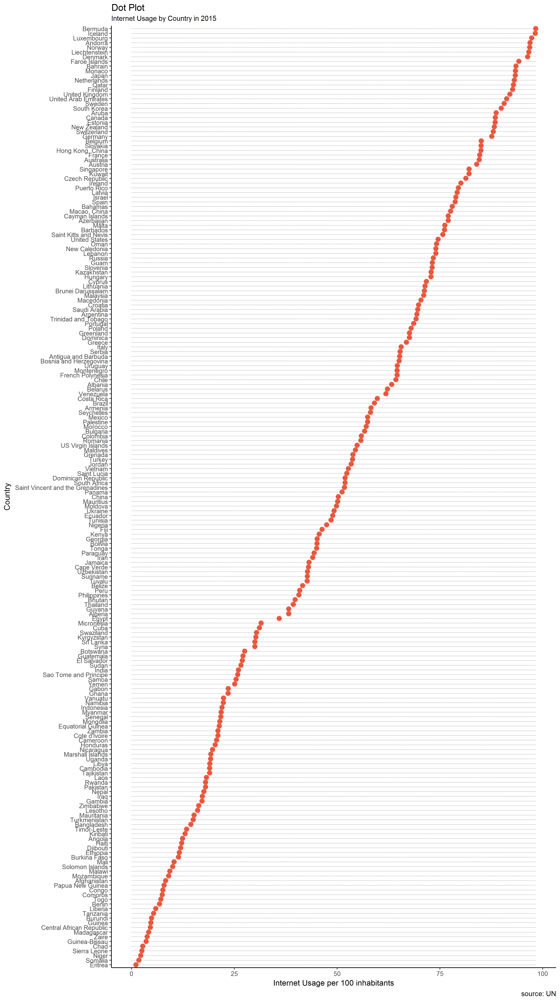
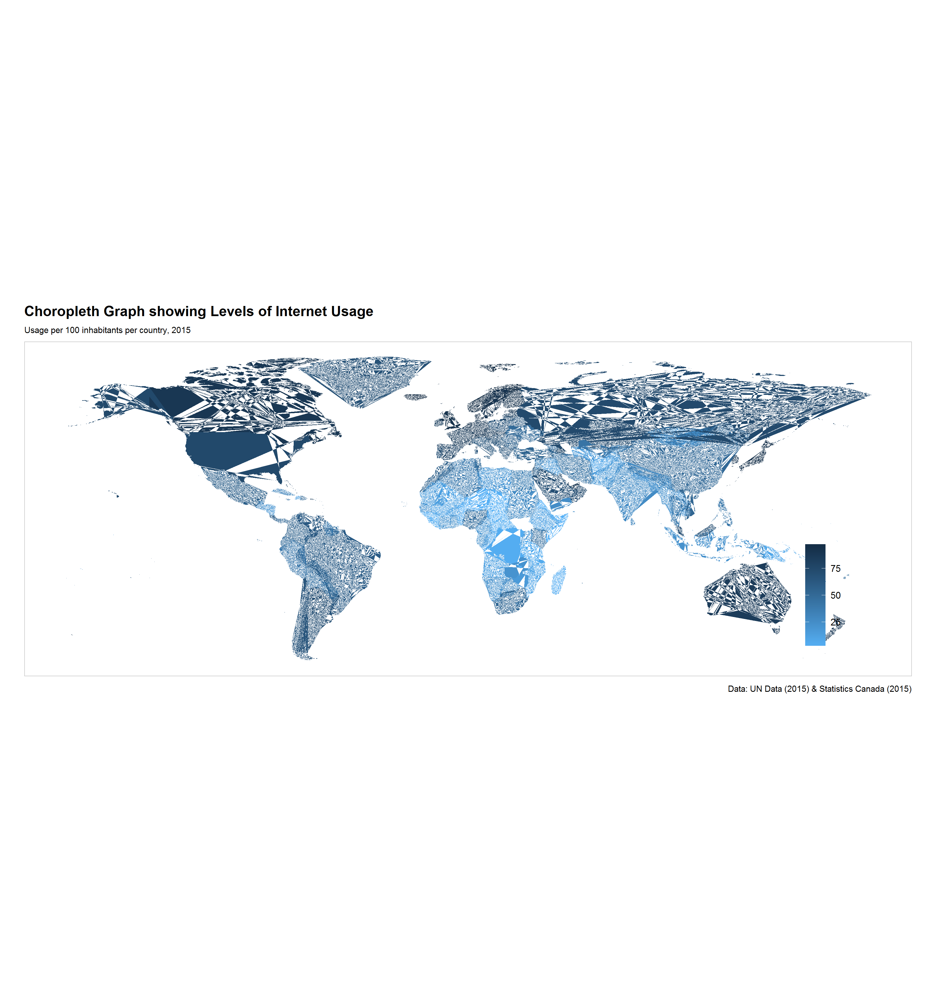

Report of Exploration into UN Data and Worldwide Internet Usage - Part 1
================
Shirlett Hall
November 14, 2017

-   [Import Datasets](#import-datasets)
    -   [Import Datasets from separate tabs](#import-datasets-from-separate-tabs)
-   [Data Cleaning](#data-cleaning)
-   [Exploring](#exploring)
    -   [Dot Plot](#dot-plot)
    -   [Choropleth Map](#choropleth-map)

``` r
options(warn = -1)
options(message = -1)
setwd("~/myrepositories/STAT545-hw-Hall-Shirlett/HW07")
suppressWarnings(suppressMessages(library(tidyverse)))
suppressWarnings(suppressMessages(library(dplyr)))
suppressWarnings(suppressMessages(library(gridExtra)))
suppressWarnings(suppressMessages(library(scales)))
suppressWarnings(suppressMessages(library(maps)))
suppressWarnings(suppressMessages(library(maptools)))
library(tidyverse)
library(knitr) 
```

for formatting the output of tables

``` r
library(dplyr) 
```

for grouping and filtering

``` r
library(forcats) 
```

used to manipulate factors for ordering, lumping etc

``` r
library(gridExtra) 
```

used to layout tables and charts in a grid

``` r
library(grid) 
```

used to layout tables and charts in a grid

``` r
library(readxl) 
```

used to read excel file formats

``` r
library(RColorBrewer) 
```

has a set of colors for print and graphics

``` r
library(scales) 
```

to modify the appearance of axis values and colors

``` r
library(ggthemes) 
```

additional color themes

``` r
library(devtools) 
```

used to save figures

``` r
library(ggplot2)
library(maps)
library(ggmap)
library(maptools)
library(stringr)
```

Import Datasets
===============

Import Datasets from separate tabs
----------------------------------

Data for Internet Usage per 100 inhabitants in 203 countries across the world from 2008 to 2015

``` r
Internet_Users <- read_excel("./UNdata_Export_ALL_Factors.xls", sheet = "Internet")
```

Data for Mobile Usage per 100 inhabitants where available for each country and year

``` r
Mobile_Users <- read_excel("./UNdata_Export_ALL_Factors.xls", sheet = "Mobile")
```

Data for Population counts in urban and rural areas where available for each country and year

``` r
Location <- read_excel("./UNdata_Export_ALL_Factors.xls", sheet = "Location")
```

Data for Gross National Income where available for each country and year

``` r
GNI <- read_excel("./UNdata_Export_ALL_Factors.xls", sheet = "GNI")
```

Data for Life Expectancy where available for each country and year

``` r
Life_Exp <- read_excel("./UNdata_Export_ALL_Factors.xls", sheet = "Life")
```

Data for Percentage of population with at least a primary school education where available for \#each country and year

``` r
Schooling <- read_excel("./UNdata_Export_ALL_Factors.xls", sheet = "Schooling")
```

Data for the dominant language spoken in each country

``` r
Language <- read_excel("./UNdata_Export_ALL_Factors.xls", sheet = "Language")
```

Data for the percentage of each population with access to electricity where available for each country and year

``` r
Electricity <- read_excel("./UNdata_Export_ALL_Factors.xls", sheet = "Electricity")
```

Data for the Adult Unemployment rate where available for each country and year

``` r
Unemployment <- read_excel("./UNdata_Export_ALL_Factors.xls", sheet = "Unemployment")
```

Data Cleaning
=============

Remove the duplicating rows where earlier census results for Rural/Urban areas are included for the same year. This code takes the higher value for each duplicated row since the most recent census collection is likely to be the most correct.

``` r
clean_location <- Location %>%
    group_by(Country, Year, Area) %>%
    mutate(Valid_Pop = max(Population)) %>%
    select(Country, Year, Area, Valid_Pop) %>%
    unique()
```

This gets percentage values of rural vs urban occupation for each country

``` r
per_rural <- clean_location %>%
    group_by(Country, Year) %>%
    mutate(Tot_pop  = sum(Valid_Pop)) %>%
    filter(Area=="Rural") %>%
    mutate(Rural_Pop=Valid_Pop, Percent_rural  = ((Valid_Pop/Tot_pop)*100), Percent_urban  = (((Tot_pop-Valid_Pop)/Tot_pop)*100)) %>%
    select(Country, Year, Tot_pop, Percent_rural, Percent_urban)
```

Merge all tables by Country and Year except Language which is the same for all years

``` r
Data1 <- merge(Internet_Users, Mobile_Users, by=c("Country", "Year"), all.x=TRUE)
Data2 <- merge(Data1, per_rural, by=c("Country", "Year"), all.x=TRUE)
Data3 <- merge(Data2, GNI, by=c("Country", "Year"), all.x=TRUE)
Data4 <- merge(Data3, Life_Exp, by=c("Country", "Year"), all.x=TRUE)
Data5 <- merge(Data4, Schooling, by=c("Country", "Year"), all.x=TRUE)
Data6 <- merge(Data5, Electricity, by=c("Country", "Year"), all.x=TRUE)
Data7 <- merge(Data6, Unemployment, by=c("Country", "Year"), all.x=TRUE)
```

Drop a column related to Age Group and sort by Country Name

``` r
All_Data  <- merge(Data7, Language, by=c("Country"), all.x=TRUE) %>%
    within(rm("Age group")) %>%
    arrange(Country)

kable(head(All_Data))
```

| Country     |  Year|  Internet\_Users\_per\_100|  Mobile\_Subs\_per\_100|  Tot\_pop|  Percent\_rural|  Percent\_urban|  GNI\_per\_cap|  Median\_Life\_Exp|  Primary\_Compl\_Rate|  Per\_Access\_Electricity|  Per\_Adult\_Unemployment| Dom\_Language |
|:------------|-----:|--------------------------:|-----------------------:|---------:|---------------:|---------------:|--------------:|------------------:|---------------------:|-------------------------:|-------------------------:|:--------------|
| Afghanistan |  2008|                   1.840000|                29.22037|  23511400|        77.32930|        22.67070|            370|           58.22502|                    NA|                  42.40000|                        NA| Persian       |
| Afghanistan |  2009|                   3.550000|                37.89494|  23993500|        77.04670|        22.95330|            470|           58.60368|                    NA|                  47.88847|                        NA| Persian       |
| Afghanistan |  2010|                   4.000000|                45.77817|  24485600|        76.76063|        23.23937|            520|           58.97083|                    NA|                  42.70000|                        NA| Persian       |
| Afghanistan |  2011|                   5.000000|                60.32632|  24987700|        76.47162|        23.52838|            570|           59.32795|                    NA|                  61.51442|                        NA| Persian       |
| Afghanistan |  2012|                   5.454546|                65.45219|  25500100|        76.17970|        23.82030|            720|           59.67961|                    NA|                  69.10000|                        NA| Persian       |
| Afghanistan |  2013|                   5.900000|                70.66136|  26023100|        75.88450|        24.11550|            730|           60.02827|                    NA|                  75.15437|                        NA| Persian       |

Export the compiled dataset for later use

``` r
write_csv(All_Data, "./All_Data.csv")
```

Exploring
=========

Dot Plot
--------

Obtain a first look at the ranking of Internet usage by factoring Country by Internet Usage in a dot plot

``` r
theme_set(theme_classic())

internet_usage <- All_Data %>%
    group_by(Country) %>%
    subset(Year == max(Year)) %>%
    select(Country, Internet_Users_per_100)
```

``` r
internet_use_plot <- internet_usage %>%
    ggplot(aes(x=reorder(Country, Internet_Users_per_100), Internet_Users_per_100)) + 
    geom_point(col="tomato2", size=3) +   # Draw points
    geom_segment(aes(x=Country, 
                                     xend=Country, 
                                     y=min(0), 
                                     yend=max(Internet_Users_per_100)), 
                             linetype="dashed", 
                             size=0.1) +   # Draw dashed lines
    labs(title="Dot Plot", 
             subtitle="Internet Usage by Country in 2015", 
             caption="source: UN",
             y = "Internet Usage per 100 inhabitants", x= "Country") +  
    coord_flip() 
```

The figure below is a very long display of all the countries. It provides a general overview of the distribution of internet penetration from Bermuda which appears to have 100/100 inhabitants with Internet usage to Eritrea which has almost zero out of every 100 inhabitants using the Internet.

``` r
ggsave("./img/internet_use_plot.png", internet_use_plot, width = 28, height=50, units="cm", scale=1)
```



Choropleth Map
--------------

Create a choropleth map to show the level of Internet usage Get list of geocodes of all countries in the world from map library

``` r
world <- map_data("world") %>%
    rename(Country=region) 
```

Replaces the names of countries that are different in the world listing from internal dataset

``` r
world$Country <- str_replace_all(world$Country, c("Antigua" = "Antigua and Barbuda", "Brunei" = "Brunei Darussalam", "Republic of Congo" = "Congo", "Ivory Coast" = "Cote d'Ivoire","Saint Kitts" = "Saint Kitts and Nevis","Saint Vincent" = "Saint Vincent and the Grenadines","Trinidad" = "Trinidad and Tobago", "UK" = "United Kingdom","USA" = "United States", "Virgin Islands" = "US Virgin Islands","Democratic Republic of the Congo" = "Zaire"))
```

Merges the internal dataset on the same country names

``` r
internet_usage_merge <- merge(internet_usage, world, by=c("Country"), all.x=TRUE) %>%
    arrange(desc(Internet_Users_per_100)) %>%
    drop_na(long, lat)
```

Create a choropleth map of all countries

``` r
internet_map <- ggplot(internet_usage_merge , aes(x = long, y = lat, group= group, fill=Internet_Users_per_100)) +
    scale_fill_continuous(high = "#132B43", low = "#56B1F7") +
    geom_polygon(aes(x = long, y = lat)) +
    coord_equal() +
    theme_void() +
    labs(x = NULL, y = NULL, fill = NULL,
             title = "Choropleth Graph showing Levels of Internet Usage",
             subtitle = "Usage per 100 inhabitants per country, 2015",
             caption = "Data: UN Data (2015) & Statistics Canada (2015)") +
    theme_void() +
    theme(text = element_text(size = 8),
                plot.title = element_text(size = 12, face = "bold"),
                plot.margin = unit(c(0, 0.25, 0.0, 0.25), "in"),
                panel.border = element_rect(fill = NA, colour = "#cccccc"),
                legend.text = element_text(size = 8),
                legend.position = c(0.9, 0.25))

ggsave("./img/internet_map.png", internet_map, width = 28, height=30, units="cm", scale=1)
```

The choloroleth map below supports the illustration in the dot plot. The western hemisphere and in particular Canada and the USA have deeper saturations of blue. In contrast, many of the African countries have a much lighter hue since many of them have less than 25 inhabitants out of 100 with Internet access/usage. 
