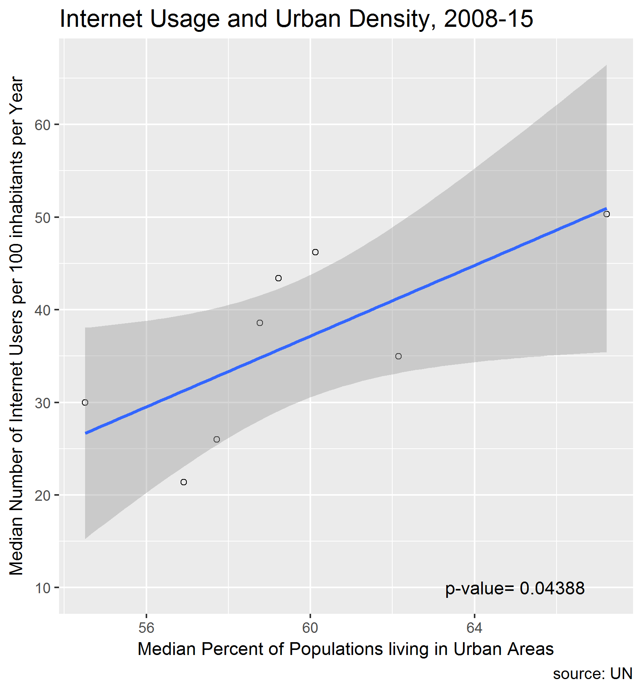
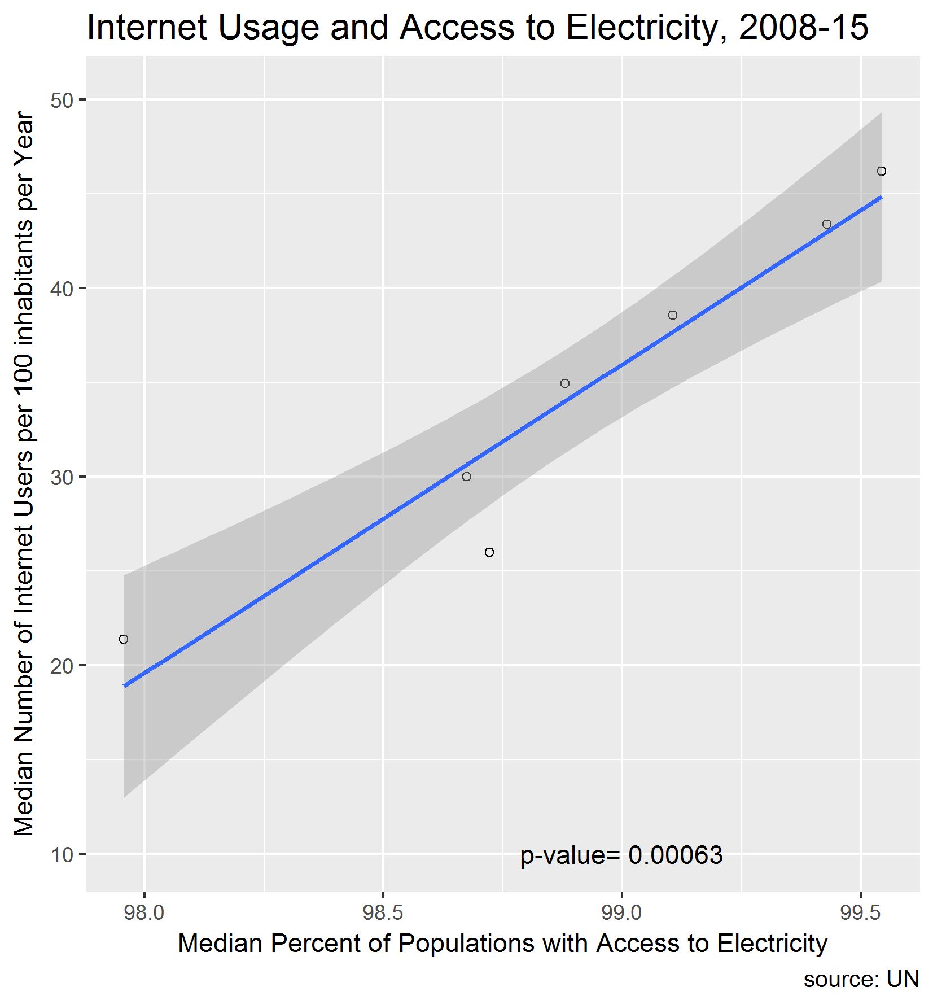

Report of Exploration into UN Data and Worldwide Internet Usage - Part 2
================
Shirlett Hall
November 14, 2017

-   [Statistical Analysis and Figures](#statistical-analysis-and-figures)
-   [Linear Regression](#linear-regression)

``` r
options(warn = -1)
options(message = -1)
suppressWarnings(suppressMessages(library(tidyverse)))
suppressWarnings(suppressMessages(library(dplyr)))
suppressWarnings(suppressMessages(library(gridExtra)))
suppressWarnings(suppressMessages(library(scales)))
suppressWarnings(suppressMessages(library(maps)))
suppressWarnings(suppressMessages(library(maptools)))

setwd("~/myrepositories/STAT545-hw-Hall-Shirlett/HW07")
library('tidyverse')
library(knitr) 
```

for formatting the output of tables

``` r
library(dplyr) 
```

for grouping and filtering

``` r
library(forcats) 
```

used to manipulate factors for ordering, lumping etc

``` r
library(gridExtra) 
```

used to layout tables and charts in a grid

``` r
library(grid) 
```

used to layout tables and charts in a grid

``` r
library(readxl) 
```

used to read excel file formats

``` r
library(RColorBrewer) 
```

has a set of colors for print and graphics

``` r
library(scales) 
```

to modify the appearance of axis values and colors

``` r
library(ggthemes) 
```

additional color themes

``` r
library(devtools) 
```

used to save figures

``` r
library(ggplot2)
library(maps)
library(ggmap)
library(maptools)
library(stringr) #for replacement of strings in dataset columns
library(broom) # to tidy printed summary output and convert to a dataframe
library(gridExtra) #used to layout tables and charts in a grid
library(grid) #used to layout tables and charts in a grid
setwd("~/myrepositories/STAT545-hw-Hall-Shirlett/HW07")
```

Statistical Analysis and Figures
================================

``` r
library(readr)
All_Data <- read_csv("./All_Data.csv")
```

    ## Parsed with column specification:
    ## cols(
    ##   Country = col_character(),
    ##   Year = col_double(),
    ##   Internet_Users_per_100 = col_double(),
    ##   Mobile_Subs_per_100 = col_double(),
    ##   Tot_pop = col_double(),
    ##   Percent_rural = col_double(),
    ##   Percent_urban = col_double(),
    ##   GNI_per_cap = col_double(),
    ##   Median_Life_Exp = col_double(),
    ##   Primary_Compl_Rate = col_double(),
    ##   Per_Access_Electricity = col_double(),
    ##   Per_Adult_Unemployment = col_double(),
    ##   Dom_Language = col_character()
    ## )

Get median values for number of Internet Users and Urban Density

``` r
Internet_Urban <- All_Data %>%
    select(Year, Internet_Users_per_100, Percent_urban) %>%
    group_by(Year) %>%
    summarise(Med_Internet_Users=median(Internet_Users_per_100), Med_Percent_urban=median(Percent_urban, na.rm = TRUE)) 
```

Get estimate of slopes, intercepts for linear model

``` r
urbanfit <- tidy(lm(Med_Internet_Users ~ Med_Percent_urban, data = Internet_Urban))
kable(urbanfit)
```

| term                |    estimate|   std.error|  statistic|    p.value|
|:--------------------|-----------:|-----------:|----------:|----------:|
| (Intercept)         |  -77.338166|  44.7782513|  -1.727137|  0.1348876|
| Med\_Percent\_urban |    1.908213|   0.7502498|   2.543437|  0.0438771|

Capture p-value to pass to graph

``` r
pval <- toString(round(urbanfit[2,5], digits=5))
```

Linear Regression
=================

``` r
Urban_plot <- Internet_Urban %>%
    ggplot(aes(Med_Percent_urban, Med_Internet_Users)) +
    geom_point(shape=1) + 
    geom_smooth(method=lm) +
    labs( 
        subtitle="Internet Usage Across the World as influenced by Urban Density", 
        caption="source: UN",
        y = "Median Number of Internet Users per 100 inhabitants per Year", x= "Median Percent of Populations living in Urban Areas") +
    theme(plot.subtitle = element_text(size = 15)) +
    annotate("text", x=65, y=10, label = paste("p-value=", pval), parse=F) 

ggsave("./img/Urban_plot.png", Urban_plot, width = 28, height=30, units="cm", scale=1)
```

 Get median values for number of Internet Users and Gross National Income

``` r
Internet_GNI <- All_Data %>%
    select(Year, Internet_Users_per_100, GNI_per_cap) %>%
    group_by(Year) %>%
    summarise(Med_Internet_Users=median(Internet_Users_per_100), Med_GNI=median(GNI_per_cap, na.rm = TRUE)) 
```

Get estimate of slopes, intercepts for linear model

``` r
gnifit <- tidy(lm(Med_Internet_Users ~ Med_GNI, data = Internet_GNI))
kable(gnifit)
```

| term        |    estimate|   std.error|  statistic|    p.value|
|:------------|-----------:|-----------:|----------:|----------:|
| (Intercept) |  -43.631663|  12.3925241|  -3.520805|  0.0125063|
| Med\_GNI    |    0.015245|   0.0023478|   6.493411|  0.0006347|

Capture p-value to pass to graph

``` r
pgni <- toString(round(gnifit[2,5], digits=5))
```

Linear Regression

``` r
GNI_plot <- Internet_GNI %>%
    ggplot(aes(Med_GNI, Med_Internet_Users)) +
    geom_point(shape=1) + 
    geom_smooth(method=lm) +
    labs(
        subtitle="Internet Usage Across the World as influenced by Gross National Income", 
        caption="source: UN",
        y = "Median Number of Internet Users per 100 inhabitants per Year", x= "Median Gross National Income per Capita") +
    theme(plot.subtitle = element_text(size = 15)) +
    annotate("text", x=5900, y=10, label = paste("p-value=", pgni), parse=F) 


ggsave("./img/GNI_plot.png", GNI_plot, width = 28, height=30, units="cm", scale=1)
```

 Get median values for number of Internet Users and Access to Electricity

``` r
Internet_Electricity <- All_Data %>%
    select(Year, Internet_Users_per_100, Per_Access_Electricity) %>%
    group_by(Year) %>%
    summarise(Med_Internet_Users=median(Internet_Users_per_100), Med_Percent_Electricity=median(Per_Access_Electricity, na.rm = TRUE)) 
```

Get estimate of slopes, intercepts for linear model using the broom package to present results

``` r
electfit <- tidy(lm(Med_Internet_Users ~ Med_Percent_Electricity, data = Internet_Electricity))
kable(electfit)
```

| term                      |     estimate|   std.error|  statistic|    p.value|
|:--------------------------|------------:|-----------:|----------:|----------:|
| (Intercept)               |  -1582.21071|  212.649779|  -7.440453|  0.0006914|
| Med\_Percent\_Electricity |     16.34516|    2.150084|   7.602101|  0.0006256|

Capture p-value to pass to graph

``` r
pelec <- toString(round(electfit[2,5], digits=5))
```

Linear Regression

``` r
Elect_plot <- Internet_Electricity %>%
    ggplot(aes(Med_Percent_Electricity, Med_Internet_Users)) +
    geom_point(shape=1) + 
    geom_smooth(method=lm) +
    labs( 
        subtitle="Internet Usage Across the World as influenced by Access to Electricity", 
        caption="source: UN",
        y = "Median Number of Internet Users per 100 inhabitants per Year", x= "Median Percent of Populations with Access to Electricity") +
    theme(plot.subtitle = element_text(size = 15)) +
    annotate("text", x=99, y=10, label = paste("p-value=", pelec), parse=F) 


ggsave("./img/Elect_plot.png", Elect_plot, width = 28, height=30, units="cm", scale=1)
```

 Get median values for number of Internet Users and Life Expectancy

``` r
Internet_Life <- All_Data %>%
    select(Year, Internet_Users_per_100, Median_Life_Exp) %>%
    group_by(Year) %>%
    summarise(Med_Internet_Users=median(Internet_Users_per_100), Med_Life=median(Median_Life_Exp, na.rm = TRUE)) 
```

Get estimate of slopes, intercepts for linear model

``` r
lifefit <- tidy(lm(Med_Internet_Users ~ Med_Life, data = Internet_Life))
kable(lifefit)
```

| term        |     estimate|   std.error|  statistic|    p.value|
|:------------|------------:|-----------:|----------:|----------:|
| (Intercept) |  -1344.51966|  167.669309|  -8.018878|  0.0004875|
| Med\_Life   |     18.88899|    2.296836|   8.223914|  0.0004330|

Capture p-value to pass to graph

``` r
plife <- toString(round(lifefit[2,5], digits=5))
```

Linear Regression

``` r
Life_plot <- Internet_Life %>%
    ggplot(aes(Med_Life, Med_Internet_Users)) +
    geom_point(shape=1) + 
    geom_smooth(method=lm) +
    labs( 
        subtitle="Internet Usage Across the World as influenced by Median Life Expectancy", 
        caption="source: UN",
        y = "Median Number of Internet Users per 100 inhabitants per Year", x= "Median Life Expectancy") +
    theme(plot.subtitle = element_text(size = 15)) +
    annotate("text", x=73, y=10, label = paste("p-value=", plife), parse=F) 


ggsave("./img/Life_plot.png", Life_plot, width = 28, height=30, units="cm", scale=1)
```


``` r
#Arrange the figures in a grid
internet_grid <- grid.arrange(Urban_plot, GNI_plot, Elect_plot, Life_plot,
                                                            ncol=2,
                                                            as.table=TRUE,
                                                            heights=c(15,15),
                                                            widths=c(13, 13),
                                                            top="Linear Regression")
```


``` r
ggsave("./img/internet_grid.png", internet_grid, width = 28, height=40, units="cm", scale=1)
```
