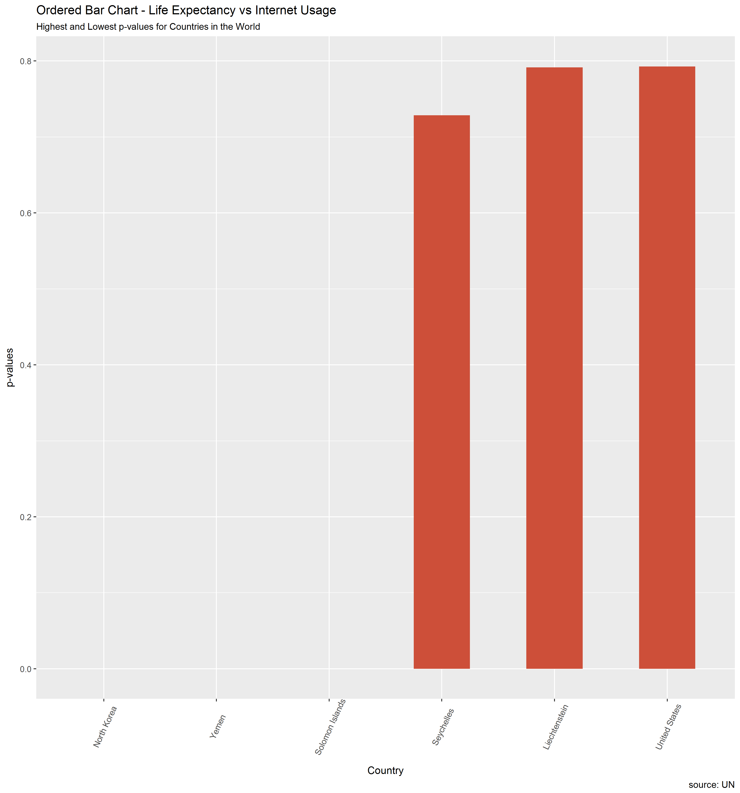

Report of Exploration into UN Data and Worldwide Internet Usage - Part 3
================
Shirlett Hall
November 14, 2017

-   [Deeper Statistical Analysis and Figures](#deeper-statistical-analysis-and-figures)

``` r
options(warn = -1)
options(message = -1)
suppressWarnings(suppressMessages(library(tidyverse)))
suppressWarnings(suppressMessages(library(dplyr)))
suppressWarnings(suppressMessages(library(gridExtra)))
suppressWarnings(suppressMessages(library(scales)))
suppressWarnings(suppressMessages(library(maps)))
suppressWarnings(suppressMessages(library(maptools)))
library(dplyr) 
```

for grouping and filtering

``` r
library(tidyverse)
library(knitr)  
```

for formatting the output of tables

``` r
library(forcats) 
```

used to manipulate factors for ordering, lumping etc

``` r
library(gridExtra) 
```

used to layout tables and charts in a grid

``` r
library(grid) 
```

used to layout tables and charts in a grid

``` r
library(readxl) 
```

used to read excel file formats

``` r
library(RColorBrewer) 
```

has a set of colors for print and graphics

``` r
library(scales) 
```

to modify the appearance of axis values and colors

``` r
library(ggthemes) 
```

additional color themes

``` r
library(devtools) 
```

used to save figures

``` r
library(ggplot2)
library(maps)
library(ggmap)
library(maptools)
library(stringr) 
```

for replacement of strings in dataset columns

``` r
library(broom) 
```

to tidy printed summary output and convert to a dataframe

``` r
setwd("~/myrepositories/STAT545-hw-Hall-Shirlett/HW07")


library(readr)
All_Data <- read_csv("./All_Data.csv")
```

    ## Parsed with column specification:
    ## cols(
    ##   Country = col_character(),
    ##   Year = col_double(),
    ##   Internet_Users_per_100 = col_double(),
    ##   Mobile_Subs_per_100 = col_double(),
    ##   Tot_pop = col_double(),
    ##   Percent_rural = col_double(),
    ##   Percent_urban = col_double(),
    ##   GNI_per_cap = col_double(),
    ##   Median_Life_Exp = col_double(),
    ##   Primary_Compl_Rate = col_double(),
    ##   Per_Access_Electricity = col_double(),
    ##   Per_Adult_Unemployment = col_double(),
    ##   Dom_Language = col_character()
    ## )

Deeper Statistical Analysis and Figures
=======================================

Based on p-values derived for each factor across the world, Life Expectancy has the best significance with Internet Usage. We can find the countries where this is the greatest

``` r
Internet_Life <- All_Data %>%
    select(Country, Year, Internet_Users_per_100, Median_Life_Exp) %>%
    drop_na(Median_Life_Exp) %>%
    group_by(Country) %>%
    do(tidy(lm(Internet_Users_per_100 ~ Median_Life_Exp, data=.))) %>%
    filter(term=="Median_Life_Exp") %>%
    tally(p.value) 

top3 <- Internet_Life %>%
    top_n(3) 
```

    ## Selecting by n

``` r
kable(top3)
```

| Country       |          n|
|:--------------|----------:|
| Liechtenstein |  0.7916530|
| Seychelles    |  0.7286933|
| United States |  0.7928303|

Life expectancy has the least significance in Liechtenstein, Seychelles, and the United States. This is likely because the life expectancy in these countries have been so stable between 2008 and 2015, yet internet usage has increased. There are other factors influencing the increase in usage.

``` r
bottom3 <- Internet_Life %>%
    top_n(-3) 
```

    ## Selecting by n

``` r
kable(bottom3)
```

| Country         |    n|
|:----------------|----:|
| North Korea     |    0|
| Solomon Islands |    0|
| Yemen           |    0|

Life expectancy has the most significance in North Korea, Solomon Islands and Yemen. North Korea has no record of Internet Usage so the p-value is invalid, whereas Solomon Islands and Yemen have seen similar rates of change in Internet usage and life expectancy in a positive direction.

``` r
matters<- rbind(top3, bottom3) %>%
    ggplot(aes(x=reorder(Country, n), n)) + 
    geom_bar(stat="identity", width=.5, fill="tomato3") + 
    labs(title="Ordered Bar Chart - Life Expectancy vs Internet Usage", 
             subtitle="Highest and Lowest p-values for Countries in the World", 
             caption="source: UN",
             y="p-values",
             x="Country") + 
    theme(axis.text.x = element_text(angle=65, vjust=0.6))


ggsave("./img/matters.png", matters, width = 28, height=30, units="cm", scale=1)
```


