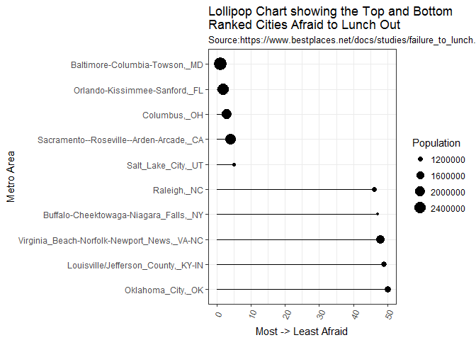

STAT545-HW10
================
Shirlett
November 28, 2017

-   [Using httr and Scraping the Web](#using-httr-and-scraping-the-web)
    -   [Extracting the table from the website](#extracting-the-table-from-the-website)
    -   [Cleaning the data in the table](#cleaning-the-data-in-the-table)
    -   [Visualizing the data](#visualizing-the-data)
-   [Articles Published on a Bird Species](#articles-published-on-a-bird-species)

Using httr and Scraping the Web
===============================

Extracting the table from the website
-------------------------------------

``` r
#Get the data regarding cities that fear of lunching out (FOLO)
webs <- httr::GET(url="https://www.bestplaces.net/docs/studies/failure_to_lunch.aspx")
lunchout <- read_html(webs)

#Create an initial table
lunchout_table <- lunchout %>%
    html_nodes("table") %>%
    .[[1]]  %>%
    html_table(header=TRUE)

#Look at the data and its structure
head(lunchout_table)
```

    ##   FOLO Rank                               CBSA name Population Pop rank
    ## 1         1           Baltimore-Columbia-Towson, MD  2,785,874       20
    ## 2         2           Orlando-Kissimmee-Sanford, FL  2,321,418       26
    ## 3         3                            Columbus, OH  1,994,536       32
    ## 4         4 Sacramento--Roseville--Arden-Arcade, CA  2,244,397       27
    ## 5         5                      Salt Lake City, UT  1,153,340       48
    ## 6         6             Phoenix-Mesa-Scottsdale, AZ  4,489,109       12

``` r
str(lunchout_table)
```

    ## 'data.frame':    50 obs. of  4 variables:
    ##  $ FOLO Rank : int  1 2 3 4 5 6 7 8 9 10 ...
    ##  $ CBSA name : chr  "Baltimore-Columbia-Towson, MD" "Orlando-Kissimmee-Sanford, FL" "Columbus, OH" "Sacramento--Roseville--Arden-Arcade, CA" ...
    ##  $ Population: chr  "2,785,874" "2,321,418" "1,994,536" "2,244,397" ...
    ##  $ Pop rank  : int  20 26 32 27 48 12 7 11 47 1 ...

Cleaning the data in the table
------------------------------

``` r
#Clean the data

#replace spaces in column names
names(lunchout_table) <- str_replace_all(names(lunchout_table), " ", "_")


#more cleaning
clean_lunch_table <- lunchout_table %>%
    select(everything()) %>%
    mutate(Population = as.numeric(gsub(",", "", Population))) %>%
    mutate(CBSA_name = gsub(" ", "_", CBSA_name))
```

    ## Warning: package 'bindrcpp' was built under R version 3.3.3

``` r
kable(head(clean_lunch_table, 10))
```

|  FOLO\_Rank| CBSA\_name                                    |  Population|  Pop\_rank|
|-----------:|:----------------------------------------------|-----------:|----------:|
|           1| Baltimore-Columbia-Towson,\_MD                |     2785874|         20|
|           2| Orlando-Kissimmee-Sanford,\_FL                |     2321418|         26|
|           3| Columbus,\_OH                                 |     1994536|         32|
|           4| Sacramento--Roseville--Arden-Arcade,\_CA      |     2244397|         27|
|           5| Salt\_Lake\_City,\_UT                         |     1153340|         48|
|           6| Phoenix-Mesa-Scottsdale,\_AZ                  |     4489109|         12|
|           7| Washington-Arlington-Alexandria,\_DC-VA-MD-WV |     6033737|          7|
|           8| San\_Francisco-Oakland-Hayward,\_CA           |     4594060|         11|
|           9| Hartford-West\_Hartford-East\_Hartford,\_CT   |     1214295|         47|
|          10| New\_York-Newark-Jersey\_City,\_NY-NJ-PA      |    20092883|          1|

Visualizing the data
--------------------

``` r
#Visualize the data
theme_set(theme_bw())

clean_lunch_table %>%
    filter(FOLO_Rank==c(1:5, 46:50)) %>%
    ggplot(aes(reorder(x=CBSA_name, FOLO_Rank), y=FOLO_Rank)) + 
    geom_point(aes(size=Population)) + 
    geom_segment(aes(x=CBSA_name, 
                                     xend=CBSA_name, 
                                     y=0, 
                                     yend=FOLO_Rank)) + 
    labs(title="Lollipop Chart showing the Top and Bottom\nRanked Cities Afraid to Lunch Out", 
             subtitle="Source:https://www.bestplaces.net/docs/studies/failure_to_lunch.aspx",
             y="Most -> Least Afraid",
             x= "Metro Area") + 
    theme(axis.text.x = element_text(angle=65, vjust=0.6)) +
    coord_flip()
```



Articles Published on a Bird Species
====================================

``` r
#look at the structure of the data on bird species
str(ebirdtaxonomy())
```

    ## Classes 'tbl_df', 'tbl' and 'data.frame':    10550 obs. of  9 variables:
    ##  $ speciesCode : chr  "ostric2" "ostric3" "grerhe1" "lesrhe2" ...
    ##  $ comNameCodes: chr  "COOS" "SOOS" "GRRH" "LERH" ...
    ##  $ bandingCodes: chr  NA NA NA NA ...
    ##  $ comName     : chr  "Common Ostrich" "Somali Ostrich" "Greater Rhea" "Lesser Rhea" ...
    ##  $ category    : chr  "species" "species" "species" "species" ...
    ##  $ sciName     : chr  "Struthio camelus" "Struthio molybdophanes" "Rhea americana" "Rhea pennata" ...
    ##  $ sciNameCodes: chr  "STCA" "STMO" "RHAM" "RHPE" ...
    ##  $ taxonID     : chr  "TC000002" "TC000003" "TC000004" "TC000005" ...
    ##  $ taxonOrder  : num  3 5 7 13 32 33 40 43 48 49 ...

``` r
test_bird <- head(ebirdtaxonomy()) %>%
               select(comName, speciesCode, sciName)
kable(test_bird)
```

| comName                | speciesCode | sciName                |
|:-----------------------|:------------|:-----------------------|
| Common Ostrich         | ostric2     | Struthio camelus       |
| Somali Ostrich         | ostric3     | Struthio molybdophanes |
| Greater Rhea           | grerhe1     | Rhea americana         |
| Lesser Rhea            | lesrhe2     | Rhea pennata           |
| Tawny-breasted Tinamou | tabtin1     | Nothocercus julius     |
| Highland Tinamou       | higtin1     | Nothocercus bonapartei |

``` r
#get the list of articles about bird species by finding articles about the common ostrich
ostrich <- searchplos("common ostrich", 'id,publication_date, title', limit=500) 
             
str(ostrich$data)
```

    ## Classes 'tbl_df', 'tbl' and 'data.frame':    404 obs. of  3 variables:
    ##  $ id              : chr  "10.1371/journal.pone.0129596" "10.1371/journal.pone.0173873" "10.1371/journal.pone.0100717" "10.1371/journal.pone.0034346" ...
    ##  $ publication_date: chr  "2015-06-08T00:00:00Z" "2017-04-12T00:00:00Z" "2014-06-25T00:00:00Z" "2012-03-29T00:00:00Z" ...
    ##  $ title           : chr  "Increased Thymic Cell Turnover under Boron Stress May Bypass TLR3/4 Pathway in African Ostrich" "Spontaneous diseases in captive ratites (Struthioniformes) in northwestern Germany: A retrospective study" "Development of Loop-Mediated Isothermal Amplification (LAMP) Assay for Rapid and Sensitive Identification of Ostrich Meat" "Analysis of Immunoglobulin Transcripts in the Ostrich Struthio camelus, a Primitive Avian Species" ...
    ##  - attr(*, "numFound")= int 404
    ##  - attr(*, "start")= int 0

``` r
kable(head(ostrich$data))
```

| id                           | publication\_date    | title                                                                                                                                   |
|:-----------------------------|:---------------------|:----------------------------------------------------------------------------------------------------------------------------------------|
| 10.1371/journal.pone.0129596 | 2015-06-08T00:00:00Z | Increased Thymic Cell Turnover under Boron Stress May Bypass TLR3/4 Pathway in African Ostrich                                          |
| 10.1371/journal.pone.0173873 | 2017-04-12T00:00:00Z | Spontaneous diseases in captive ratites (Struthioniformes) in northwestern Germany: A retrospective study                               |
| 10.1371/journal.pone.0100717 | 2014-06-25T00:00:00Z | Development of Loop-Mediated Isothermal Amplification (LAMP) Assay for Rapid and Sensitive Identification of Ostrich Meat               |
| 10.1371/journal.pone.0034346 | 2012-03-29T00:00:00Z | Analysis of Immunoglobulin Transcripts in the Ostrich Struthio camelus, a Primitive Avian Species                                       |
| 10.1371/journal.pone.0023203 | 2011-08-24T00:00:00Z | Ostriches Sleep like Platypuses                                                                                                         |
| 10.1371/journal.pone.0086973 | 2014-01-31T00:00:00Z | Tracking Socioeconomic Vulnerability Using Network Analysis: Insights from an Avian Influenza Outbreak in an Ostrich Production Network |
